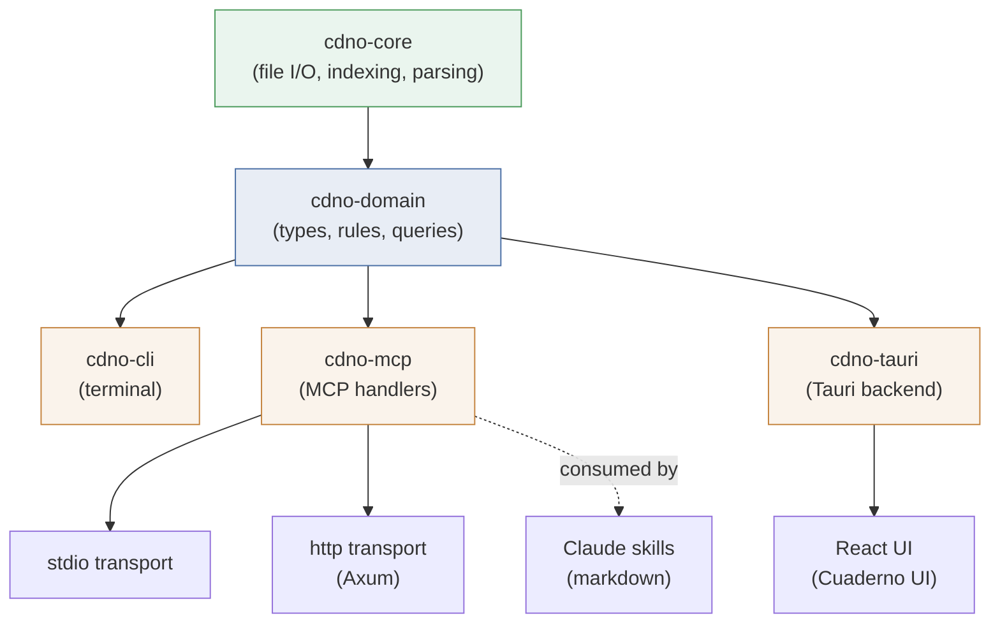

# Cuaderno — Design Document

## A Research Logbook Method implementation in Rust

**Version**: 0.1 (design phase)
**Command**: `cdno` (alias: `cdrn`)
**Full name**: cuaderno (“notebook” / “logbook” in Spanish)

-----

## 1. Purpose

Cuaderno is a vault management tool that implements the Research Logbook Method (RLM) — a system for knowledge, tasks, and life organisation designed for experimental and hard-science researchers, with specific accommodations for ADHD. It succeeds mdvault, inheriting its lower-level infrastructure (file I/O, indexing, markdown parsing) while replacing its domain model with one built around the RLM’s concepts: chronological logging, evidence portfolios, project maps, stewardships, and question-driven organisation.

The tool has four consumers:

- **The researcher** via the CLI in a terminal
- **The researcher** via the Cuaderno desktop UI (Tauri)
- **Claude** via the MCP server (stdio for local, HTTP for self-hosted)
- **Claude skills** as choreographed workflows combining MCP calls with ADHD-friendly interaction patterns

-----

## 2. Design Principles

**The markdown files are the source of truth.** The SQLite index is a cache. The UI is a view. The MCP is an API. If everything except the vault folder were deleted, the system could be rebuilt by reindexing.

**Everything in one place, in open formats.** All notes, projects, stewardships, commitments, questions, evidence, and tracking data are markdown files in a single directory tree. No proprietary formats, no cloud dependency, no ecosystem lock-in.

**Opinionated enforcement over flexibility.** Required frontmatter by note type, automatic scaffolding, validation, enforced linking patterns. The tool has strong opinions about structure because the user benefits from externally imposed structure.

**ADHD-friendly emotional design.** Lead with what is there, not what is missing. No guilt engines. No angry red overdue counts. Permission to park or drop things. Missed reviews cost nothing. Celebration before problems.

**Minimal maintenance overhead.** If maintaining the system takes more than five minutes a day (outside the weekly review), something is wrong. Quick capture, deferred organisation, minimal friction.

-----

## 3. Note Types

|Type         |Description                                                  |Mutable?                          |Lives in                                  |
|-------------|-------------------------------------------------------------|----------------------------------|------------------------------------------|
|`daily`      |Chronological log entry for a single day                     |Append-only                       |`journal/daily/`                          |
|`weekly`     |Weekly review artefact                                       |Append-only                       |`journal/weekly/`                         |
|`project`    |Mutable project dashboard (one screen)                       |Yes (state, actions)              |`projects/`                               |
|`action`     |Manifest note for an action-as-investigation (heavier form)  |Yes while attached, append-only after completion |`actions/` (archived to `actions/_done/<year>/`) |
|`portfolio`  |Index note for an evidence folder                            |Rarely (summary)                  |`portfolios/*/`                           |
|`evidence`   |Individual capture inside a portfolio                        |No                                |`portfolios/*/`                           |
|`stewardship`|Dashboard for a perpetual responsibility                     |Occasionally                      |`stewardships/` or `stewardships/*/`      |
|`tracking`   |Structured log entry for a stewardship                       |No                                |`stewardships/*/tracking/`                |
|`question`   |An important research or life question                       |Occasionally                      |`questions/research/` or `questions/life/`|
|`commitment` |A standalone promise with a hard deadline                    |No (moves to `_done/`)            |`commitments/`                            |
|`inbox`      |Uncategorised capture awaiting triage                        |Temporary                         |`inbox/`                                  |

### Note lifecycle patterns

**Append-only**: daily, weekly, evidence, tracking. Once written, these notes only grow. They are the historical record.

**Mutable dashboard**: project. The current state section is rewritten regularly. Previous states are auto-logged to the daily entry before being overwritten, preserving full history in the chronological log.

**Stable reference**: portfolio (index), stewardship, question. Updated occasionally during reviews, not during daily work.

**Transient**: commitment (moves to `_done/` on completion), inbox (triaged to its proper home).

**Two-state lifecycle**: action notes (see §5.11). While *attached* to a project bullet they are mutable manifests; on completion the bullet is removed and the note is archived to `actions/_done/<year>/` and becomes append-only. Append-only after completion (rather than locked) preserves the option to add late retrospectives without forcing a workaround.

-----

## 4. Vault Folder Structure

```
vault/
│
├── journal/
│   ├── daily/
│   │   ├── 2026-04-04.md
│   │   ├── 2026-04-05.md
│   │   └── 2026-04-06.md
│   └── weekly/
│       ├── 2026-W13.md
│       └── 2026-W14.md
│
├── projects/
│   ├── surrogate-model.md
│   ├── icml-paper.md
│   ├── apartment-renovation.md
│   └── _parked/
│       └── bayesian-opt-survey.md
│
├── actions/
│   ├── characterise-kan-ppo-sample-efficiency.md  ← type: action
│   ├── port-section-3-results.md
│   └── _done/
│       └── 2026/
│           └── run-20-seed-ablation.md
│
├── portfolios/
│   ├── sparse-vs-dense-ood/
│   │   ├── _index.md              ← type: portfolio
│   │   ├── 2026-03-15-chen-et-al.md       ← type: evidence
│   │   ├── 2026-03-22-ablation-run-b.md   ← type: evidence
│   │   └── 2026-04-01-supervisor-notes.md ← type: evidence
│   ├── inductive-bias-graph-systems/
│   │   ├── _index.md
│   │   └── ...
│   └── apartment-layout-options/
│       ├── _index.md
│       └── ...
│
├── stewardships/
│   ├── finances.md                ← flat, no tracking needed
│   ├── home-maintenance.md        ← flat
│   ├── health/                    ← expanded, has tracking
│   │   ├── _index.md              ← type: stewardship
│   │   ├── tracking/
│   │   │   ├── 2026-04-06-gym.md  ← type: tracking
│   │   │   ├── 2026-04-04-gym.md
│   │   │   ├── 2026-04-01-swim.md
│   │   │   └── 2026-03-30-body.md
│   │   └── routines/
│   │       ├── upper-body-a.md
│   │       └── lower-body-b.md
│   └── professional-dev/          ← expanded, has tracking
│       ├── _index.md
│       └── tracking/
│           └── ...
│
├── commitments/
│   ├── passport-renewal.md
│   ├── review-eriks-draft.md
│   └── _done/
│       └── tax-prepayment-q1.md
│
├── questions/
│   ├── research/
│   │   ├── surrogate-cost-reduction.md
│   │   ├── inductive-bias-graph-systems.md
│   │   ├── world-model-distillation.md
│   │   └── ts-foundation-models-telecom.md
│   └── life/
│       ├── apartment-as-home.md
│       ├── sustainable-fitness.md
│       └── savings-structure.md
│
├── inbox/
│   └── ...
│
└── .cuaderno/
    ├── config.toml              ← vault-level configuration
    └── templates/               ← custom note templates
        ├── project.md
        ├── evidence.md
        ├── tracking-gym.md
        └── ...
```

### Structural conventions

- **`_parked/`** inside `projects/`: inactive projects, not deleted. Revisited at monthly review.
- **`_done/`** inside `commitments/`: fulfilled commitments, kept for record.
- **`_done/<year>/`** inside `actions/`: completed action notes, partitioned by year so the active set stays scannable. Year subfolders are created on demand at completion time.
- **`_index.md`** inside portfolio and expanded stewardship folders: the folder’s identity note.
- **`routines/`** inside stewardship folders: prescriptive reference documents (workout plans, routines), not logs.
- **`tracking/`** inside stewardship folders: structured time-series entries.
- Stewardships can be either a flat `.md` file or an expanded folder with `_index.md`. The tool handles both.
- **`.cuaderno/`** at vault root: tool configuration and custom templates. Not synced to version control by default (add to `.gitignore` if desired, or keep it for portability).

-----

## 5. Note Specifications

### 5.1 Daily Log Entry

```markdown
---
type: daily
date: 2026-04-06
tags: [surrogate-model, apartment, health]
---

# Sunday, 6 April 2026

## Morning
- Started focusing on the surrogate model ablation.
- Ran the 20-seed variant of feature set B. Variance dropped
  significantly — CI now [0.82, 0.87]. This confirms the
  improvement is real, not a lucky seed.
- Filed the result to the sparse-vs-dense-ood portfolio.

## Afternoon
- Read Müller et al. 2026 on spectral attention for PDE
  surrogates. Filed annotation to inductive-bias portfolio.
- Apartment: called the electrician. Available next Thursday.
  Updated project map.

## Evening
- Gym: upper body A, 45 min. Bench still at 70kg.
- Dental check-up overdue. Added to commitments.

## Index
surrogate-model, ablation, confidence-intervals,
spectral-attention, apartment, electrician, gym
```

**Frontmatter**: `type`, `date`, `tags` (auto-populated from index keywords).

**Content**: free-form chronological prose grouped by time of day. Includes reasoning, observations, and cross-references. Short entries for stewardship activities (gym, errands) with details in their respective tracking notes.

**Created by**: auto-scaffolded by the tool on first interaction of the day. Appended to throughout the day via CLI (`cdno log "..."`), Claude, or direct editing.

### 5.2 Weekly Review

```markdown
---
type: weekly
week: 2026-W14
date_start: 2026-03-30
date_end: 2026-04-06
---

# Week 14, 2026

## Wins
- Confirmed feature set B improvement with proper CI.
- Read 4 papers, filed 3 evidence notes.
- Apartment: electrician booked, flooring quotes received.
- Gym 3 times.

## Challenges
- Wednesday was low-energy. Did admin instead. That is fine.
- ICML introduction still feels unfocused. Avoiding it.

## One Improvement
- Block Tuesday morning for deep writing. No Slack until noon.

## Next Week's Focus
Draft the ICML methods section using the ablation results.
```

**Created by**: Claude during the weekly review ritual, with user input.

### 5.3 Project Map

```markdown
---
type: project
context: work
status: active
created: 2026-01-15
core_question: "[[questions/research/surrogate-cost-reduction]]"
---

# Surrogate Model for Turbulence Simulations

## Current State
Feature set B ablation confirmed with 20-seed CI [0.82, 0.87].
Sparse variant matches dense on in-distribution, within 3% on
OOD. Next step is full geometry evaluation. ICML deadline
approaching — need to start writing.

## Next Actions
- [ ] Run feature set B on full geometry mesh (deep)
- [ ] [[actions/characterise-kan-ppo-sample-efficiency]] (deep)
- [ ] Draft methods section with ablation figures (medium)
- [ ] Email supervisor with CI results (light)

## Waiting On
- Compute allocation — requested 500 GPU-hours, 2026-03-28

## Milestones
- [x] Baseline dense model trained — 2026-02-10
- [x] Sparse variant matches baseline (in-dist) — 2026-03-18
- [x] Ablation confirmed with CI — 2026-04-06
- [ ] Full geometry evaluation — target: April
- [ ] ICML paper submitted — hard: 2026-05-22

## Links
- Portfolio: [[portfolios/sparse-vs-dense-ood/_index]]
- Portfolio: [[portfolios/inductive-bias-graph-systems/_index]]
- Notebook: experiments/2026-04-06-ablation-20seed.ipynb
```

**Milestones are event markers, not work containers.** A milestone is a Gantt-style point in time — a deliverable, deadline, or external event ("ICML submission", "course end", "RA defence"). Multi-evidence work that *leads to* a milestone is an action note (§5.11) that may link to the milestone via its `milestone:` frontmatter field. Milestones never become note types because they don't accumulate content; they fire once. Retrospectives on a milestone live in evidence, not in a milestone note.

Milestones are extracted into a first-class `milestones(project_id, name, date, hard_soft, status)` index table during reconciliation, so queries are O(1) without inflating the note surface.

**Mutability**: the Current State section is rewritten on each meaningful update. The tool auto-logs previous state to the daily entry before overwriting:

```
- [project:surrogate-model] State updated:
  was: "Ablation on feature set B showed 12% improvement,
  variance too high to be conclusive"
  now: "Feature set B ablation confirmed with 20-seed CI..."
```

**5-project cap**: maximum 5 active projects across all contexts. Parked projects move to `projects/_parked/`. Enforced by the tool — creating a 6th active project prompts parking one first.

**Milestones with hard deadlines** are picked up by the commitments aggregation query.

### 5.4 Portfolio Index

```markdown
---
type: portfolio
question: "Does the sparse variant outperform the dense baseline
  on out-of-distribution data?"
created: 2026-02-01
project: "[[projects/surrogate-model]]"
---

# Does the sparse variant outperform dense on OOD data?

## Summary
Evidence suggests sparse matches dense on in-distribution and
comes within 3% on OOD, with 4.2x inference speedup. Key
remaining question: does this hold on full geometry?

## Related Questions
- [[questions/research/surrogate-cost-reduction]]
- [[questions/research/inductive-bias-graph-systems]]
```

**Content**: the summary is optional, updated during monthly reviews or when the researcher feels like synthesising. The evidence notes in the folder are the real content. The “evidence count” and “last updated” are computed by the indexer, not stored in the file.

### 5.5 Evidence Note

```markdown
---
type: evidence
created: 2026-03-15
source: "Chen et al. 2025, arXiv:2503.12345"
portfolio: "sparse-vs-dense-ood"
origin: "[[projects/surrogate-model]]"
---

They show sparse attention in transformer surrogates preserves
95% of predictive accuracy while reducing inference cost 4x.
Sparsity pattern is learned, not fixed — contradicts my
assumption that structured sparsity (block-diagonal) would
suffice. Worth testing learned sparsity on our architecture.

Key figure: Table 3, fixed vs learned sparsity across three
PDE families. Gap widens on turbulent flows specifically.
```

**Design**: minimal frontmatter, free-form prose content. The `portfolio` field is redundant with the file path (it lives inside the portfolio folder) but useful for orphan detection if a note gets moved accidentally. The `source` field can be a citation, an experiment reference, a conversation, or "personal observation."

**The `origin:` field is required from Phase 3 onward.** It points to whatever produced the evidence — a project, an action note, a stewardship, etc. The forward-link gives provenance ("which work produced this?") and the backlink falls out of the index for free, which means actions and projects can list their evidence without duplicating any structural data. Baking it in from day one of Phase 3 avoids a migration if the action layer (§5.11) wants to lean on it.

**Created by**: CLI (`cdno file "sparse-vs-dense-ood" --source "Chen et al. 2025"`), Claude (via read-paper or file-to-portfolio skill), or directly in Obsidian.

### 5.6 Stewardship Dashboard

**Flat variant** (`stewardships/finances.md`):

```markdown
---
type: stewardship
context: household
---

# Finances

## Current Status
Budget is stable. Savings rate ~20% of net income. No
outstanding debts. Apartment renovation spending tracked
in the project, not here.

## Periodic Commitments
- Tax declaration — yearly — next: 2026-05-02
- Home insurance renewal — yearly — next: 2026-09-01
- Budget review — monthly — next: 2026-05-01

## Notes
- Primary bank: SEB, account XXXX-XXXX
- Tax portal: skatteverket.se, BankID login
```

**Expanded variant with tracking** (`stewardships/health/_index.md`):

```markdown
---
type: stewardship
context: personal
---

# Health

## Current Status
Gym 3x/week holding steady. Sleep averaging 6.5h, want 7.5h.
No acute issues.

## Periodic Commitments
- Dental check-up — every 6 months — next: 2026-04 (overdue)
- Eye exam — yearly — next: 2026-09
- Blood work — yearly — next: 2026-11

## Active Habits
- Resistance training 3x/week — on track
- Swimming 1x/week — lapsed since March
- Sleep before midnight — inconsistent

## Notes
- Gym: SATS Linköping, membership #12345
- GP: Dr Lindgren, Vårdcentralen Centrum
```

### 5.7 Tracking Note

**Gym session** (`stewardships/health/tracking/2026-04-06-gym.md`):

```markdown
---
type: tracking
stewardship: health
activity: gym
date: 2026-04-06
duration_min: 45
routine: "[[stewardships/health/routines/upper-body-a]]"
---

# Gym — 6 April 2026

| Exercise         | Sets | Reps     | Weight (kg) | Notes           |
|------------------|------|----------|-------------|-----------------|
| Bench press      | 4    | 8,8,7,6 | 70          | Failed last rep |
| Overhead press   | 3    | 10,10,8 | 40          |                 |
| Cable rows       | 3    | 12,12,12| 55          | Felt easy       |
| Face pulls       | 3    | 15,15,15| 20          |                 |
| Tricep pushdowns | 3    | 12,10,10| 30          |                 |

## Notes
Energy was good. Bench plateau continues at 70kg — consider
deloading next week. Cable rows could go up to 60kg.
```

**Body measurements** (`stewardships/health/tracking/2026-03-30-body.md`):

```markdown
---
type: tracking
stewardship: health
activity: body
date: 2026-03-30
---

# Body — 30 March 2026

| Metric      | Value  |
|-------------|--------|
| Weight      | 82.3kg |
| Waist       | 86cm   |
| Sleep (avg) | 6.8h   |

## Notes
Weight stable for 3 weeks. Waist down 1cm from February.
```

**Frontmatter** is indexable for time-series queries. Table data is parsed on-demand by Claude or the UI when deeper analysis is needed.

### 5.8 Question Note

```markdown
---
type: question
domain: research
status: active
created: 2026-01-10
updated: 2026-04-01
---

# Can learned surrogates reduce simulation cost by 10x
  while preserving boundary accuracy?

## Why This Matters
Full CFD simulations take 48h per geometry variant. A surrogate
running in minutes with <5% boundary error would transform the
design iteration cycle.

## Current Thinking
Evidence suggests 4x speedup is achievable with sparse
architectures at ~3% OOD cost. The 10x target may require
multi-fidelity or adaptive resolution approaches.

## Related Projects
- [[projects/surrogate-model]]
- [[projects/icml-paper]]

## Related Portfolios
- [[portfolios/sparse-vs-dense-ood/_index]]
- [[portfolios/inductive-bias-graph-systems/_index]]
```

**Status values**: `active` (on the current important list), `parked` (interesting but not now), `answered` (resolved, kept for reference), `retired` (no longer relevant).

**Queried by**: “give me all question notes where status=active, grouped by domain” produces the important questions view for orientations and reviews.

### 5.9 Commitment Note

```markdown
---
type: commitment
due: 2026-06-30
context: personal
project: null
stewardship: null
---

# Renew passport

Expires August 2026. Apply by end of June for processing time.
Requires: new photo, current passport, application form from
Polisen website.
```

**Lifecycle**: lives in `commitments/` while active. Moves to `commitments/_done/` on completion. The `project` and `stewardship` fields are null for standalone commitments, or link to the relevant source for commitments that originate elsewhere (though those are typically tracked inline as milestone dates or periodic commitments rather than as separate files). The links are **bare slugs** written as quoted YAML scalars (e.g. `stewardship: "health"`), matching `action.project` and `tracking.stewardship` — not wikilinks, since frontmatter wikilinks aren't indexed as backlinks. Inputs are canonicalised through the same slugifier as filenames, so `Health` resolves to the `health` stewardship and the stored value can never inject YAML. The source side reads them back via the type-scan-and-filter backlink queries (`commitments_for_project` / `commitments_for_stewardship`), so a stewardship dashboard can list the dated commitments that point at it. The links are loose pointers: target existence isn't validated on creation.

### 5.10 Contexts

Contexts classify projects, stewardships, and commitments by life domain. The canonical set is defined in code as a Rust enum and serialised as kebab-case in YAML frontmatter and CLI flags:

| Variant        | YAML / CLI form  |
|----------------|------------------|
| `Work`         | `work`           |
| `SideProject`  | `side-project`   |
| `University`   | `university`     |
| `Family`       | `family`         |
| `Household`    | `household`      |
| `Legal`        | `legal`          |
| `Personal`     | `personal`       |

**Why a compile-time enum and not config-driven.** Contexts are part of the system's core ontology — orientation, weekly review, and dashboards branch on context, and an exhaustive enum gives those code paths compile-time guarantees. This matches the same "make illegal states unrepresentable" choice made for `ProjectStatus` and `NoteType`. Configurable per-type *fields* (via `extra_required`) extend the schema; configurable contexts would change the *valid values* of a closed enum, which has a much wider blast radius across queries and views.

**Future-proofing.** If real users need contexts the canonical set does not cover, the migration path is local: promote `Context` to a newtype around a validated string whose `TryFrom` checks against a config-defined set. That change touches one struct and one impl. Tracked as a low-priority follow-up (see GitHub issue) so it isn't lost.

### 5.11 Action Note

An *action* is the RLM word for "thing to do." The default form is an inline `- [ ]` bullet under a project's `## Next Actions` section (§5.3). For the unusual case of an *action-as-investigation* — multi-day work, multiple evidence artefacts, complex completion criteria — the bullet can be promoted to (or created with) a thin manifest note. This note is what the rest of this section specifies.

**Why action, not task.** "Task" carries mdvault muscle memory — heavyweight per-item notes, GTD-style backlogs. Renaming to "action" is deliberate paradigm signalling: the default form is a bullet, the note form is exceptional, the discipline is staying close to the daily log. Users coming from mdvault see the unfamiliar word and don't reflexively reach for the heavy form.

**Why ship it from Phase 2.** The original analysis (see vault note `decision-task-notes-thin-layer.md`) recommended deferring this layer to Phase 6 pending dogfooding. The decision was reversed on adoption grounds: the migration path from mdvault → RLM needs a thin scaffold for users who occasionally need it, and shipping it unused costs less than discovering its absence mid-transition. The thin-ness rules below stop being aesthetic ("clean design") and become load-bearing ("removable later if not used") — they keep the option to drop the type real if dogfooding shows it's unneeded.

```markdown
---
type: action
status: active
project: surrogate-model
energy: deep
milestone: "[[projects/surrogate-model#full-geometry-evaluation]]"
due: null
created: 2026-04-15
completed: null
blocker: null
criteria: |
  Sample efficiency curve generated for KAN-PPO across 5 seeds
  on RET control task. Confidence interval reported. Comparison
  table against vanilla PPO included.
tags: [kan, ppo, sample-efficiency]
---

# Characterise KAN-PPO sample efficiency on RET control

## Manifest
- Run KAN-PPO with default config, log every 10k steps:
  [[evidence/2026-04-15-kan-ppo-baseline-run]]
- Sweep over network width and KAN basis count:
  [[evidence/2026-04-18-kan-ppo-width-sweep]]
- Compare against PPO baseline from earlier ablation:
  [[portfolios/sparse-vs-dense-ood/_index]]

## Notes
(Day-by-day reasoning belongs in the daily log under
 `#action/characterise-kan-ppo-sample-efficiency`, not here.)
```

**Frontmatter fields:**

| Field       | Required | Notes                                                                                          |
|-------------|----------|------------------------------------------------------------------------------------------------|
| `status`    | yes      | `active`, `completed`, or `blocked`                                                            |
| `project`   | yes      | Slug of the parent project. Every action belongs to a project.                                 |
| `energy`    | yes      | `deep`, `medium`, or `light`. Same vocabulary as bullet actions.                               |
| `milestone` | optional | Wikilink to a project milestone. The milestone owns the date; the action inherits.             |
| `due`       | optional | ISO date. Used only when the action has a self-imposed deadline not tied to a milestone.       |
| `created`   | yes      | Date the note was created.                                                                     |
| `completed` | optional | Date set on completion.                                                                        |
| `blocker`   | optional | Free text describing what's blocking, if `status: blocked`.                                    |
| `criteria`  | optional | What "done" looks like. Free text; one of the four jobs the note exists to do.                 |
| `tags`      | optional | List of strings; surfaced via the `tags` index table for cross-action queries.                 |

**Body shape — manifest, not journal.** The body is a list of links to relevant evidence, plus a short statement of what done looks like (when not in `criteria:`). Day-by-day reasoning during the work belongs in the daily log, tagged `#action/<slug>` so the index can reconstruct the train-of-thought view on demand. Schema enforcement (a soft line-cap warning, plus a "this looks more like evidence" hint) lives in `cdno-domain::lint` and is a generic primitive shared with commitments and other note types.

**Two-state lifecycle.** An action note exists in one of two states:

1. **Attached** — a matching `- [ ]` bullet exists in the parent project's `## Next Actions` section, with the bullet text rewritten as `- [ ] [[actions/<slug>]] (energy)`. The note is mutable; evidence links and notes can be added.
2. **Orphaned (after completion)** — the bullet has been removed (logged to the daily as usual), the note's `status` is `completed`, `completed:` is set, and the file is moved to `actions/_done/<year>/<slug>.md`. The note becomes append-only: existing content cannot be edited, but new lines can be added (e.g. a six-months-later follow-up: "turns out we missed a confound — see [[evidence/foo]]"). Append-only-after-completion is preferred over locking the file because the late-retrospective case is real and locking forces a workaround.

**Promotion semantics.** `cdno action promote <project> "<query>"` finds a matching bullet, creates the action note from the template, and rewrites the bullet to wikilink the new note. The bullet stays — it's still "what's pending" in the project's Next Actions, surfaced by orient. The note is the manifest that hangs off it. On completion, both writes (bullet removal + note status update + file move to `_done/<year>/`) run atomically through a single `VaultTransaction`, with the daily log entry logged once.

**Tasks-as-atomic-actions stay as bullets.** "Email Florian" doesn't earn a note. The friction of typing `--note` (or running `promote` after the fact) keeps the discipline informally — there's no programmatic enforcement of "this is too small for a note", because that's not reliably detectable. Cultural norm + the friction surface is the defence.

**Index implications.**
- A `tags(note_id, tag)` index table is populated during reconciliation from `#action/<slug>` mentions in daily logs (and other tagged content). This is the Faraday-style query: "show me every dated paragraph where I mentioned this action." Generic infrastructure — useful for evidence cross-tag queries too.
- The `milestones` index table (see §5.3) gives action notes their date when they reference a milestone, without duplicating the date in the action's frontmatter.
- Commitments aggregation (§6) gains action `due:` (when standalone) as a fourth source.

-----

## 6. Commitments Register (Computed View)

The commitments register is **not a static file**. It is a query assembled by the indexer from four sources:

1. **Project milestones** with hard deadlines (parsed from `## Milestones` sections where the line contains `hard:`, surfaced via the `milestones` index table)
2. **Stewardship periodic commitments** (parsed from `## Periodic Commitments` sections, with recurrence logic)
3. **Standalone commitment notes** in `commitments/` (read from the `due` frontmatter field)
4. **Action notes** with a self-imposed `due:` field (i.e. action-as-investigation deadlines that aren't pinned to a milestone). Action notes that link to a milestone instead of carrying their own `due:` are *not* duplicated here — the milestone is the source of truth.

The CLI, MCP, and UI all consume this query. Example output:

```
Commitments (next 6 weeks)
──────────────────────────────────────────────────
2026-04-08  Book dentist (overdue)           health
2026-04-10  Review Erik's draft              standalone
2026-04-17  Quarterly tax pre-payment        finances
2026-05-01  Compute allocation renewal       surrogate-model
2026-05-01  Monthly budget review            finances
2026-05-15  ICML draft to supervisor         icml-paper
2026-05-22  ICML submission                  icml-paper
```

-----

## 7. History Preservation

The project map is the only mutable note. To prevent loss of historical context:

**On every Current State update**, the tool:

1. Reads the existing Current State text
2. Appends it to today’s daily log with timestamp and project reference
3. Writes the new Current State text

**Log entry format**:

```markdown
- [project:surrogate-model] State updated:
  was: "Ablation on feature set B showed 12% improvement,
  variance too high to be conclusive"
  now: "20-seed ablation confirmed. CI [0.82, 0.87].
  Ready to test on full geometry."
```

**To trace a project’s full evolution**: search the daily log for `[project:surrogate-model] State updated` — returns the complete chronological sequence of state changes.

**Next actions** are also logged on deletion:

```markdown
- [project:surrogate-model] Completed action:
  "Run 20-seed ablation of feature set B"
```

This ensures no information is lost while keeping the project map clean and focused on the present.

-----

## 8. Crate Architecture

```
cuaderno/
├── Cargo.toml              ← workspace root
├── crates/
│   ├── cdno-core/          ← file I/O, frontmatter, markdown
│   │                          parsing, SQLite indexing, file watching
│   ├── cdno-domain/        ← note types, validation, business rules,
│   │                          queries, state transitions
│   ├── cdno-cli/           ← terminal commands
│   ├── cdno-mcp/           ← MCP server (handlers + transports)
│   │   └── src/
│   │       ├── lib.rs      ← tool definitions & handlers (transport-agnostic)
│   │       ├── transport/
│   │       │   ├── stdio.rs    ← for Claude Desktop / Claude Code
│   │       │   └── http.rs     ← for self-hosted (Axum + SSE)
│   │       └── bin/
│   │           ├── stdio.rs    ← cdno-mcp binary (default, stdio)
│   │           └── server.rs   ← cdno-mcp-server binary (HTTP)
│   └── cdno-tauri/         ← Tauri backend commands for Cuaderno UI
├── ui/                     ← React + Tremor frontend (Cuaderno UI)
└── skills/                 ← Claude skill definitions (markdown)
```

### Dependency graph



### Crate responsibilities

**cdno-core**: no domain knowledge. Knows how to read/write markdown files with YAML frontmatter, manipulate markdown sections (find, replace, append to a specific heading), define index and storage abstractions (`VaultStore` trait, `VaultIndex` trait), watch for filesystem changes, and ensure index-filesystem consistency through transactional writes and reconciliation (see below). Reusable in any markdown vault tool. **Note**: the `SqliteIndex` implementation lives in core for now, but its schema is domain-shaped (note types, deadlines, links). If the boundary feels violated as the schema grows, consider moving the implementation to `cdno-domain` or a dedicated `cdno-index` crate — the trait stays in core either way.

**cdno-domain**: all RLM business logic. Defines the note type enum and per-type frontmatter schemas. Validates notes against schemas. Enforces rules (5-project cap, tasks must link to projects, milestones must have targets). Implements queries (commitments aggregation, portfolio staleness, active questions, weekly activity summary). Handles state transitions (park a project, complete a commitment, triage an inbox item). This is the heart of cuaderno.

**cdno-cli**: thin translation layer. Parses command-line arguments, calls domain functions, formats output for the terminal. No business logic.

**cdno-mcp**: thin translation layer. Defines MCP tool schemas (derived from domain types via serde), receives JSON-RPC requests, calls domain functions, returns JSON-RPC responses. The handler layer is transport-agnostic. Two transport implementations (stdio, HTTP/SSE) are separate modules producing separate binaries.

**cdno-tauri**: thin translation layer. Defines Tauri commands that call domain methods directly (not MCP handler wrappers — Tauri can work with richer Rust types via its own serde bridge, avoiding unnecessary serialisation overhead). Manages the Tauri state (vault path, index handle). The React frontend calls these commands via `invoke()`. The right shared layer between MCP and Tauri is the domain API itself, not the MCP handlers.

### Index integrity

The SQLite index is a cache over the vault’s markdown files. In mdv, this cache could fall out of sync — even when using the CLI for writes. Cuaderno treats index integrity as a core architectural concern with multiple layers of defence.

**Transactional writes.** Every operation that modifies files goes through a `VaultTransaction` that groups all file writes and index updates into a single logical unit. The sequence is:

1. Read current content of all affected files (for rollback on failure)
2. Begin a SQLite transaction
3. Execute all file writes
4. Update all index entries within the same SQLite transaction
5. Commit the SQLite transaction

If any file write fails, all successfully written files are restored from their saved content and the SQLite transaction is rolled back. If the process crashes between file writes and the SQLite commit, the startup reconciliation (below) detects the index-vs-filesystem inconsistency and re-indexes the changed files. The invariant is: **a stale index is recoverable; a stale file is data loss** — so the system always fails in the safe direction. **Important caveat**: this provides **file-level consistency** (every file on disk is correctly indexed), not **operation-level atomicity across crashes**. If a multi-file operation (e.g., update project state + append to daily log) is interrupted mid-way, reconciliation will index the files that were written but has no concept of "this logical operation was partial." In practice, most operations touch 1-2 files and the daily log is append-only, so the worst case is a missing log entry — not data corruption.

**Startup reconciliation.** On every CLI invocation, MCP session start, or Tauri app launch, the tool performs a fast consistency check:

```
for each file in vault:
    if file.mtime != index.mtime(file):
        if file.content_hash != index.content_hash(file):
            re-parse and re-index the file
        else:
            update mtime only (touch without content change)

for each entry in index:
    if file does not exist on disk:
        remove entry from index (file deleted externally)

for each file in vault not in index:
    parse and add to index (file created externally)
```

This is O(n) in files but each check is a stat call — no file reads unless mtime differs. For a vault of a few thousand files, this completes in milliseconds. The content hash (xxhash or similar, fast and non-cryptographic) is stored in the index alongside each file’s mtime and is updated on every indexed write.

**File watching.** For long-running processes (MCP HTTP server, Tauri app), a filesystem watcher (via the `notify` crate) detects external changes in real time and updates the index incrementally. File watching is a best-effort optimisation — it reduces latency but is not relied upon for correctness, because watchers can miss events (overflow, race conditions, OS limitations). The startup reconciliation is the correctness backstop.

For the HTTP transport specifically, a periodic full reconciliation (every 5 minutes) runs as a safety net alongside the watcher, catching any events the watcher missed.

**SQLite WAL mode.** The index database uses `PRAGMA journal_mode=WAL` to allow concurrent reads during writes. This prevents the CLI and MCP server (or multiple CLI invocations) from blocking each other. WAL mode also provides better crash recovery than the default rollback journal.

**Integrity recovery.** The index is a cache — the vault files are the source of truth — so a corrupt index is always safe to discard and rebuild. Rather than pay a `PRAGMA integrity_check` on every CLI invocation (tens of milliseconds per startup), recovery is triggered two ways: opening an index that fails with a corruption-shaped SQLite error (`DatabaseCorrupt` / `NotADatabase`) transparently drops the file and reopens fresh, and reconciliation then repopulates it; and `cdno reindex` forces a clean rebuild on demand. Either way the index is rebuilt in seconds and no data is lost. (`SqliteIndex::check_integrity` exists for an explicit, opt-in scan.)

**The practical guarantee.** After these guards, the worst case is: you edit a file in Obsidian, the watcher misses the event, and for up to 5 minutes (HTTP) or until the next CLI invocation (stdio) the index is stale. The next operation detects and corrects the inconsistency before proceeding. There is no scenario where the index silently diverges and causes incorrect behaviour — every read path checks freshness, and every write path ensures consistency.

-----

## 9. Configuration and Template System

Cuaderno does not have a scripting or plugin layer. The domain logic is opinionated and fixed in the Rust crates. Customisation happens through two lighter mechanisms: a configuration file for vault-level settings and schemas, and template files for note scaffolding with variable replacement.

### Configuration

The vault configuration lives at `.cuaderno/config.toml`:

```toml
[vault]
name = "My Research Vault"

# Per-type frontmatter schema extensions.
# Built-in required fields are always enforced.
# These add vault-specific requirements on top.
[schemas.project]
extra_required = ["collaborators"]

[schemas.evidence]
extra_required = []

# Vault-level variables available in all templates.
[variables]
author = "A. Researcher"
institution = "University of Examples"
orcid = "0000-0000-0000-0000"

# Prompted variables — the tool asks for these interactively
# when a template uses them and no value is provided via CLI flag.
[variables.prompt]
collaborators = "Who are the collaborators?"
experiment_id = "Experiment identifier?"
```

### Templates

Templates live at `.cuaderno/templates/`. Each is a markdown file with `{{variable}}` placeholders. The tool ships with built-in defaults for every note type. If a custom template exists for a given type, it takes precedence. You can customise one template without defining all of them.

> **Status (#212).** Custom overrides resolve and render for the eight file-template note types (project, action, question, stewardship, portfolio, evidence, commitment, tracking). They render against the built-in variable set each operation supplies; a custom template that references a *new* variable not provided by the domain (e.g. a vault-level `{{author}}` from `[variables]`) leaves it as a literal `{{author}}` until config variables are wired (#238). The daily/weekly/inbox notes still use built-in scaffolds pending their template-file conversion.

Example custom evidence template (`.cuaderno/templates/evidence.md`):

```markdown
---
type: evidence
created: {{date}}
source: {{source}}
portfolio: {{portfolio}}
author: {{author}}
---

# {{title}}

{{cursor}}
```

Example custom project template (`.cuaderno/templates/project.md`):

```markdown
---
type: project
context: {{context}}
status: active
created: {{date}}
core_question: "{{core_question}}"
collaborators: {{collaborators}}
---

# {{title}}

## Current State
New project. No work done yet.

## Next Actions
- [ ] Define first concrete step (light)

## Waiting On
(nothing yet)

## Milestones
- [ ] First milestone — target: TBD

## Links
- Portfolio: (none yet)
```

### Variable tiers

Variables are resolved in order of precedence (later tiers override earlier ones):

**Tier 1 — Built-in variables.** Always available, computed by the tool:

|Variable       |Example value              |
|---------------|---------------------------|
|`{{date}}`     |`2026-04-06`               |
|`{{date_iso}}` |`2026-04-06T14:30:00+02:00`|
|`{{time}}`     |`14:30`                    |
|`{{year}}`     |`2026`                     |
|`{{month}}`    |`04`                       |
|`{{week}}`     |`W14`                      |
|`{{day_name}}` |`Sunday`                   |
|`{{day_short}}`|`Sun`                      |
|`{{timestamp}}`|`1743946200`               |

**Tier 2 — Contextual variables.** Derived from the command or vault state:

|Variable             |Source                           |
|---------------------|---------------------------------|
|`{{title}}`          |Command argument                 |
|`{{slug}}`           |Kebab-case of title              |
|`{{context}}`        |`--context` flag or prompt       |
|`{{project}}`        |Project being operated on        |
|`{{portfolio}}`      |Portfolio being filed to         |
|`{{stewardship}}`    |Stewardship being tracked        |
|`{{routine}}`        |Linked routine (for gym tracking)|
|`{{source}}`         |`--source` flag (for evidence)   |
|`{{core_question}}`  |`--question` flag (for projects) |
|`{{active_projects}}`|Count of active projects         |

**Tier 3 — Vault-level variables.** From `config.toml` `[variables]` section. These are static values that apply to all notes in the vault (author name, institution, identifiers).

**Tier 4 — Prompted variables.** From `config.toml` `[variables.prompt]` section. When a template uses one of these and no value has been provided via CLI flag or context, the tool asks interactively. In the MCP context, the prompt is returned as a required parameter that Claude asks the user for.

### The `{{cursor}}` marker

Templates can include a `{{cursor}}` placeholder to indicate where the editor cursor should land after scaffolding. This is a quality-of-life detail that reduces friction: after `cdno file sparse-vs-dense-ood --source "Chen et al."`, the new note opens with the cursor positioned in the content area, ready for typing. In the MCP context, `{{cursor}}` is simply removed (Claude provides the content directly).

### Template selection logic

When scaffolding a note, the tool selects the template in this order:

1. **Activity-specific template** if it exists: `templates/tracking-gym.md` for `cdno track gym`, `templates/tracking-body.md` for `cdno track body`. This allows different tracking types to have different table structures.
2. **Custom type template** if it exists: `templates/evidence.md`, `templates/project.md`, etc.
3. **Built-in default** compiled into the binary. Always available as fallback.

### No conditionals, no logic

Templates are pure variable substitution. There are no `if` blocks, no loops, no expressions. If you need a different structure for work projects versus personal projects, create two templates (`templates/project-work.md`, `templates/project-personal.md`) and the tool selects based on context. This keeps templates inspectable, editable in any text editor, and impossible to break with a syntax error.

### MCP and skill transparency

The template system is invisible to Claude and the skills. When Claude calls `file_to_portfolio(portfolio, source, content)`, the domain layer loads the appropriate template, substitutes variables, writes the file. Claude provides values; the template provides structure. No skill needs to know which template is in use or what variables it contains.

-----

## 10. CLI Command Surface

Commands are organised by workflow, not by CRUD.

### Orientation and review

```bash
cdno orient              # Daily orientation: commitments (48h),
                         # active projects, energy prompt
cdno review weekly       # Guided weekly review
cdno review monthly      # Guided monthly review
cdno status              # Quick snapshot: active projects,
                         # commitments this week, question list
```

### Logging and capture

```bash
cdno log "Ran 20-seed ablation, CI confirms improvement"
                         # Append to today's daily log
cdno capture "Idea: try multi-fidelity for 10x target"
                         # Quick capture to inbox
cdno triage              # Walk through inbox items one by one
```

### Projects

```bash
cdno project create "Surrogate Model" --context work \
  --question surrogate-cost-reduction
                         # Create project map (enforces 5-cap)
cdno project state surrogate-model \
  "20-seed ablation confirmed. Ready for full geometry."
                         # Update current state (auto-logs previous)
cdno project park bayesian-opt-survey
                         # Move to _parked/
cdno project activate bayesian-opt-survey
                         # Move back (enforces 5-cap)
cdno project list        # Show active projects with states
cdno project milestone add surrogate-model \
  "Full geometry evaluation" --target 2026-04-30
                         # Add a milestone (event marker)
cdno project milestone done surrogate-model \
  "Ablation confirmed with CI"
                         # Mark a milestone as fired
```

### Actions

```bash
cdno action add surrogate-model \
  "Run feature set B on full geometry mesh" --energy deep
                         # Add a Next-Actions bullet (default form)
cdno action add surrogate-model \
  "Characterise KAN-PPO sample efficiency" --energy deep --note
                         # Add a bullet AND spin an action note
                         # (heavier form, --note opts in)
cdno action promote surrogate-model \
  "Characterise KAN-PPO sample efficiency"
                         # Attach a note to an existing bullet
                         # (rewrites bullet to wikilink the note)
cdno action complete surrogate-model \
  "Run 20-seed ablation of feature set B"
                         # Complete an action — removes the bullet,
                         # logs to daily, archives any attached note
                         # to actions/_done/<year>/
cdno action list surrogate-model
                         # Show the project's bullets and any
                         # attached notes, with status
```

The default form is the inline bullet — typing `--note` is the friction surface that keeps the heavy form exceptional. Tasks-as-atomic-actions ("email Florian") never get notes; the friction enforces this informally rather than via lint rejection (which would be too brittle). See §5.11.

### Portfolios

```bash
cdno portfolio create "Does sparse outperform dense on OOD?"
                         # Create portfolio folder with _index.md
cdno file sparse-vs-dense-ood \
  --source "Chen et al. 2025" \
  "Sparse attention preserves 95% accuracy at 4x speedup"
                         # Create evidence note in portfolio
cdno portfolio list      # Show all portfolios with note counts
                         # and last-updated dates
cdno portfolio show sparse-vs-dense-ood
                         # List evidence notes in the portfolio
cdno portfolio link sparse-vs-dense-ood \
  --question model-fidelity-vs-cost
                         # Retrofit: link a portfolio to a question
                         # whose slug differs. Writes both ends —
                         # the question's ## Related Portfolios and
                         # the portfolio's ## Related Questions.
                         # (create does this automatically when the
                         # portfolio and question slugs match)
```

### Stewardships

```bash
cdno stewardship create "Health" --context personal --tracking
                         # Create expanded stewardship with tracking/
cdno stewardship create "Home Maintenance" --context household
                         # Create flat stewardship
cdno track gym --routine upper-body-a
                         # Scaffold gym tracking note, open for editing
cdno track body          # Scaffold body measurement note
cdno stewardship add-periodic health \
  "Dental check-up" --every 6months --next 2026-04-15
                         # Add periodic commitment
```

### Commitments

```bash
cdno commit "Renew passport" --due 2026-06-30 --context personal
                         # Create standalone commitment note
cdno commit done passport-renewal
                         # Move to _done/
cdno commitments         # Show aggregated deadline view
cdno commitments --weeks 6  # 6-week lookahead
```

### Questions

```bash
cdno question create research \
  "Can learned surrogates reduce simulation cost by 10x?"
                         # Create question note
cdno question park world-model-distillation
                         # Change status to parked
cdno questions           # Show active questions grouped by domain
```

### Index and maintenance

```bash
cdno reindex             # Rebuild SQLite index from vault files
cdno lint                # Validate all notes against schemas
cdno lint --strict       # Treat warnings (e.g. broken wikilinks) as failures too
cdno normalise           # Reorder note frontmatter to canonical per-type order
cdno normalise --check   # Report out-of-order notes (non-zero exit), write nothing
```

### CLI ergonomics: interactive prompts and confirmation

Every mutating CLI command supports two paths to the same domain operation:

1. **Non-interactive (full args).** All required inputs supplied via flags, e.g. `cdno action add surrogate-model "Run sweep" --energy deep`. The command runs without prompting and without a confirmation step. This is the path used for scripting, for muscle-memory invocation, and (by mirror) for agentic clients (MCP, Tauri) which always supply full args at the transport boundary.
2. **Interactive (prompt missing fields).** Required flags can be omitted; if stdout is a TTY the CLI prompts for them — fuzzy-search selectors for finite sets (project slug, milestone, energy, status), text input for titles, calendar widget for dates. After all values are gathered, a preview is shown and the user confirms before the `VaultTransaction` is committed.

**Confirmation policy: confirm-on-prompt, not always.** If the user supplied every required field via flags, the command proceeds without an extra confirmation — they already showed they know what they want. If at least one field was prompted (i.e. the user wasn't fully sure), a preview-and-confirm runs before commit. This preserves typing speed on the deliberate path and adds a safety net on the exploratory path. Agentic clients never see prompts at all; their input is validated by the transport's schema before reaching the handler.

**TTY detection and override.** Non-TTY sessions (piped, CI, redirected) skip prompting entirely and error with a clear "missing --flag" message. A `--no-interactive` flag forces the same behaviour explicitly. There is no `--yes` / autoconfirm flag because the only confirmation is on the prompt path, and on that path you've already typed values into prompts — saying yes once at the end is honest.

**Implementation.** Prompting lives entirely in `cdno-cli` (a `prompt` module with helpers like `prompt_project`, `prompt_milestone`, `prompt_energy`, `confirm_preview`). The `cdno-domain` crate stays sync, pure, and I/O-free; it never knows about prompts. The selectors read from the existing index — `Vault::list_active_projects()`, the `milestones` index table — so no new domain surface is required. The library is `inquire` (chosen over `dialoguer` for fuzzy-by-default selectors and a built-in date widget — exactly the "I don't remember the slug" and "what's the deadline" cases). The size cost (~200-400 KB binary, 25-40 transitive deps) is noise next to rusqlite/axum/tauri.

-----

## 11. MCP Tool Surface

MCP tools are organised by the context they serve (orientation, review, deep work) rather than by note type.

### Context gathering (read-heavy, used by skills)

```
get_orientation
  → commitments due within 48h
  → active project maps (state + top next action)
  → active question count
  → any lapsed stewardship habits

get_weekly_context
  → this week's daily log entries
  → tasks/actions completed (for wins list)
  → project states that changed
  → stewardship status
  → commitments for next 2 weeks

get_monthly_context
  → weekly wins from past month
  → active questions with status
  → portfolio list with note counts and last-updated
  → project maps with stuck detection (unchanged >2 weeks)
  → stewardship dashboards
  → commitments 6-week lookahead
  → active project count vs cap

get_project_context(project)
  → full project map content
  → recent daily log entries mentioning this project
  → linked portfolio summaries
  → linked question

get_portfolio_contents(portfolio)
  → list of evidence notes with dates and sources
  → full text of each note (for deep work consultation)

get_stewardship_tracking(stewardship, activity, period)
  → structured tracking data for trend analysis

get_active_questions(domain?)
  → all questions with status=active, grouped by domain
```

### Operations (write, used by skills and UI)

```
append_to_log(text)
  → appends to today's daily entry, creating it if needed

file_to_portfolio(portfolio, source, content)
  → creates evidence note in the portfolio folder

update_project_state(project, new_state)
  → reads old state, logs to daily, writes new state

add_action(project, title, energy, with_note?)
  → appends a bullet to project's Next Actions section
  → if with_note=true, also creates an action note (§5.11)
    and rewrites the bullet to wikilink it

promote_action(project, query)
  → finds a matching bullet, creates an action note
    from the template, and rewrites the bullet to
    wikilink the new note

complete_action(project, query)
  → removes the bullet, logs completion to daily,
    and (if a note was attached) updates its status
    to completed and archives it to actions/_done/<year>/

create_commitment(title, due, context, project?, stewardship?)
  → creates commitment note

complete_commitment(commitment)
  → moves to _done/

create_tracking_entry(stewardship, activity)
  → scaffolds tracking note, returns path for editing

triage_inbox()
  → returns inbox items one by one for routing decisions
```

-----

## 12. Skill Adaptations

### Existing skills — modify

|Skill                              |Changes                                                                                                                                                                                                                 |
|-----------------------------------|------------------------------------------------------------------------------------------------------------------------------------------------------------------------------------------------------------------------|
|**start-day → daily-orientation**  |Gather from `get_orientation` instead of task-focused queries. Show commitments (48h), one project to start with, energy prompt. Remove meetings/agenda step. Keep emotional architecture.                              |
|**weekly-review**                  |Add stewardship scan step. Use `get_weekly_context` for wins pre-population. Add commitments 2-week lookahead. Keep celebration-first structure.                                                                        |
|**monthly-report → monthly-review**|Restructure as interactive strategic scan using `get_monthly_context`. Walk through: wins patterns, questions review, portfolio staleness, project stuck-check, stewardship habits, 6-week commitments, slot allocation.|
|**create-project**                 |Generate project map template. Add `core_question` linking. Enforce 5-project cap. Prompt to park if at cap.                                                                                                            |
|**create-task → add-action**       |Default: append inline next action to project map via `add_action`. Set `with_note=true` only for action-as-investigation cases (§5.11) — the heavier form is exceptional, not default.                                  |
|**read-paper**                     |Add final step: “Which portfolio should this go into?” File annotation via `file_to_portfolio`.                                                                                                                         |
|**brain-dump**                     |Add post-capture step: suggest which portfolios/projects items belong to. Route via triage.                                                                                                                             |
|**context-switch**                 |Update outgoing project map state via `update_project_state`. Read incoming project map state via `get_project_context`.                                                                                                |
|**complete-task → complete-action**|Call `complete_action`. Celebrate the win. If the action had an attached note, archive it to `actions/_done/<year>/`. Prompt for next action to replace it.                                                             |
|**project-review**                 |Use `get_project_context`. Show portfolio health, recent activity, linked question progress.                                                                                                                            |
|**gym-session**                    |Create tracking note via `create_tracking_entry`. Log brief summary to daily entry. Keep the interactive coaching flow.                                                                                                 |
|**quick-capture**                  |Unchanged — capture to inbox or daily log.                                                                                                                                                                              |
|**set-focus**                      |Show active project slate (5 slots). Allow swapping.                                                                                                                                                                    |
|**take-break / unstuck**           |Unchanged — ADHD support utilities independent of method.                                                                                                                                                               |
|**close-day**                      |Add brief stewardship check: “Anything to note for health/finances today?” Log to daily.                                                                                                                                |

### New skills

|Skill                 |Purpose                                                                                                                                  |
|----------------------|-----------------------------------------------------------------------------------------------------------------------------------------|
|**create-portfolio**  |Gather question, create folder + `_index.md`, optionally link to project and question notes.                                             |
|**file-to-portfolio** |Ultra-low-friction: “file this to [portfolio].” Creates evidence note with source and content.                                           |
|**create-stewardship**|Gather name, context, whether tracking is needed. Create flat file or expanded folder. Prompt for known periodic commitments.            |
|**triage**            |Walk through inbox items one by one. For each: suggest destination (portfolio, project action, commitment, discard). Execute the routing.|

-----

## 13. UI Views (Cuaderno UI)

### Home / Daily Orientation

The default view on launch. Shows:

- **Commitments strip**: items due within 48h, horizontal, colour-coded by context
- **Active projects** (up to 5): cards showing project name, current state (first 2 lines), and top next action with energy tag
- **Energy selector**: deep / medium / light toggle that filters next actions across project cards
- **Start button**: logs the selected action to today’s daily entry and opens the relevant file/notebook

Design: calm, spacious, no red. Commitments use subtle colour coding by context (see §5.10), not urgency colours.

### Weekly Review

Guided flow matching the skill’s steps:

1. **Wins composer**: pre-populated from completed actions and log entries, editable
2. **Project scan**: inline-editable project map states
3. **Stewardship check**: dashboard statuses with lapsed-habit indicators
4. **Commitments lookahead**: 2-week timeline
5. **Focus picker**: choose one direction for next week

### Strategic / Monthly

- **Questions grid**: active questions grouped by domain, with linked projects and portfolios
- **Portfolio health**: table showing name, evidence count, last updated, staleness indicator (green/amber/grey)
- **Project slots**: visual 5-slot allocator with drag to park/activate
- **Stewardship overview**: status lines with habit trend sparklines
- **Commitments timeline**: 6-week date-sorted view

### Portfolio Browser

For deep-work sessions:

- **Portfolio selector**: list with note counts and last-updated
- **Evidence timeline**: chronological list of notes with inline preview
- **Quick-add**: create new evidence note with source field and content area
- **Links**: associated project maps and questions shown in sidebar

### Commitments Timeline

- **Date-sorted** vertical timeline of all deadlines from all sources
- **Colour-coded** by source context (see §5.10)
- **Filterable** by context
- **Source links**: each item links to its origin (project map, stewardship, standalone note)

### Stewardship Detail (with tracking)

For stewardships with tracking data:

- **Dashboard**: current status, habits, periodic commitments
- **Charts**: time-series visualisation of tracking data (weight over time, exercise volume per week, swimming pace trends)
- **Recent entries**: last 5 tracking notes with inline preview
- **Log button**: create new tracking entry

### Design principles for all views

- Lead with what is there, not what is missing
- No angry red overdue indicators — use neutral amber or grey
- No progress bars (research projects have no meaningful “percentage done”)
- Stewardships show status, not completion (they never complete)
- Project maps show current state and one next action, not lists of undone items

-----

## 14. Transport Architecture (MCP)

The MCP handler layer is transport-agnostic. Two transports are provided:

### Stdio (default)

```bash
cdno-mcp                 # launched by Claude Desktop / Claude Code
```

- Reads JSON-RPC from stdin, writes to stdout
- Index rebuilt or refreshed on session start
- Stateless between sessions (index is rebuilt from files)
- Zero configuration for local use

### HTTP (self-hosted)

```bash
cdno-mcp serve --port 3000 --vault ~/vault --auth-token $CDNO_TOKEN
```

- Axum server with SSE for MCP streaming
- Long-running process with persistent index
- File watching for live index updates
- Token-based authentication for remote access
- Enables: access from any device, mobile Claude usage, multi-machine setups

### Tauri (direct)

The Cuaderno UI does **not** use either MCP transport. It imports `cdno-domain` directly via Tauri commands — no serialisation overhead, no separate process. The UI is an internal consumer; MCP transports are for external consumers (Claude Desktop, remote clients).

### Future extensions

- **WebSocket transport**: for real-time bidirectional communication (e.g., live collaboration)
- **Multi-vault**: HTTP server serving multiple vaults for different users, with authentication scoping

-----

## 15. Build Phases

### Phase 1: Foundation

- Set up cargo workspace with `cdno-core` and `cdno-domain`
- Implement note type enum and frontmatter schemas
- Implement vault folder structure creation (`cdno init`), including `.cuaderno/` with default config and templates
- Implement the template engine (variable resolution across all four tiers, template selection logic, `{{cursor}}` handling)
- Port file I/O, markdown parsing, and SQLite indexing from mdv
- **Implement `VaultTransaction` for atomic multi-file writes with rollback**
- **Implement startup reconciliation (mtime + content hash comparison)**
- **Configure SQLite WAL mode and integrity self-check**
- Add portfolio folder support to indexer
- Basic CLI: `cdno init`, `cdno log`, `cdno capture`, `cdno lint`

**Deliverable**: a working vault with the correct folder structure and note types, basic logging and capture from the terminal.

### Phase 2: Daily Loop

> **Sequencing note.** The action layer (§5.11) was originally scoped for Phase 6 pending dogfooding (see `decision-task-notes-thin-layer.md` in the vault). On 2026-05-03 the call was reversed on adoption grounds — the mdvault → RLM transition needs the scaffold. The action layer ships in Phase 2 ahead of the orient flow so that `orient` can surface action notes from day one. The `tags` and `milestones` index tables, plus the `cdno-cli::prompt` ergonomics module, are pulled forward to the same phase to avoid retrofit churn.

- Implement project maps (create, update state with history logging, park/activate, 5-cap enforcement, milestone management)
- Implement commitment notes (create, complete)
- Implement the **action layer** (§5.11): `action` note type with frontmatter + template, attached/orphaned lifecycle, `cdno action add` (default bullet, `--note` opts in), `cdno action promote`, `cdno action complete` with two-write transaction (bullet removal + note status update + archive to `actions/_done/<year>/`)
- Implement the **`milestones` index table** populated during reconciliation from project bodies — first-class queryable surface for milestone events without promoting milestones to a note type
- Implement the **`tags` index table** populated during reconciliation from `#action/<slug>` (and other) tag mentions — Faraday-style train-of-thought queries across daily entries
- Implement the **`cdno-cli::prompt` module** (using `inquire`) — optional flags + TTY-detected prompts for missing required fields + confirm-on-prompt before commit. Domain layer stays I/O-free; agentic clients always supply full args at the transport boundary
- Implement commitments aggregation query: project milestones + action `due:` (when standalone) + standalone commitments. Stewardship periodics added in Phase 3
- Implement `cdno orient` — daily orientation composing multiple domain queries (now including action notes attached to active projects)
- CLI: `cdno project`, `cdno action`, `cdno commit`, `cdno commitments`, `cdno orient`

**Deliverable**: the tool is daily-usable. Projects with 5-cap, actions with optional note form, commitments, and daily orientation from the terminal — with interactive prompting and confirm-on-prompt for the exploratory path. The minimum viable practice of the RLM, with the adoption scaffold for users migrating from mdvault.

### Phase 3: Knowledge & Stewardship Layer

- Implement portfolio operations (create, file evidence, list, show)
- Implement question notes (create, park, list active)
- Implement stewardships (create flat/expanded, add periodic commitments, tracking scaffolding)
- Make `origin:` mandatory on evidence frontmatter from day one (see §5.5) — projects, action notes, and stewardships all carry provenance
- CLI: `cdno portfolio`, `cdno file`, `cdno questions`, `cdno stewardship`, `cdno track`

**Deliverable**: the full knowledge and stewardship layer is operational. Commitments aggregation now includes stewardship periodics automatically. Action notes can link to evidence and evidence carries `origin:` back to the action — the provenance loop closes.

### Phase 4: MCP Server

- Implement MCP handler layer with all context queries and operations
- Implement stdio transport (with startup reconciliation on session start)
- **Implement file watcher integration for long-running sessions**
- Update Claude skills for the new domain model
- Test end-to-end: Claude Desktop → MCP → domain → vault

**Deliverable**: Claude integration is working. Daily orientation, weekly review, and all capture workflows function via conversation.

### Phase 5: UI (Cuaderno UI)

- Implement Tauri backend commands consuming `cdno-domain`
- **Implement persistent file watcher for live index updates in the desktop app**
- Build Home / Daily Orientation view
- Build Weekly Review view
- Build Commitments Timeline view

**Deliverable**: the core daily-use UI views are functional.

### Phase 6: Extended UI and HTTP

- Build Strategic / Monthly view
- Build Portfolio Browser
- Build Stewardship Detail with tracking charts
- Implement HTTP transport for MCP (with persistent file watcher and periodic full reconciliation)
- Deploy and test self-hosted mode

**Deliverable**: full UI and remote access capability.

### Phase 7: Migration

- Build migration tooling: read mdv vault, map old note types to new ones, guide interactive conversion
- Migrate existing vault incrementally during monthly reviews

**Deliverable**: complete transition from mdv to cuaderno.

-----

## 16. What Not to Build

- **Automatic linking between portfolios.** Evidence is filed by question. If a connection between portfolios matters, the researcher notices it and notes it.
- **Progress tracking dashboards.** No burndown charts, no velocity, no completion percentages. The project map’s prose is the progress indicator.
- **Push notifications.** The commitments register is a pull-based list consulted during orientation. No pings, no anxiety.
- **A mobile app.** Mobile capture is handled by any quick-note app syncing to the vault folder. Full mobile client is out of scope.
- **Automated reviews.** Reviews are assisted (pre-gathered context, pre-populated wins) but not automated. The human reflection is the point.
- **A scripting or plugin runtime.** No Lua, no WASM, no embedded language. The domain logic is opinionated and fixed in Rust. Customisation happens through configurable schemas, template files with variable substitution, and MCP event hooks for external integration. Claude skills are the extension mechanism for workflows.
- **Template conditionals or logic.** Templates are pure variable substitution. No `if` blocks, no loops, no expressions. If different structures are needed for different contexts, create separate template files.
- **Over-complex recurrence logic for stewardship commitments.** Simple patterns only: daily, weekly, monthly, every N months, yearly. No “third Tuesday of every month” complexity. If it is that complex, it belongs in a calendar.

-----

*This design document is the specification for Cuaderno v0.1. It should be treated as a living document, updated as implementation reveals necessary adjustments. The method it implements — the Research Logbook Method — is documented separately in the RLM guide (v2.2).*