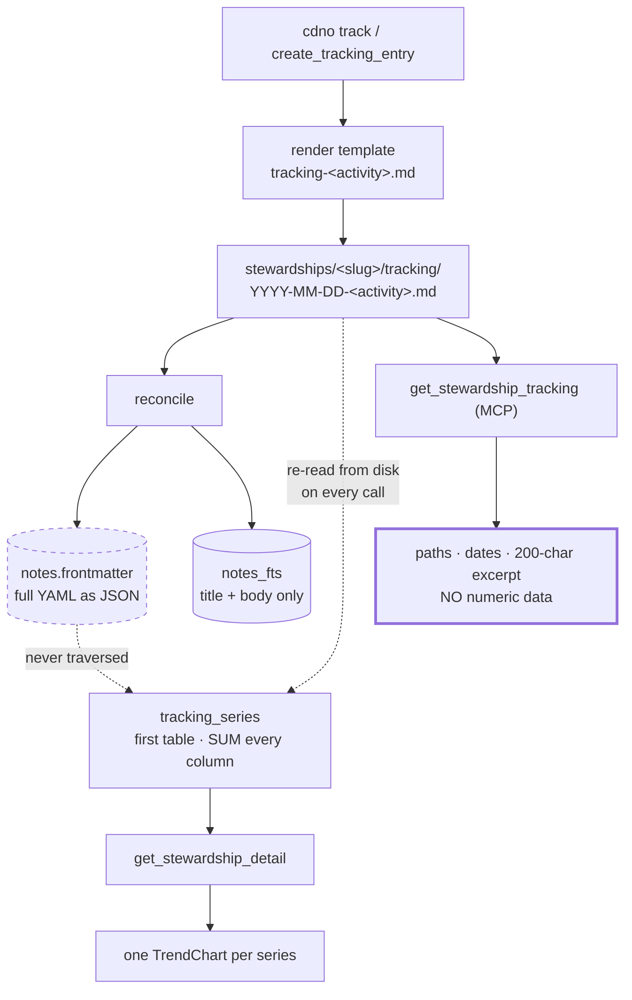
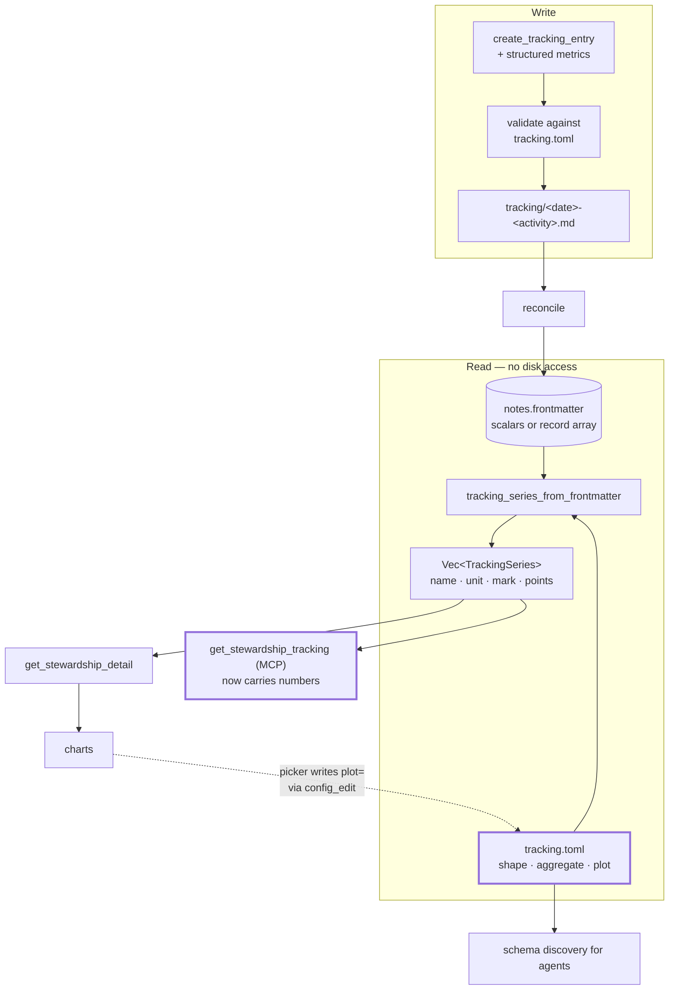

# RFC 0001 — Declarative tracking metrics

| | |
|---|---|
| **Status** | Draft — for discussion |
| **Affects** | `cdno-core`, `cdno-domain`, `cdno-mcp`, `cdno-tauri`, `ui` |
| **Related** | #453 (stewardship line parsing), #461 (stewardship detail draft bug) |

> **Authorship.** This RFC was produced collaboratively between the repository maintainer and
> Claude (Anthropic), and synthesises a working session that began as a status review of
> stewardship tracking and custom note types. The problem statement, the move to
> frontmatter-held metrics, the repeated-record shape, the scoped-config design, and the
> insistence that tracking not be shaped around any one domain are the maintainer's; the
> codebase archaeology, failure analysis, and drafting are Claude's. Decisions that emerged
> from the exchange are recorded where they matter.

---

## 1. Summary

Move tracking metrics from **markdown tables in a note's body** to **declared, structured data
in its frontmatter**, and introduce a scoped config file — `.cuaderno/tracking.toml` — declaring
each activity's shape, per-metric **aggregation**, and how (or whether) each metric is plotted.

The central correctness change is that **aggregation becomes a per-metric declaration instead of
a single universal rule**. Today every numeric column is summed. Summing is correct for totals
and wrong for everything else, which is why the current engine misreports account balances,
body measurements, ratings, and per-item values alike.

The central capability change is **grouping**: an entry that records several comparable items at
once fans out into one independent series per item, so each can be followed over time on its own
— spend per category, minutes per subject, progression per tracked item. §6.2 walks this through
with a worked example.

---

## 2. Motivation

### 2.1 One aggregation rule cannot fit every metric

`Vault::tracking_series` (`crates/cdno-domain/src/vault/context.rs:603`) parses the **first
table** in a tracking note's body and **sums each column** into one point per date.

But tracked quantities fall into at least four kinds, and only the first of them sums:

| Kind | Examples | Correct aggregate | Sum gives |
|---|---|---|---|
| **Total** | amount spent, pages read, minutes practised, repetitions | `sum` | ✅ correct |
| **Level** | account balance, body measurement, a top value reached | `last` / `max` | ❌ nonsense — adds successive readings of the same thing |
| **Rate / rating** | a score out of 10, perceived difficulty, satisfaction | `mean` | ❌ grows with how often you record |
| **Occurrence** | a call made, a visit, a practice session | `count` | ❌ meaningless if the column is a flag |

The code's own doc comment concedes the limitation:

> Per-column sums are the canonical *raw* aggregate this layer can compute **without knowing
> column semantics** … meaningful for counts … noise for [per-item values] — picking which
> series to chart is the consumer's job.

This is not hypothetical. The shipped example template
`examples/templates/tracking/body.md` is long-format — one metric per row, sharing a single
`Value` column — so filling it in produces one series that adds unrelated measurements
together. The unit test documenting correct behaviour
(`tracking_series_single_row_measurement_is_the_value_itself`) uses a **one-row** table, which
is not the shape the shipped template hands the user.

The same defect appears wherever a column holds a *level* rather than a *total* — a savings
balance recorded across several rows, a measurement taken twice in a session, a per-item value
in a multi-row table.

### 2.2 There is no way to group by an entity

Many tracked things are naturally *per category*: spending by budget line, minutes by activity
type, contact by person, practice by piece. The engine sums a **whole column** and has no
group-by, so the only workaround is to promote every category to its own column — which fixes
the category set at table-design time and breaks when it changes.

### 2.3 Metrics are invisible to agents

`get_stewardship_tracking` returns note paths, dates, an optional duration, and a 200-character
body excerpt (`crates/cdno-mcp/src/context.rs:326`; DTO at `dto.rs:829`). **`tracking_series` is
not exposed over MCP at all.**

An agent asked "is this trending up?" must open and parse every tracking note itself. The chart
layer and the agent layer see different data, and the gap widens as a vault grows.

### 2.4 Charts do not scale

The backend emits every derivable series; the UI draws all of them, narrowed only by ephemeral
React state that resets on navigation
(`ui/src/views/stewardships/StewardshipDetail.tsx:107`). The component's own comment records
the breakdown: three activities × three metrics is nine charts in one column — "roughly 1600px
of scroll with no way to narrow it." Nine was already too many, and the filter forgets.

### 2.5 The better substrate exists and is unused

The index already stores the **full frontmatter as JSON**:

```sql
-- crates/cdno-core/migrations/001_initial.sql
CREATE TABLE notes (
    path          TEXT PRIMARY KEY,
    note_type     TEXT NOT NULL,
    ...
    frontmatter   TEXT NOT NULL,          -- full frontmatter as JSON
    ...
);
```

`NoteEntry.frontmatter` is a `serde_json::Value` — "deserialised on the way out so callers get a
structured value" (`crates/cdno-core/src/index.rs:299`) — and `json_extract` is the documented
access pattern, already used in production (`SCHEMA.md:277`).

Body tables are **not indexed at all**. `tracking_series` re-opens and re-parses every tracking
file on every call, even though `list_by_type` already handed it the parsed frontmatter.

The module's own doc comment describes the design this RFC restores:

> The frontmatter is the time-series substrate …; the body holds the rich, activity-specific
> detail … read on demand rather than indexed.
> — `crates/cdno-domain/src/frontmatter/tracking.rs:6-9`

The implementation inverted it: frontmatter carries one number, and it never reaches a chart.

---

## 3. The shapes of tracking

Any design here must cover more than one domain. The following span the space and are used as
worked examples throughout.

| Domain | Per-entry shape | Grouping | Metric kinds | What matters most |
|---|---|---|---|---|
| **Spending** | many records/day | by category | total | correct sums; recording after the fact |
| **Savings** | one scalar | none | **level** | `last`, never `sum` |
| **Reading** | one or two scalars | none (the *book* is an entity, not a metric) | total | cadence as much as magnitude |
| **Staying in touch** | occurrence, often no number at all | by person | **occurrence** | did it happen this period |
| **Practice / study** | scalars + a rating | by subject | total + **rate** | mixed kinds in one entry |
| **Physical training** | many records/entry | by movement | total + **level** | two kinds in one record |

Three structural lessons fall out:

1. **Some tracking has no numbers.** Staying in touch with someone is a *cadence*, and the
   existing 12-week ISO sparkline already serves it. The design must degrade to "declare no
   metrics" without ceremony.
2. **Some entries hold repeated records, most hold scalars.** Both must be first class; neither
   should be the archetype.
3. **Entities are not metrics.** A book, a person, a piece of music is a thing with its own
   state (status, author, rating), not a column. Those belong in **custom note types** linked
   by wikilink from the tracking entry — the mechanism already exists (`[note_types.<name>]`,
   `docs-site/src/reference/custom-note-types.md`). This RFC deliberately does not try to
   absorb them. See §6.4.

---

## 4. Background — how tracking works today



The dashed edge from indexed frontmatter is never traversed, and the MCP branch terminates
without numbers.

---

## 5. Proposal

### 5.1 Entry shapes — scalars and repeated records, both first class

**Scalar entry** — the common case. Savings, reading, a study session:

```yaml
---
type: tracking
stewardship: finances
activity: savings
date: 2026-07-25
balance: 12480.50        # a LEVEL — must not be summed
contributed: 400.00      # a TOTAL
---
```

**Repeated records** — when one entry contains several comparable items. Spending, a training
session, a practice block:

```yaml
---
type: tracking
stewardship: finances
activity: spend
date: 2026-07-25
detail:
  - { category: groceries, amount: 42.10 }
  - { category: transport, amount: 12.00 }
  - { category: groceries, amount:  8.75 }
---
```

A **sequence of flat records**, not a mapping. Repetition is the point — the same category
recurs within one entry, which a mapping keyed by category cannot express.

> **Decision.** An earlier draft used single-key wrappers (`- groceries: { amount: 42.10 }`).
> Rejected: reading it needs two `json_each` hops because the key is unknown until you unnest,
> it maps to an awkward `Vec<HashMap<String, _>>` in Rust with nothing guaranteeing one key, and
> the category becomes un-validatable because keys are not fields. The records form is
> isomorphic and easier on every axis.

**Occurrence-only entry** — no metrics at all, and that is a complete, valid use:

```yaml
---
type: tracking
stewardship: family
activity: call
date: 2026-07-25
person: "[[people/a-relative]]"    # wikilink to a custom note type
---
```

#### Verified safe against existing machinery

| Concern | Finding |
|---|---|
| Does nested YAML parse? | Yes. `Frontmatter` keeps arbitrary `serde_yaml::Value` below the top level; only the top level must be a string-keyed mapping (`crates/cdno-core/src/frontmatter.rs:56-70`) |
| Survives `cdno normalise`? | Yes. `reorder_frontmatter` moves whole line-groups and never re-emits YAML; `top_level_key` rejects candidates containing whitespace, which every `- ` sequence entry has (`crates/cdno-domain/src/vault/normalise.rs:192-195, 268-277`) |
| Nested wikilinks still backlink? | Yes. `extract_frontmatter_wikilinks` walks Arrays and Objects depth-first (`crates/cdno-core/src/extractors.rs:233-245`) — so the `person:` link above resolves |
| Reaches the index? | Yes, as nested JSON, via `Frontmatter::as_json` |

One hazard: `as_json` ends in `.unwrap_or(serde_json::Value::Null)` (`frontmatter.rs:125`). YAML
permits mapping keys JSON cannot represent; on failure **the whole field indexes as `null` with
no error surfaced**. See §7.4.

### 5.2 A scoped config file — `.cuaderno/tracking.toml`

```toml
# Shape and presentation for tracked activities.
# Loaded if present; an absent file is not an error.

# --- Repeated records, grouped by a field -----------------------------
[tracking.spend]
records  = "detail"        # frontmatter key holding the records
group_by = "category"      # one series per distinct value

[tracking.spend.metrics.amount]
type = "float"; aggregate = "sum"; unit = "EUR"; plot = "column"

# The same figure, ungrouped: one daily total alongside the per-category
# lines. `group_by` is overridable per metric -- see §6.2.
[tracking.spend.metrics.day_total]
type = "float"; derived = "amount"; aggregate = "sum"
group_by = "none"; unit = "EUR"; plot = "line"

# --- A LEVEL: the defect in §2.1, declared away ------------------------
[tracking.savings]
[tracking.savings.metrics.balance]
type = "float"; aggregate = "last"; unit = "EUR"; plot = "line"
[tracking.savings.metrics.contributed]
type = "float"; aggregate = "sum";  unit = "EUR"; plot = "column"

# --- Plain scalars ----------------------------------------------------
[tracking.reading]
[tracking.reading.metrics.pages]
type = "int"; aggregate = "sum"; plot = "column"
[tracking.reading.metrics.minutes]
type = "int"; aggregate = "sum"; plot = "none"      # collected, not drawn

# --- Mixed kinds in one activity --------------------------------------
[tracking.practice]
group_by = "subject"
[tracking.practice.metrics.minutes]
type = "int"; aggregate = "sum";  plot = "column"
[tracking.practice.metrics.focus]
type = "int"; aggregate = "mean"; plot = "line"     # a RATE

# --- Cadence only: no metrics block at all ----------------------------
[tracking.call]
group_by = "person"
```

**Why a separate file rather than `config.toml`.** Presentation is configuration, not note data,
and a global config would accumulate every activity of every stewardship. A scoped file keeps
`config.toml` uncluttered while retaining the two properties a note-held declaration loses:
validation at vault-open, and discovery through the existing config read path.

**Why a fixed path rather than a `tracking_config = "..."` pointer.** A pointer buys relocation
at the cost of path resolution, a vault-escape guard (`..`, absolute, `\` — already handled for
`note_types.folder` at `crates/cdno-core/src/config.rs:428`), and a watcher predicate that can
no longer be an exact match. An override key can follow if a concrete need appears.

**Why keyed on activity.** Template resolution already discriminates on activity alone
(`tracking-<activity>.md`, no stewardship in the path), so this is consistent with existing
behaviour. `[tracking.<stewardship>.<activity>]` can be added if two stewardships ever collide.

### 5.3 Derived metrics

Some quantities are products of others — a total from a unit price and a count, a load from a
weight and a repetition count, a cost from a rate and a duration:

```toml
[tracking.commute.metrics.cost]
type = "float"; derived = "km * rate_per_km"; aggregate = "sum"; unit = "EUR"; plot = "line"
```

Evaluated per record, then aggregated. Deliberately minimal — see §8.2.1.

### 5.4 Proposed data flow



### 5.5 Agent round trip

```mermaid
sequenceDiagram
    participant Ag as Agent
    participant MCP as cdno-mcp
    participant V as Vault
    participant IX as Index

    Ag->>MCP: get_stewardship_tracking(stewardship, activity)
    MCP->>V: read tracking.toml + entries
    V-->>MCP: schema + aggregated series
    MCP-->>Ag: "records: detail; fields: category, amount"

    Note over Ag: emits a conforming payload —<br/>no guessing, no config.toml read

    Ag->>MCP: create_tracking_entry(metrics: {...}, date: ...)
    MCP->>V: validate against schema
    alt conforms
        V->>IX: write + reconcile
        V-->>Ag: {path, message}
    else violates
        V-->>Ag: error naming the offending field
    end
```

---

## 6. Detailed design

### 6.1 Config types (`cdno-core`)

```rust
/// One activity's tracking contract, from `[tracking.<activity>]`.
#[derive(Debug, Clone, Deserialize, Default)]
pub struct TrackingSpec {
    /// Frontmatter key holding repeated records. `None` = scalar metrics
    /// read straight off the frontmatter.
    pub records: Option<String>,
    /// Field to split series by — a category, a subject, a person.
    pub group_by: Option<String>,
    /// May be empty: a cadence-only activity declares no metrics.
    #[serde(default)]
    pub metrics: HashMap<String, MetricSpec>,
}

#[derive(Debug, Clone, Deserialize)]
pub struct MetricSpec {
    /// Reuses the existing `FieldType`, extended with `Float` (§7.1).
    #[serde(rename = "type")]
    pub ty: FieldType,
    /// The correctness fix: declared per metric, not assumed globally.
    #[serde(default)]
    pub aggregate: Aggregate,
    /// Expression over sibling numeric fields, applied per record.
    pub derived: Option<String>,
    /// Overrides the activity's `group_by` for this metric alone.
    /// `None` inherits it; `Some("none")` collapses across all records so
    /// the metric yields one entry-level series (see §6.2).
    pub group_by: Option<String>,
    pub unit: Option<String>,
    #[serde(default)]
    pub plot: PlotKind,
}

#[derive(Debug, Clone, Copy, Deserialize, Default)]
#[serde(rename_all = "lowercase")]
pub enum Aggregate {
    /// Totals — the only kind the current engine handles correctly.
    #[default] Sum,
    /// Levels: a balance, a measurement, a top value.
    Last, Max, Min,
    /// Rates and ratings.
    Mean,
    /// Occurrences.
    Count,
}

#[derive(Debug, Clone, Copy, Deserialize, Default)]
#[serde(rename_all = "lowercase")]
pub enum PlotKind {
    /// Collected and queryable, but not drawn. The default, so declaring
    /// metrics never changes the UI until you opt in.
    #[default] None,
    Line, Column, Area, Scatter,
}
```

### 6.2 Series derivation (`cdno-domain`)

```rust
/// Numeric series lifted from tracking-note *frontmatter*, per the
/// activity's declared contract. Unlike `tracking_series`, this reads the
/// frontmatter the index already holds — no file is opened.
pub fn tracking_series_from_frontmatter(
    &self,
    stewardship: &str,
    specs: &HashMap<String, TrackingSpec>,
) -> Result<Vec<TrackingSeries>, DomainError> {
    // name -> date -> the values contributing to that date's point
    let mut acc: BTreeMap<String, BTreeMap<NaiveDate, Vec<f64>>> = BTreeMap::new();

    for entry in self.index.list_by_type(NoteType::Tracking.as_str())? {
        // `entry.frontmatter` is already parsed JSON — no store.read_file.
        let fm = &entry.frontmatter;
        if str_field(fm, "stewardship") != Some(stewardship) { continue }
        let (Some(activity), Some(date)) = (str_field(fm, "activity"), date_field(fm)) else { continue };
        let Some(spec) = specs.get(activity) else { continue };

        // Scalar activity -> one pseudo-record; record activity -> the array.
        for record in records_of(fm, spec) {
            let group = spec.group_by.as_deref().and_then(|g| str_field(&record, g));
            for (metric, mspec) in &spec.metrics {
                let Some(v) = value_of(&record, metric, mspec) else { continue };  // honours `derived`
                acc.entry(series_name(activity, group, metric))
                   .or_default().entry(date).or_default().push(v);
            }
        }
    }

    Ok(finalise(acc, specs))   // apply each metric's Aggregate; attach unit + mark
}
```

Series are named `"<activity> · [<group> · ]<metric>"`.

#### Two levels of aggregation

This is the part most easily missed, so it is worth stating plainly:

1. **Within an entry** — all records sharing a `group_by` value collapse to **one value per
   metric**, using that metric's declared `aggregate`.
2. **Across entries** — those collapsed values become **one point per date**. No aggregation
   happens at this level; the series is simply the sequence of points.

`group_by` therefore does not split *notes*. It splits *series*, and each note contributes at
most one point to each series it touches.

#### Worked example: independent series from one shared entry

A common need is to follow one item's progress over time when every entry records several
items together. Given this declaration:

```toml
[tracking.stability-routine]
records  = "detail"
group_by = "exercise"

[tracking.stability-routine.metrics.kg]
type = "float"; aggregate = "max"; unit = "kg"; plot = "line"
[tracking.stability-routine.metrics.reps]
type = "int";   aggregate = "sum"; plot = "none"
```

and three entries a week apart:

```yaml
# 2026-07-06                  # 2026-07-13                  # 2026-07-20
detail:                       detail:                       detail:
  - {exercise: chest-press,     - {exercise: chest-press,     - {exercise: chest-press,
     reps: 10, kg: 15}             reps: 10, kg: 17.5}           reps: 11, kg: 17.5}
  - {exercise: chest-press,     - {exercise: chest-press,     - {exercise: face-pull,
     reps: 8,  kg: 15}             reps: 9,  kg: 17.5}           reps: 15, kg: 27.5}
  - {exercise: face-pull,       - {exercise: face-pull,       - {exercise: row,
     reps: 15, kg: 25}             reps: 15, kg: 27.5}           reps: 12, kg: 30}
```

three entries yield **five independent series**:

| Series | 07-06 | 07-13 | 07-20 | Within-entry aggregate |
|---|---|---|---|---|
| `stability-routine · chest-press · kg` | 15 | 17.5 | 17.5 | `max` of that day's records |
| `stability-routine · chest-press · reps` | 18 | 19 | 11 | `sum` — 10+8, 10+9, 11 |
| `stability-routine · face-pull · kg` | 25 | 27.5 | 27.5 | `max` |
| `stability-routine · face-pull · reps` | 15 | 15 | 15 | `sum` |
| `stability-routine · row · kg` | — | — | 30 | first appears 07-20 |

The first row is the case this design exists to serve: one item's progression over time,
extracted from entries that each contain several items. The declared `max` is what makes it a
progression rather than a sum of unrelated records.

The same mechanism, other domains: `group_by = "category"` on spending gives one spend line per
budget category; `group_by = "subject"` on practice gives minutes per subject; `group_by =
"person"` on contact gives a cadence series per person.

#### Missing values are gaps, not zeros

- **A skipped item leaves a gap.** `row` has no point before 07-20 because it was not recorded
  — not because its value was zero. Zero-filling would draw a false line up from the axis.
- **A new value starts a new series automatically**, with no config change: `row` appears the
  moment it appears in the data. This is the main advantage over promoting categories to
  columns, which fixes the set at table-design time.

#### Consequence for the UI — a second filter level is required

The UI's `activityOf` splits on the **first** `" · "`
(`ui/src/views/stewardships/StewardshipDetail.tsx:38-40`), so a three-part name groups under the
correct activity with no frontend change to *grouping*. But **filtering** is a different matter:
every series above collapses into one `stability-routine` chip, so eight grouped values × two
plotted metrics is sixteen charts behind a single filter option — worse than the nine-chart
problem §2.4 describes.

`group_by` therefore requires a **second filter level keyed on the middle segment**. This is new
frontend work, tracked in §9 Tier 2, not a free ride on the existing naming convention.

#### Per-metric grouping override

Grouping is declared per activity, but some metrics want the session total rather than the
per-item split — a daily spend total alongside per-category lines, total practice minutes
alongside per-subject ones. `group_by` is therefore overridable per metric:

```toml
[tracking.stability-routine.metrics.tonnage]
type = "float"; derived = "reps * kg"; aggregate = "sum"
group_by = "none"        # collapse across all records -> one series for the whole entry
plot = "line"
```

An absent `group_by` on a metric inherits the activity's; `"none"` collapses it.

For the earlier scalar cases nothing changes: `savings · balance` has no records to group and
takes the **last** reading rather than a running sum.

### 6.3 DTO extension

```rust
pub struct TrackingSeries {
    pub name: String,
    pub points: Vec<TrackingPoint>,
    pub unit: Option<String>,      // new
    pub label: Option<String>,     // new — display name; defaults to `name`
    pub mark: Option<PlotKind>,    // new — declared; falls back to the heuristic
}
```

Additive; `ts-rs` regenerates the bindings. `markForSeries`
(`ui/src/components/charts/TrendChart.tsx:37`), which today infers column-vs-line from whether
every value is an integer, becomes the **fallback** when `mark` is absent rather than the only
rule.

### 6.4 What this deliberately does not absorb

Entities — a book, a person, a supplier, a piece of music — are **not** metrics. They have their
own state (status, author, counterparty, rating) and belong in a **custom note type**, linked
from the tracking entry by wikilink:

```toml
# .cuaderno/config.toml
[note_types.book]
folder = "books"
required = ["title"]
optional = ["author", "status", "rating", "finished"]
```

Because `extract_frontmatter_wikilinks` walks nested values, a `book:` or `person:` field in a
tracking entry produces a real backlink, and the entity note accumulates every session that
touched it. **Tracking is the time series; the custom note type is the entity; wikilinks are the
join.** Trying to express entities as series would mean one series per entity, which does not
scale and misuses the model.

### 6.5 Querying works before any of this ships

Because frontmatter is already indexed as JSON, records are queryable the moment they are
written:

```sql
-- Spend by category, current month
SELECT json_extract(r.value, '$.category')      AS category,
       SUM(json_extract(r.value, '$.amount'))   AS total
FROM notes n, json_each(n.frontmatter, '$.detail') AS r
WHERE n.note_type = 'tracking'
  AND json_extract(n.frontmatter, '$.activity') = 'spend'
  AND json_extract(n.frontmatter, '$.date') >= '2026-07-01'
GROUP BY category
ORDER BY total DESC;
```

```sql
-- Latest savings balance — the query the current engine cannot express
SELECT json_extract(frontmatter, '$.date')    AS on_date,
       json_extract(frontmatter, '$.balance') AS balance
FROM notes
WHERE note_type = 'tracking'
  AND json_extract(frontmatter, '$.activity') = 'savings'
ORDER BY on_date DESC LIMIT 1;
```

---

## 7. Compatibility and risks

### 7.1 `FieldType` has no float

`FieldType` is `Bool | Int | String | Date` (`crates/cdno-core/src/config.rs:115`). Currency,
measurements, rates, and durations in fractional units cannot be *declared*. Adding `Float` is a
small enum arm plus a validation branch, and it **blocks this RFC** for any non-integer metric.

### 7.2 Live reload of the new file

`crates/cdno-tauri/src/watcher.rs:568` and `events.rs:231` match `.cuaderno/config.toml`
**exactly**, deliberately, "so a stray `.cuaderno/templates/config.toml` could never trigger a
spurious rebuild." A second config file is invisible to live reload until an arm is added. Add a
second exact match; do not loosen the predicate.

### 7.3 Body tables keep working

`tracking_series` is unchanged and continues to serve activities with no declaration. The two
sources concatenate into the `series` vec `get_stewardship_detail` already returns
(`crates/cdno-tauri/src/commands/stewardships.rs:139`). No migration is forced.

### 7.4 Silent null on unrepresentable frontmatter

`Frontmatter::as_json` swallows conversion failures into `Null` (`frontmatter.rs:125`). For
agent-written structured data this is the worst failure mode — nothing errors, the series simply
has a hole. Should become an indexing error.

### 7.5 One entry per activity per day

`add_tracking_entry_with_vars` errors with `AlreadyExists` for a second entry on the same
`(activity, date)` (`crates/cdno-domain/src/vault/tracking.rs:127`). The rationale is sound —
"one merged note, not two silently-overwriting writes" — but **several domains are naturally
multi-occurrence**: spending happens throughout a day, calls happen more than once, practice can
be split morning and evening. A merge mode is required, not optional.

### 7.6 No backfill

Every surface injects `Local::now()`; the domain already accepts `at: NaiveDateTime`
(`tracking.rs:95`), so only the surfaces need a flag. `cdno log --at` is the precedent, one
match arm away (`crates/cdno-cli/src/main.rs:359`).

This is **disqualifying for reconciled domains**. Spending is recorded from a statement days
later; a balance is read when you happen to open the app; a call is remembered that evening.
Without a date parameter, none of these can be recorded truthfully, and no historical data can
be imported.

---

## 8. Drawbacks and unresolved questions

### 8.1 Drawbacks

- **A second config file** is a new concept, with its own load, validation and watch path.
- **Two coexisting metric sources** (body tables, frontmatter) until — or unless — tables are
  deprecated.
- **Frontmatter grows** for record-heavy entries. Acceptable, since the index holds it as JSON
  regardless, but it makes the raw file denser to read.
- **Declaration is upfront work.** Mitigated by `PlotKind::None` defaulting and by
  undeclared activities continuing to work through the existing path.

### 8.2 Unresolved

1. **How far should `derived` go?** A product of two sibling fields is useful; a full expression
   language is not wanted. Proposal: binary operations over sibling numeric fields only,
   rejected at config load otherwise.
2. **Composition charts (pie and similar).** Raised in discussion, and deliberately *not* folded
   into `PlotKind`: a pie shows composition at an instant, not a series over time, so it needs a
   different DTO (categories + magnitudes over a window), a different component, and a window
   selector. "Share of spend by category this month" is a real question, but it is separate
   work. It is also a different visual register from the deliberately austere existing charts —
   worth an explicit call.
3. **Should the UI picker write config?** Writing `plot =` back via the surgical `toml_edit`
   writer (`cdno-core`'s `config_edit`, #365) keeps the vault authoritative and the choice
   agent-visible. The alternative — ephemeral UI state — is cheaper but forgets, which is the
   status quo complaint.
4. **Does the Config view gain a tab for this file,** or stay raw-edit-only initially?
5. **Should body-table series eventually be deprecated,** or remain the low-ceremony path?
6. **Should `count` be implicit?** Every activity has an entry count already surfaced as the
   12-week sparkline. Declaring `count` explicitly may be redundant.

---

## 9. Implementation plan

### Tier 0 — unblocks everything (small, independent)

- Add `Float` to `FieldType` + validation arm — `crates/cdno-core/src/config.rs:115`.
- Add `metrics` and `date` to `CreateTrackingEntryInput` (`crates/cdno-mcp/src/input.rs:208`)
  and the domain write path. Today only `vars: HashMap<String, String>` exists — text
  substitution, which cannot carry structured data safely.
- Add `--at` to `cdno track`, mirroring `cdno log` (`crates/cdno-cli/src/main.rs:359`).
- Make `as_json`'s `.unwrap_or(Null)` an indexing error (`frontmatter.rs:125`).

### Tier 1 — the payoff

- `tracking_series_from_frontmatter` in `crates/cdno-domain/src/vault/context.rs`.
- Extend `TrackingSeries` with `unit` / `label` / `mark`; demote `markForSeries` to fallback.
- Carry series through `get_stewardship_tracking` (`crates/cdno-mcp/src/context.rs:326`).

### Tier 2 — the scoped config

- Load `.cuaderno/tracking.toml` if present, alongside `VaultConfig::load` (`config.rs:378`,
  path constant `paths.rs:74`); validate at vault-open.
- Add the second exact-match arm to the watcher predicate (`watcher.rs:568`, `events.rs:231`).
- Return the parsed schema from `get_stewardship_tracking` for agent discovery.
- **A second filter level keyed on the group segment** of a series name — required by §6.2, not
  optional. `group_by` multiplies series by the number of distinct grouped values, and the
  existing activity-level chip cannot narrow within an activity
  (`StewardshipDetail.tsx:38-40, 107`).
- UI chart picker writing `plot` back via `config_edit`, replacing the ephemeral `activities`
  state (`StewardshipDetail.tsx:107`).
- Merge mode for same-day entries (`tracking.rs:127`) — required by §7.5.

### Tier 3 — hygiene, independently valuable

- Rewrite `examples/templates/tracking/body.md` to wide format, and **broaden
  `examples/templates/tracking/` beyond fitness** — a spending and a reading variant at minimum,
  so the shipped examples stop implying tracking is for workouts.
- Document the aggregation contract and the metric-kind taxonomy (§2.1) in
  `docs-site/src/tutorials/stewardships-and-tracking.md` — currently discoverable only in a Rust
  doc comment.

### Later, separately

- Composition charts (§8.2.2).

### Recommended first slice

`Float` + the `metrics` write param + `tracking_series_from_frontmatter`, on **two** activities
— one scalar with a `last` aggregate, one record-based with `group_by` — with the specs
hardcoded before `tracking.toml` is parsed. Two activities rather than one, deliberately: a
single example would let a domain-specific assumption survive unnoticed, which is how the
current design acquired its bias.

---

## 10. Verification

- `cargo test --workspace`.
- **Aggregation kinds**, beside the existing block at
  `crates/cdno-domain/tests/unit/context_tests.rs:493` — one test per `Aggregate`, including a
  `last` metric where a sum would visibly compound, and a `mean` metric whose value does not
  change when a second entry is added the same day.
- **Grouping** (§6.2): a record activity with a repeated group value yields one series per
  distinct value, with within-entry values aggregated before the point is emitted. Assert the
  worked example directly — a group appearing twice in one entry produces **one** point whose
  value reflects that metric's aggregate, not two points.
- **Gaps, not zeros**: a group absent from an entry emits no point for that date, and a group
  first appearing mid-window starts its series there rather than being back-filled with zeros.
- **Per-metric `group_by` override**: a metric declaring `group_by = "none"` under a grouped
  activity yields a single entry-level series alongside the grouped ones.
- **Cadence-only**: an activity declaring no metrics produces no series and no error, and still
  appears in the 12-week sparkline.
- **Frontmatter round trip**, `crates/cdno-core/tests/unit/frontmatter_tests.rs`: a nested
  record sequence parses, reaches the index as a JSON array, and `as_json` now *errors* rather
  than nulling on unrepresentable input.
- **Normalise**, `normalise_tests.rs`: a record sequence survives reorder byte-for-byte, both
  indented and at column zero.
- **Config**: a malformed `tracking.toml` fails at vault-open with a clear error, not at first
  chart render; an absent file is not an error; an external edit live-reloads in the desktop app.
- **Backfill**: an entry written with an explicit past date lands at that date and appears in a
  window query covering it.
- **Through MCP**: `create_tracking_entry` with `metrics` then `get_stewardship_tracking`
  returns aggregated series; a payload violating the schema errors naming the field.
- **In the app**: one chart per metric whose `plot` is not `none`, with declared unit and mark;
  toggling the picker rewrites `tracking.toml` leaving neighbouring tables byte-identical.
  Covered by `StewardshipDetail.test.tsx` and `TrendChart.test.tsx`.
