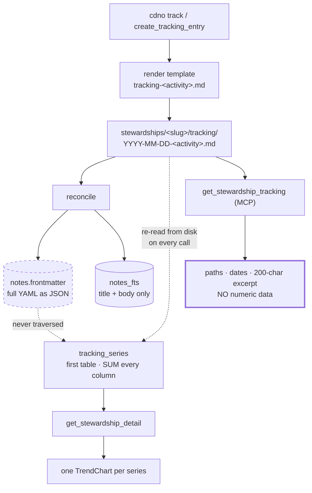
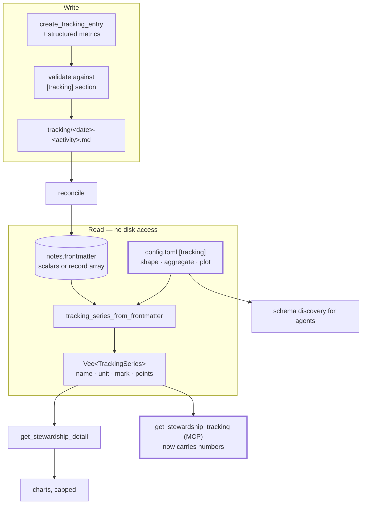

# RFC 0001 — Declarative tracking metrics

| | |
|---|---|
| **Status** | Draft — for discussion |
| **Affects** | `cdno-core`, `cdno-domain`, `cdno-mcp`, `cdno-tauri`, `ui` |
| **Related** | #453 (stewardship line parsing), #461 (stewardship detail draft bug) |

> **Authorship.** This RFC was produced collaboratively between the repository maintainer and
> Claude (Anthropic), and synthesises a working session that began as a status review of
> stewardship tracking and custom note types. The problem statement, the move to
> frontmatter-held metrics, the repeated-record shape, and the insistence that tracking not be
> shaped around any one domain are the maintainer's; the codebase archaeology, failure analysis,
> and drafting are Claude's. Decisions that emerged from the exchange are recorded where they
> matter.

---

## 1. Summary

Move tracking metrics from **markdown tables in a note's body** to **declared, structured data
in its frontmatter**, declared under a `[tracking]` section in `.cuaderno/config.toml` that
gives each activity its record shape, per-metric **aggregation**, and how (or whether) each
metric is plotted.

Two changes carry the weight:

- **Correctness — aggregation becomes a per-metric declaration.** Today every numeric column is
  summed. Summing is right for totals and wrong for levels, rates and occurrences.
- **Capability — grouping.** An entry recording several comparable items fans out into one
  independent series per item, so each can be followed on its own: spend per category, minutes
  per subject, progression per tracked item. §6.2 walks this through.

---

## 2. Motivation

### 2.1 One aggregation rule cannot fit every metric

`Vault::tracking_series` (`crates/cdno-domain/src/vault/context.rs:603`) parses the **first
table** in a tracking note's body and **sums each column** into one point per date.

Tracked quantities fall into at least four kinds, and only the first sums:

| Kind | Examples | Correct aggregate | Sum gives |
|---|---|---|---|
| **Total** | amount spent, pages read, minutes practised | `sum` | ✅ correct |
| **Level** | account balance, a measurement, a top value reached | `last` / `max` | ❌ adds successive readings of the same thing |
| **Rate / rating** | a score out of 10, perceived difficulty | `mean` | ❌ grows with how often you record |
| **Occurrence** | a call made, a visit | — (see §6.6) | ❌ meaningless if the column is a flag |

The code's own doc comment concedes the limitation:

> Per-column sums are the canonical *raw* aggregate this layer can compute **without knowing
> column semantics** … meaningful for counts … noise for [per-item values] — picking which
> series to chart is the consumer's job.

This is not hypothetical: the shipped `examples/templates/tracking/body.md` is long-format — one
metric per row sharing a single `Value` column — so filling it in produces one series that adds
unrelated measurements together. The test documenting correct behaviour
(`tracking_series_single_row_measurement_is_the_value_itself`) uses a **one-row** table, not the
shape the template hands the user.

**Where the fix actually bites.** For a single scalar per entry (a balance recorded once a day)
the defect is cured by the *shape change* alone — one value has nothing to sum with, so `last`,
`sum` and `mean` all return it unchanged. `Aggregate` earns its keep in three specific places:
multi-record entries, grouped collapse (§6.2), and merged same-day entries (§7.5). §1 should be
read with that scope in mind.

### 2.2 There is no way to group by an entity

Many tracked things are naturally per category: spending by budget line, minutes by subject,
contact by person. The engine sums a whole column and has no group-by, so the only workaround is
promoting every category to its own column — which fixes the set at table-design time.

### 2.3 Metrics are invisible to agents

`get_stewardship_tracking` returns note paths, dates, an optional duration, and a 200-character
body excerpt (`crates/cdno-mcp/src/context.rs:326`; DTO at `dto.rs:829`). **`tracking_series` is
not exposed over MCP at all.** An agent asked "is this trending up?" must open and parse every
tracking note itself.

### 2.4 Charts do not scale

The backend emits every derivable series; the UI draws all of them, narrowed only by ephemeral
React state (`ui/src/views/stewardships/StewardshipDetail.tsx:107`). The component's own comment
records the breakdown: three activities × three metrics is nine charts in one column, "roughly
1600px of scroll with no way to narrow it."

Grouping makes this worse before it makes it better — see §6.3.

### 2.5 The better substrate exists and is unused

The index already stores the **full frontmatter as JSON**:

```sql
-- crates/cdno-core/migrations/001_initial.sql
CREATE TABLE notes (
    path          TEXT PRIMARY KEY,
    note_type     TEXT NOT NULL,
    ...
    frontmatter   TEXT NOT NULL,          -- full frontmatter as JSON
    ...
);
```

`NoteEntry.frontmatter` is a `serde_json::Value`, "deserialised on the way out so callers get a
structured value" (`crates/cdno-core/src/index.rs:299`). `SCHEMA.md:61,277` documents
`json_extract` as the intended access path for this column, though **no Rust code queries it
today** — status filtering happens in the domain after `list_by_type` deserialises the blob. The
JSON1 capability is available (rusqlite `bundled`); the §6.7 queries would be the first to use
it.

Body tables are **not indexed at all**. `tracking_series` re-opens and re-parses every tracking
file on every call, even though `list_by_type` already handed it the parsed frontmatter.

The module's own doc comment describes the design this RFC restores:

> The frontmatter is the time-series substrate …; the body holds the rich, activity-specific
> detail … read on demand rather than indexed.
> — `crates/cdno-domain/src/frontmatter/tracking.rs:6-9`

---

## 3. The shapes of tracking

| Domain | Per-entry shape | Grouping | Metric kinds | What matters most |
|---|---|---|---|---|
| **Spending** | many records/day | by category | total | correct sums; recording after the fact |
| **Savings** | one scalar | none | **level** | `last`, never `sum` |
| **Reading** | one or two scalars | none (the *book* is an entity) | total | cadence as much as magnitude |
| **Staying in touch** | occurrence, often no number | by person | **occurrence** | did it happen this period |
| **Practice / study** | records + a rating | by subject | total + **rate** | mixed kinds in one entry |
| **Physical training** | many records/entry | by movement | total + **level** | two kinds in one record |

Three structural lessons:

1. **Some tracking has no numbers.** Cadence is served by the existing 12-week sparkline. The
   design must degrade to "declare no metrics" without ceremony.
2. **Scalars are the common case**, repeated records the minority. Both are first class; neither
   is the archetype.
3. **Entities are not metrics.** A book, a person, a piece of music has its own state and
   belongs in a **custom note type** linked by wikilink (§6.5).

---

## 4. Background — how tracking works today



---

## 5. Proposal

### 5.1 Entry shapes — scalars and repeated records, both first class

**Scalar entry** — the common case:

```yaml
---
type: tracking
stewardship: finances
activity: savings
date: 2026-07-25
balance: 12480.50        # a LEVEL
contributed: 400.00      # a TOTAL
---
```

**Repeated records** — when one entry contains several comparable items:

```yaml
---
type: tracking
stewardship: study
activity: practice
date: 2026-07-06
detail:
  - { subject: harmony,       minutes: 25, focus: 4 }
  - { subject: harmony,       minutes: 20, focus: 3 }
  - { subject: sight-reading, minutes: 15, focus: 5 }
---
```

A **sequence of flat records**, not a mapping — the same subject recurs within one entry, which
a mapping keyed by subject cannot express.

> **Decision.** An earlier draft used single-key wrappers (`- harmony: { minutes: 25 }`).
> Rejected: reading it needs two `json_each` hops because the key is unknown until you unnest, it
> maps to an awkward `Vec<HashMap<String, _>>` in Rust with nothing guaranteeing one key, and the
> subject becomes un-validatable because keys are not fields.

**Occurrence-only entry** — no metrics at all, a complete and valid use:

```yaml
---
type: tracking
stewardship: family
activity: call
date: 2026-07-25
person: "[[people/a-relative]]"
---
```

#### Verified safe against existing machinery

| Concern | Finding |
|---|---|
| Does nested YAML parse? | Yes. `Frontmatter` keeps arbitrary `serde_yaml::Value` below the top level; only the top level must be a string-keyed mapping (`crates/cdno-core/src/frontmatter.rs:56-70`) |
| Survives `cdno normalise`? | Yes. `reorder_frontmatter` moves whole line-groups and never re-emits YAML; `top_level_key` rejects candidates containing whitespace, which every `- ` sequence entry has (`crates/cdno-domain/src/vault/normalise.rs:192-195, 268-277`) |
| Nested wikilinks still backlink? | Yes. `extract_frontmatter_wikilinks` walks Arrays and Objects depth-first (`crates/cdno-core/src/extractors.rs:233-245`) |
| Reaches the index? | Yes, as nested JSON, via `Frontmatter::as_json` — but see §7.4 |

### 5.2 Declaration lives in `config.toml` under `[tracking]`

```toml
# --- Repeated records, grouped by a field -----------------------------
[tracking.practice]
records  = "detail"        # frontmatter key holding the records
group_by = "subject"       # one series per distinct value

[tracking.practice.metrics.minutes]
type      = "int"
aggregate = "sum"
unit      = "min"
plot      = "column"

[tracking.practice.metrics.focus]
type      = "int"
aggregate = "mean"         # a RATE — sum would grow with how often you log
plot      = "line"

# --- A LEVEL --------------------------------------------------------
[tracking.savings]

[tracking.savings.metrics.balance]
type      = "float"
aggregate = "last"
unit      = "EUR"
plot      = "line"

[tracking.savings.metrics.contributed]
type      = "float"
aggregate = "sum"
unit      = "EUR"
plot      = "column"

# --- Records with an entry-level total alongside ----------------------
[tracking.spend]
records  = "detail"
group_by = "category"

[tracking.spend.metrics.amount]
type      = "float"
aggregate = "sum"
unit      = "EUR"
plot      = "column"

[tracking.spend.metrics.day_total]
type      = "float"
derived   = "amount"
aggregate = "sum"
group_by  = "none"         # collapse across records -> one entry-level series
unit      = "EUR"
plot      = "line"

# --- Plain scalars ----------------------------------------------------
[tracking.reading]

[tracking.reading.metrics.pages]
type      = "int"
aggregate = "sum"
plot      = "column"

[tracking.reading.metrics.minutes]
type      = "int"
aggregate = "sum"
plot      = "none"         # collected and queryable, not drawn

# --- Cadence only: no metrics block at all ----------------------------
[tracking.call]
group_by = "person"
```

> **Decision — one config file, not two.** An earlier draft proposed a scoped
> `.cuaderno/tracking.toml`. Reversed: the two properties that motivated it — validation at
> vault-open and discovery through the config read path — are equally available from a section,
> and a section **rides the existing watcher for free**. A second file would have required its
> own load entry point, its own validation call, and new arms in *two* watcher predicates
> (§7.2). Its only remaining advantage was keeping `config.toml` short, which is aesthetic —
> the file already accumulates every `[note_types.*]` and `[schemas.*]`.

**Keyed on activity**, consistent with template resolution, which already discriminates on
activity alone (`tracking-<activity>.md`, no stewardship in the path).
`[tracking.<stewardship>.<activity>]` can be added if two stewardships ever collide.

### 5.3 Who writes this

**The agent is the primary author; hand-editing is the escape hatch.** Declaring
`aggregate`/`group_by`/`plot` is schema design, which is the opposite of this vault's one-line
capture ethos. The intended flow is that a user says "track my spending by category" and the
agent authors the section, having first read the shape back through `list_note_types` and the
schema read in §5.5. Stating this as a design commitment is what keeps §8.1's declaration burden
acceptable; if the mental model were "the user hand-writes TOML," the burden would be real.

### 5.4 Derived metrics

Some quantities are products of others — a cost from a rate and a distance, a load from a weight
and a count:

```toml
[tracking.commute.metrics.cost]
derived   = "km * rate_per_km"
aggregate = "sum"
unit      = "EUR"
plot      = "line"
```

Deliberately minimal, and **parsed into a typed AST at config load**, not kept as a string and
re-evaluated per record — the codebase's own "parse, don't validate" discipline. Grammar:

```
expr    := operand OP operand
operand := sibling-field-name | numeric-literal
OP      := '+' | '-' | '*'
```

One binary operation, no recursion, no function calls, no parentheses. **Division is excluded
from v1**: it is the one operator that manufactures NaN/Inf, which §7.7 has to keep out of the
aggregates. Anything outside the grammar, or naming a field absent from the record shape, is a
**vault-open error** naming the offending field — not a first-render surprise.

`type` is omitted for a derived metric: its output is always numeric, so declaring it invites a
silent contradiction (`type = "int"` on a fractional expression).

### 5.5 Agent round trip

```mermaid
sequenceDiagram
    participant Ag as Agent
    participant MCP as cdno-mcp
    participant V as Vault
    participant IX as Index

    Ag->>MCP: get_stewardship_tracking(stewardship, activity)
    MCP->>V: read [tracking] section + entries
    V-->>MCP: schema + aggregated series
    MCP-->>Ag: "records: detail; fields: subject, minutes, focus"

    Note over Ag: emits a conforming payload —<br/>no guessing, no config parsing

    Ag->>MCP: create_tracking_entry(metrics: {...}, date: ...)
    MCP->>V: validate against schema
    alt conforms
        V->>IX: write + reconcile
        V-->>Ag: {path, message}
    else violates
        V-->>Ag: error naming the offending field
    end
```

### 5.6 Proposed data flow



---

## 6. Detailed design

### 6.1 Config types (`cdno-core`)

```rust
/// One activity's tracking contract, from `[tracking.<activity>]`.
#[derive(Debug, Clone, Deserialize, Default)]
pub struct TrackingSpec {
    /// Frontmatter key holding repeated records. `None` = scalar metrics
    /// read straight off the frontmatter.
    pub records: Option<String>,
    /// Field to split series by — a category, a subject, a person.
    pub group_by: Option<String>,
    /// May be empty: a cadence-only activity declares no metrics.
    #[serde(default)]
    pub metrics: HashMap<String, MetricSpec>,
}

#[derive(Debug, Clone, Deserialize)]
pub struct MetricSpec {
    /// Reuses `FieldType`, extended with `Float` (§7.1). Omitted for a
    /// derived metric, whose output is numeric by construction (§5.4).
    #[serde(rename = "type")]
    pub ty: Option<FieldType>,
    /// The correctness fix: declared per metric, not assumed globally.
    #[serde(default)]
    pub aggregate: Aggregate,
    /// Parsed to a typed AST at config load, never re-parsed per record.
    pub derived: Option<DerivedExpr>,
    /// Overrides the activity's `group_by`. `None` inherits it;
    /// `Some("none")` collapses across all records (§6.2).
    pub group_by: Option<String>,
    pub unit: Option<String>,
    #[serde(default)]
    pub plot: PlotKind,
    /// Reserved for the time-reduction axis (§8.3). Rejected at config
    /// load today; declared so adding it later is not a breaking change.
    #[serde(default)]
    pub window: Option<String>,
}

#[derive(Debug, Clone, Copy, PartialEq, Eq, Deserialize, Serialize, Default)]
#[cfg_attr(feature = "ts-bindings", derive(ts_rs::TS))]
#[cfg_attr(feature = "ts-bindings", ts(export))]
#[serde(rename_all = "lowercase")]
pub enum Aggregate {
    /// Totals — the only kind the current engine handles correctly.
    #[default] Sum,
    /// Levels: a balance, a measurement, a top value.
    Last, Max, Min,
    /// Rates and ratings.
    Mean,
}

/// Presentation vocabulary. Carried here for the same reason `FieldType`
/// is — it is deserialised from config — but it is the one type in core
/// that core neither parses for itself nor interprets; it flows through to
/// the DTO. Called out as a deliberate exception to core's
/// no-domain-knowledge contract.
#[derive(Debug, Clone, Copy, PartialEq, Eq, Deserialize, Serialize, Default)]
#[cfg_attr(feature = "ts-bindings", derive(ts_rs::TS))]
#[cfg_attr(feature = "ts-bindings", ts(export))]
#[serde(rename_all = "lowercase")]
pub enum PlotKind {
    /// Collected and queryable, but not drawn. The default, so declaring
    /// metrics never changes the UI until you opt in.
    #[default] None,
    Line, Column, Area, Scatter,
}
```

`Aggregate` and `PlotKind` both cross the config → DTO → TypeScript boundary, so both carry
`Serialize` and the `ts-rs` pair, mirroring `FieldType` (`config.rs:111-114`).

**`Count` is deliberately absent.** It reduces record *presence*, not a field's values, unlike
every other arm — and the occurrence activity it would serve declares no metrics at all, so
there is no `MetricSpec` to hang it on. Occurrence counting is handled structurally in §6.6.

### 6.2 Series derivation (`cdno-domain`)

```rust
/// Identifies one series. Keyed on a typed tuple, never on the formatted
/// display name — a group value may legitimately contain the `·` used as
/// the display separator.
#[derive(PartialEq, Eq, Hash, PartialOrd, Ord)]
struct SeriesKey { activity: String, group: Option<String>, metric: String }

pub fn tracking_series_from_frontmatter(
    &self,
    stewardship: &str,
    specs: &HashMap<String, TrackingSpec>,
) -> Result<Vec<TrackingSeries>, DomainError> {
    // Values are pushed in document order; `last` depends on it (§6.4).
    let mut acc: BTreeMap<SeriesKey, BTreeMap<NaiveDate, Vec<f64>>> = BTreeMap::new();

    for entry in self.index.list_by_type(NoteType::Tracking.as_str())? {
        // `entry.frontmatter` is already parsed JSON — no store.read_file.
        let fm = &entry.frontmatter;
        if str_field(fm, "stewardship") != Some(stewardship) { continue }
        let (Some(activity), Some(date)) = (str_field(fm, "activity"), date_field(fm))
            else { continue };
        let Some(spec) = specs.get(activity) else { continue };

        // Scalar activity -> one pseudo-record; record activity -> the array,
        // in document order.
        for record in records_of(fm, spec) {
            for (metric, mspec) in &spec.metrics {
                let group = mspec.group_for(spec).and_then(|g| group_key(&record, g));
                // `value_of` honours `derived`, and drops any non-finite
                // result: NaN/Inf poison sums and panic naive max/min (§7.7).
                let Some(v) = value_of(&record, metric, mspec).filter(|v| v.is_finite())
                    else { continue };
                acc.entry(SeriesKey { activity: activity.into(), group, metric: metric.clone() })
                   .or_default().entry(date).or_default().push(v);
            }
        }
    }

    Ok(finalise(acc, specs))   // reduce each cell; attach unit + mark + display name
}
```

Display names are formatted only at the end, as `"<activity> · [<group> · ]<metric>"`.

#### One reduction per `(series, date)` cell

Every value from every record lands in `acc[key][date]`, and `finalise` applies the metric's
`Aggregate` to that per-date vector. There is **one** reduction, not two:

- With **one entry per date** (today's guard), the vector holds that entry's records, so the
  reduction is a within-entry collapse and the series is the sequence of those collapses.
- With **merge** (§7.5), two same-date entries share the cell, and the *same* rule reduces
  across both. This is deliberate and must be understood: merge does not add a level, it widens
  what the existing cell contains.

`group_by` does not split *notes*. It splits *series*, and each date contributes at most one
point to each series it touches.

#### Worked example

Given the `[tracking.practice]` declaration in §5.2 and three entries a week apart — shown side
by side for comparison, so this is a layout rather than a copyable snippet:

```text
# 2026-07-06                     # 2026-07-13                     # 2026-07-20
detail:                          detail:                          detail:
  - {subject: harmony,             - {subject: harmony,             - {subject: harmony,
     minutes: 25, focus: 4}           minutes: 30, focus: 4}           minutes: 35, focus: 5}
  - {subject: harmony,             - {subject: sight-reading,       - {subject: ear-training,
     minutes: 20, focus: 3}           minutes: 20, focus: 4}           minutes: 10, focus: 3}
  - {subject: sight-reading,
     minutes: 15, focus: 5}
```

three entries yield **six independent series**:

| Series | 07-06 | 07-13 | 07-20 | Cell reduction |
|---|---|---|---|---|
| `practice · harmony · minutes` | 45 | 30 | 35 | `sum` — 25+20 |
| `practice · harmony · focus` | 3.5 | 4 | 5 | `mean` — (4+3)/2 |
| `practice · sight-reading · minutes` | 15 | 20 | — | `sum` |
| `practice · sight-reading · focus` | 5 | 4 | — | `mean` |
| `practice · ear-training · minutes` | — | — | 10 | `sum` |
| `practice · ear-training · focus` | — | — | 3 | `mean` |

Two things the flat-table engine cannot do are visible in one entry: **`minutes` sums while
`focus` averages** over the same two records, and each subject is followed independently.

The same mechanism elsewhere: `group_by = "category"` on spending gives a line per budget
category; `group_by = "person"` on contact gives a cadence series per person; `group_by =
"movement"` with `aggregate = "max"` on training gives per-movement progression rather than a
sum of unrelated records.

#### Missing values are gaps, not zeros

- **A skipped item leaves a gap.** `sight-reading` has no point on 07-20 because it was not
  recorded, not because it was zero. Zero-filling would draw a false line to the axis.
- **A new value starts a new series automatically**: `ear-training` appears the moment it appears
  in the data, with no config change. This is the main advantage over promoting categories to
  columns.

#### Per-metric grouping override

Some metrics want the entry-level total rather than the per-item split — a daily spend total
beside per-category lines. `group_by` is overridable per metric; `"none"` collapses it, an
absent value inherits the activity's. See `[tracking.spend.metrics.day_total]` in §5.2.

### 6.3 Consequence for the UI — cap first, filter second

`activityOf` splits on the **first** `" · "` (`StewardshipDetail.tsx:38-40`), so a three-part
name groups under the correct activity with no change to *grouping*. Presentation is another
matter: a grouped metric fans out to *N* charts, and **N grows on its own** as new values appear
in the data. One `plot = "line"` therefore becomes a silently expanding grid.

> **Decision — cap, don't only filter.** A second filter level would *manage* the growth; it
> would not *bound* it. The direction is a **default cap** — draw the top N series (by recency
> or magnitude) with an explicit "show all" — consistent with the capping the shell already
> applies elsewhere (#460). A grouped filter may follow if the cap proves insufficient in
> practice; this RFC sets the direction rather than specifying every case.

Two further UI positions, so implementation does not have to guess:

- **The ephemeral activity filter stays ephemeral.** Resetting to the full picture on navigation
  is correct: persistent hiding is out-of-sight-out-of-mind. §2.4's "the filter forgets" is a
  complaint about *looking*, and must not be answered by persisting a *declaration*.
- **Plot kind persists only through an explicit, labelled action**, routed through the same
  validate → compare-and-swap → write → live-reload gate every other config mutation uses
  (`Config.tsx`, `useConfigDraft`, the `config_edit` writer from #365). A chart tap must never
  fire a background TOML write that could then live-reload and race a hand-edit.

### 6.4 `last` needs an order, and `NaiveDate` does not provide one

`add_tracking_entry_with_vars` does `let date = at.date()`, discarding the time
(`crates/cdno-domain/src/vault/tracking.rs:128`), and `TrackingFrontmatter.date` is a
`NaiveDate` (`frontmatter/tracking.rs:29`). `sum`, `mean`, `max` and `min` are order-independent;
**`last` is not** — and §2.1's own motivating scenario is a level read more than once.

The resolution, without a schema change:

- **Order is document order.** Records are read in the order they appear in the entry, and the
  accumulator preserves that order. A merge (§7.5) appends into the same file, so document order
  remains well defined across a merged day.
- **Index iteration order must never be relied on.** `list_by_type` orders by path; within a
  date cell only the push order above is meaningful.
- **Escape hatch for genuine intra-day ordering**: an optional `time` field on a record. When
  present on any record of an entry, records sort by it before reduction. Nothing else changes.

### 6.5 What this deliberately does not absorb

Entities — a book, a person, a supplier — are **not** metrics. They have their own state and
belong in a custom note type, linked from the entry by wikilink:

```toml
[note_types.book]
folder   = "books"
required = ["title"]
optional = ["author", "status", "rating", "finished"]
```

Because `extract_frontmatter_wikilinks` walks nested values, a `book:` or `person:` field
produces a real backlink and the entity note accumulates every session that touched it.
**Tracking is the time series; the custom note type is the entity; wikilinks are the join.**

### 6.6 `group_by` cardinality, and occurrence counting

Grouping is right for a **bounded** key — budget categories, subjects, movements. It is a
liability for an **unbounded** one: `group_by = "person"` produces one series per person, which
is the same explosion §6.5 warns against for entities. Two rules follow:

- **Grouping keys are for bounded categories.** For an unbounded entity, group only if the
  practical cardinality is small, and rely on the cap in §6.3 regardless.
- **A wikilink key resolves before it is used.** `person: "[[people/a-relative]]"` must key the
  series on the resolved slug or display label, never on the raw `[[…]]` text.

**Occurrence counting** is a property of the activity, not of any metric — which is why
`Aggregate::Count` does not exist (§6.1). An activity that declares no metrics still has an
entry count, already surfaced as the 12-week sparkline. Under a `group_by`, that count is free
per group: it is the number of records contributing to each cell. Expose it as an implicit
`<activity> · <group> · count` series rather than something the user declares.

### 6.7 Querying, once records land

```sql
-- Practice minutes by subject, current month
SELECT json_extract(r.value, '$.subject')       AS subject,
       SUM(json_extract(r.value, '$.minutes'))  AS total
FROM notes n, json_each(n.frontmatter, '$.detail') AS r
WHERE n.note_type = 'tracking'
  AND json_extract(n.frontmatter, '$.activity') = 'practice'
  AND json_extract(n.frontmatter, '$.date') >= '2026-07-01'
GROUP BY subject
ORDER BY total DESC;
```

```sql
-- Latest savings balance — the query the current engine cannot express
SELECT json_extract(frontmatter, '$.date')    AS on_date,
       json_extract(frontmatter, '$.balance') AS balance
FROM notes
WHERE note_type = 'tracking'
  AND json_extract(frontmatter, '$.activity') = 'savings'
ORDER BY on_date DESC LIMIT 1;
```

These would be the codebase's first `json_extract`/`json_each` queries (§2.5).

---

## 7. Compatibility and risks

### 7.1 `FieldType` has no float

`FieldType` is `Bool | Int | String | Date` (`crates/cdno-core/src/config.rs:115`), and the `Int`
arm explicitly rejects floats (`check_value`, `config.rs:247`). Currency, measurements and rates
cannot be declared. Adding `Float` **blocks this RFC** for any non-integer metric.

Two details the work item must carry:

- The arm must be `is_f64() || is_i64() || is_u64()`. A whole-number YAML float parses to a JSON
  i64, so `minutes: 25` alongside `focus: 3.5` would otherwise be rejected as not-a-float.
- There are **five exhaustive match sites**, not one — `as_str`, `check_value`,
  `default_mismatch` (`cdno-core/src/config.rs`), and `coerce_value`, `write_scalar`
  (`cdno-domain/src/vault/set_frontmatter.rs`) — plus the `ts-rs` export. All compiler-guided,
  so low-risk, but not a one-line change.

### 7.2 Live reload comes free

Because the declaration is a `[tracking]` section in `config.toml` (§5.2), it inherits the
existing reload path with no new work. For the record, two distinct predicates are involved and
a second file would have needed arms in both: `is_note_path` (`watcher.rs:558`) matches on
**basename** `config.toml` — guarded from `.cuaderno/templates/` by an earlier branch — and
decides whether the event survives filtering at all; `is_config_file` (`watcher.rs:137`) is a
**full-path** match on `.cuaderno/config.toml` and decides whether the vault rebuilds.

### 7.3 Body tables keep working — with a precedence rule

`tracking_series` is unchanged and continues to serve undeclared activities. But concatenating
both sources blindly would emit **two series for the same metric** when a declared activity's
notes still carry a legacy body table.

**Rule: a declared activity suppresses its body-table series entirely.** Declaration is the
opt-in, and it is unambiguous. This lands with the derivation work (Tier 1), not with the
deprecation question in §8.2 — a silent duplicate is a correctness bug, not a migration choice.

### 7.4 Silent null nulls the whole record set

`Frontmatter::as_json` ends in `.unwrap_or(serde_json::Value::Null)` (`frontmatter.rs:125`), and
it maps each **top-level** field. For a record activity, `detail` is one top-level field holding
the entire array — so a single unrepresentable nested value (a non-string mapping key, or a
`.nan`/`.inf` scalar, which `serde_json` refuses) **nulls every record in the entry**, dropping
that date from every series the entry feeds.

This is not "the series has a hole"; it is a whole-entry disappearance with no error anywhere.
It should become an indexing error — **but see §9, where that change is deliberately
de-bundled**: `as_json` is a shared primitive used by all twelve note types, so making it strict
can surface latent nulls in existing vaults on reconcile. Its blast radius must be assessed on
its own, not carried in on tracking's Tier 0.

### 7.5 One entry per activity per day — merge needs an identity

`add_tracking_entry_with_vars` errors `AlreadyExists` for a second entry on the same
`(activity, date)` (`crates/cdno-domain/src/vault/tracking.rs:~130`). The rationale is sound, but
**several domains are naturally multi-occurrence**: spending happens throughout a day, calls
happen more than once, practice splits morning and evening. A merge mode is required.

The guard is currently also the only thing preventing double-writes, so merge must not be blind
concatenation:

- **Records carry an optional stable `id`.** Merge *replaces* a record whose `id` matches and
  appends otherwise. Re-running an import or a backfill is then idempotent.
- **Without `id`, merge appends** — and re-running double-counts every `sum`. Import paths must
  supply one; this must be documented, not discovered.
- Merge interacts with `last` (§6.4) and with the single-cell reduction (§6.2); those three
  sections describe one seam.

### 7.6 Backfill — and its bound

Every surface injects `Local::now()`; the domain already accepts `at: NaiveDateTime`
(`tracking.rs:96`), so only the surfaces need a flag, with `cdno log --at` as precedent
(`crates/cdno-cli/src/main.rs:359`).

This is **disqualifying for reconciled domains**: spending is recorded from a statement days
later, a balance is read when you happen to open the app.

But an unbounded caller-supplied date combined with agent-written content means history is
writable — a mistaken or injected call can place points that silently reshape a trend. The write
boundary should **reject implausible dates** (far-future, absurdly far-past) and the existing
daily-log audit trail should record backfilled and merged writes, so a reshaped series is
traceable.

### 7.7 Numeric integrity

The current engine filters non-finite cells and says why: NaN/Inf "would poison sums"
(`context.rs:614-618`). The new path must carry that discipline forward — §6.2's `value_of` is
shown with an explicit `.filter(|v| v.is_finite())` for exactly this reason. Two additions:

- **`max`/`min` must be NaN-safe.** A naive `partial_cmp().unwrap()` over `Vec<f64>` *panics* on
  a single NaN, turning a bad frontmatter value into a chart-render and MCP failure. Filter
  first, or use `total_cmp`.
- **A non-finite derived result skips its record** (a gap), never propagating into an aggregate.
  This is also why division is excluded from §5.4's grammar.

**Currency precision.** `TrackingPoint.value` is `f64` (`context.rs:156`) and the workspace has
no decimal type, so this RFC does not introduce the smell — but it does promote money to a
declared concept (`unit = "EUR"`). `sum` and `mean` over f64 accrue binary-rounding drift;
`last`/`max`/`min` are exact. **Policy: `finalise` rounds to the unit's minor unit for display,
and exact decimal arithmetic is an explicit non-goal.** Reaching for integer minor units or
`rust_decimal` is only warranted if exact sums become a stated requirement.

---

## 8. Drawbacks and unresolved questions

### 8.1 Drawbacks

- **Declaration is upfront work.** Mitigated by `PlotKind::None` defaulting, by undeclared
  activities continuing to work, and above all by §5.3 — the agent is the author.
- **Two coexisting metric sources** until body tables are deprecated, now with an explicit
  precedence rule (§7.3).
- **Frontmatter grows** for record-heavy entries. The index holds it as JSON regardless, but the
  raw file is denser to read.

### 8.2 Unresolved

1. **Should body-table series eventually be deprecated,** or remain the low-ceremony path?
2. **Composition charts (pie and similar).** A pie shows composition at an instant, not a series
   over time — a different DTO, component and window selector. Deliberately outside `PlotKind`.
   It is also a different visual register from the deliberately austere existing charts.
3. **Where does the status/metrics line now fall?** The trend charts currently ride a "status,
   not goals" exemption from `useMetrics()` (`ui/src/lib/metrics.ts`), which a calm 12-week
   sparkline earns. Per-category currency lines and `mean`-aggregated ratings are closer to the
   quantitative graphics that toggle exists to hide. Proposed direction: a single status trend
   stays always-on; dense multi-series and rating grids go behind `useMetrics()`. Needs a call
   before this touches `ui/`.
4. **Does the Config view gain a structured tab?** Raw-edit-only initially — the existing raw
   editor already reaches `config.toml`, so this is nearly free. If it earns one later it must
   be a **form** (dropdowns for aggregate and plot, built on the shipped `config_*` surgical
   machinery), never a second raw pane. The primary authoring path remains the agent (§5.3).

### 8.3 Reserved: the time-reduction axis

The model reduces within a `(series, date)` cell and never across time. That leaves an entire
class outside the declarative surface: month-over-month deltas, monthly rollups, streaks and
"days since last", cumulative-with-reset. §6.7 shows those being done in ad-hoc SQL.

Retrofitting a third reduction level after `MetricSpec` ships would be disruptive, so the axis is
**reserved now**: `MetricSpec.window` exists, is rejected at config load with a "not yet
implemented" error, and is documented here as the intended home for windowed reductions. Cheap
today; a breaking change if omitted.

---

## 9. Implementation plan

### Tier 0 — unblocks everything

- Add `Float` to `FieldType` — five match sites and the `is_f64() || is_i64() || is_u64()`
  detail per §7.1.
- Add `metrics` and `date` to `CreateTrackingEntryInput` (`crates/cdno-mcp/src/input.rs:208`)
  and the domain write path. Today only `vars: HashMap<String, String>` exists — text
  substitution, which cannot carry structured data. **Take a `TrackingEntryDraft` params
  struct** rather than more positional arguments: `add_tracking_entry_with_vars` already carries
  `#[allow(clippy::too_many_arguments)]` (`tracking.rs:93`).
- Add `--at` to `cdno track`, mirroring `cdno log` (`crates/cdno-cli/src/main.rs:359`), with the
  implausible-date bound from §7.6.

### Tier 1 — the payoff

- `tracking_series_from_frontmatter` (`crates/cdno-domain/src/vault/context.rs`), keyed on
  `SeriesKey`, with the finite filter and NaN-safe `max`/`min` (§7.7) and document-order
  preservation for `last` (§6.4).
- **The `derived` AST**: parser, config-load validation, per-record evaluation (§5.4). Previously
  used throughout with no task to build it.
- **The §7.3 precedence rule** — a declared activity suppresses its body-table series.
- Extend `TrackingSeries` with `unit` / `label` / `mark`; demote `markForSeries` to fallback.
- Carry series through `get_stewardship_tracking` (`crates/cdno-mcp/src/context.rs:326`).

### Tier 2 — the declaration and the surfaces

- Parse and validate `[tracking.*]` in `VaultConfig::load` (`config.rs:378`) at vault-open;
  reject `window` (§8.3). No watcher work — §7.2.
- Return the parsed schema from `get_stewardship_tracking` for agent discovery (§5.5).
- **Cap rendered series with an explicit "show all"** (§6.3).
- Implicit per-group occurrence count (§6.6).
- Merge mode with record `id` identity (§7.5).
- Plot-kind persistence via an explicit gated action, not a silent write (§6.3).

### Tier 3 — hygiene, independently valuable

- Rewrite `examples/templates/tracking/body.md` to wide format, and **broaden
  `examples/templates/tracking/` beyond fitness** — a spending and a reading variant at minimum.
- Document the aggregation contract and the metric-kind taxonomy (§2.1) in
  `docs-site/src/tutorials/stewardships-and-tracking.md`.

### Separately — not part of this RFC's tiers

- **Make `as_json` strict** (§7.4). A shared indexing primitive touching all twelve note types;
  needs its own blast-radius assessment against existing vaults.
- Composition charts (§8.2.2).

### Recommended first slice

`Float` + the `metrics` write param + `tracking_series_from_frontmatter`, on **two** activities
— one scalar with a `last` aggregate, one record-based with `group_by` and two different
aggregates — with the specs hardcoded before `[tracking]` is parsed. Two activities
deliberately: a single example would let a domain-specific assumption survive unnoticed, which is
how the current design acquired its bias.

---

## 10. Verification

- `cargo test --workspace`.
- **Aggregation kinds**, beside `crates/cdno-domain/tests/unit/context_tests.rs:493` — one test
  per `Aggregate`, including a `last` where a sum would visibly compound and a `mean` that does
  not move when a second record repeats a value.
- **Two aggregates, one entry** (§6.2): assert the worked example directly — `minutes` sums and
  `focus` averages over the *same* two records, producing one point each.
- **Gaps, not zeros**: a group absent from an entry emits no point; a group first appearing
  mid-window starts its series there rather than being back-filled.
- **`last` ordering** (§6.4): two records of a level metric in one entry resolve to the
  document-order last, not to index iteration order; a `time` field, when present, reorders them.
- **Numeric integrity** (§7.7): a `.nan`/`.inf` value is skipped rather than poisoning a sum, and
  `max`/`min` over a vector containing NaN does not panic.
- **Precedence** (§7.3): an activity with both a declaration and a legacy body table emits the
  frontmatter series only.
- **Merge idempotency** (§7.5): re-applying the same records with matching `id`s leaves every
  `sum` unchanged.
- **Per-metric `group_by` override**: `group_by = "none"` under a grouped activity yields one
  entry-level series alongside the grouped ones.
- **Cadence-only**: an activity declaring no metrics produces no series and no error, and still
  appears in the sparkline.
- **Frontmatter round trip** (`crates/cdno-core/tests/unit/frontmatter_tests.rs`): a nested
  record sequence reaches the index as a JSON array; and — with the §7.4 change, wherever it
  lands — an unrepresentable value **nested inside `detail`** errors rather than nulling the
  whole field.
- **Normalise** (`normalise_tests.rs`): a record sequence survives reorder byte-for-byte, both
  indented and at column zero.
- **Config**: a malformed `[tracking]` section, an unknown `aggregate`, a `derived` expression
  naming an absent field, or a `window` key all fail at **vault-open** with a field-named error,
  not at first chart render. An absent `[tracking]` section is not an error.
- **Backfill**: an explicit past date lands at that date and appears in a covering window query;
  an implausible date is rejected.
- **Through MCP**: `create_tracking_entry` with `metrics`, then `get_stewardship_tracking`
  returns aggregated series; a payload violating the schema errors naming the field.
- **In the app**: series beyond the cap are hidden behind "show all"; the activity filter still
  resets on navigation; plot-kind persists only through the explicit save action, leaving
  neighbouring config tables byte-identical. Covered by `StewardshipDetail.test.tsx` and
  `TrendChart.test.tsx`.
