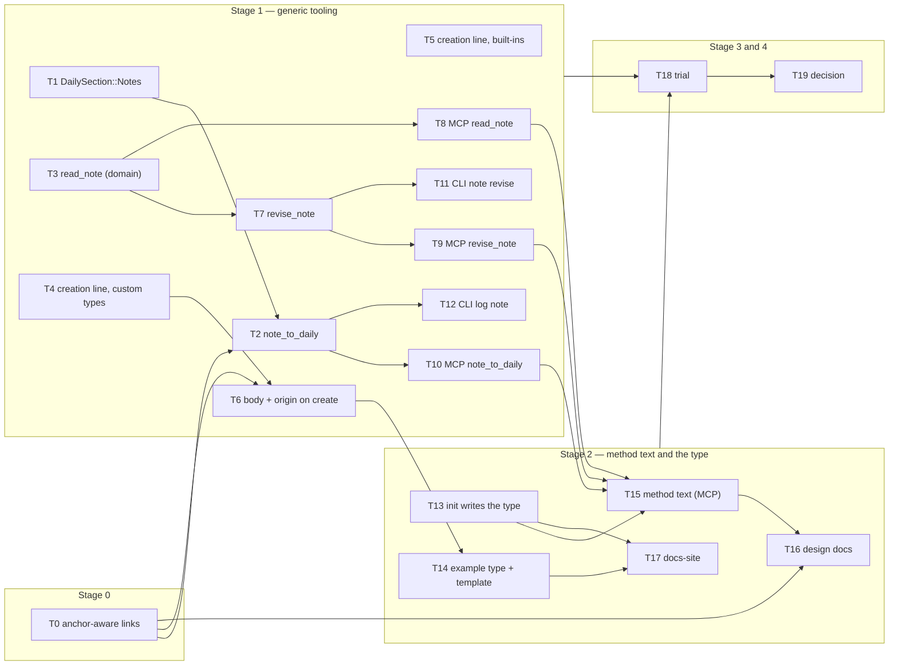

# RFC 0002 — Implementation plan

Companion to [RFC 0002 — Concept notes](0002-concept-notes.md). Each task below is meant to be
one issue and one pull request: small enough to review in one sitting, independent where the
dependency graph allows, and **done only when its probe passes**. Two rules carried over from
#597: a green suite is not a probe (a probe asserts the specific new behaviour, and where it
guards a regression the breaking mutation is shown to fail), and no-regression probes are
differential against artefacts captured from `main`, never against a hand-written expectation.

Conventions used here: `cdno` means the CLI built from the branch; `just ci` is the local gate
(fmt + clippy + test); every new Rust test is registered in its crate's `tests/unit.rs` or it
never runs.

## Dependency graph

Stage 0 is T0. Stage 1 is T1 to T12. Stage 2 is T13 to T17. Stage 3 is T18, stage 4 is T19.
T0, T1, T3, T4, T5 and T13 have no prerequisites and can start in parallel.

---

## Stage 0

### T0 — Anchor-aware wikilink resolution

**What.** `resolve_one` in `crates/cdno-core/src/extractors.rs` splits the target before the
first `#` and resolves the path part; the anchor is opaque. `LinkEntry` gains no field and there
is no migration (`target_raw` already carries the anchor). `docs/design.md:587` is rewritten to
the heading-text form.

**Why.** Every `[[note#Heading]]` in the vault is unresolved today, so `milestone:` links produce
no `links` edge and no backlink. The RFC's `## Notes` pointers and `origin:` depend on heading
links resolving.

**How.** In `resolve_one`, `let (path_part, _anchor) = target.split_once('#').unwrap_or((target,
""));` before rule 1, and run rules 1, 1b and 2 on `path_part`. An empty path part
(`[[#Heading]]`) resolves to `None`. Tests in
`crates/cdno-core/tests/unit/extractors_tests.rs` for `[[note#Heading]]`, `[[note#]]`,
`[[note#^block]]`, `[[folder#Heading]]` (folder index) and `[[#Heading]]`.

**Probes.**
- `cargo test -p cdno-core --test unit -- unit::extractors_tests` passes with the five new cases.
- Mutation: revert the split; the five cases fail.
- Differential: index the repo vault before and after (`cdno reindex` on `main` and on the
  branch), then `sqlite3 .cuaderno/index.db "select count(*) from links where resolved_path is
  not null"` is strictly higher on the branch and the difference equals the number of
  `[[…#…]]` targets in the vault.
- `cdno lint` reports no new findings on the repo vault.

---

## Stage 1 — generic tooling

### T1 — `DailySection::Notes`, append forced

**What.** Add a `Notes` arm to `DailySection` in `crates/cdno-domain/src/vault/daily.rs`.
`upsert_daily_section` treats it as append-only: an `append = false` call is rejected with a
`DomainError` naming the section, never an overwrite. The section is created immediately before
`## Logs` when absent; the template is untouched.

**Why.** `## Notes` is the daily note's substance section (RFC §5.4). The allow-list is the
mechanism that keeps overwrite paths away from history sections; `Notes` joins `Logs` on the
history side.

**How.** Extend the enum, `as_str`, `FromStr` and the error's allow-list text. In the upsert
path, branch on `section.is_history()` (new helper returning true for `Notes`) to force append.
Placement falls out of the existing `ensure_section` + pin-`## Logs`-to-bottom logic; add a test
that a fresh daily note gets `## Notes` above `## Logs`, and that a note that already has both
keeps their order after a `Standup` upsert.

**Probes.**
- `cargo test -p cdno-domain --test unit -- unit::daily_tests` passes with: append to `notes`
  grows the section; `append = false` on `notes` errors; `## Notes` precedes `## Logs` after
  creation; the order survives a planning-section upsert.
- Mutation: remove the `is_history` guard; the `append = false` test fails.
- `cdno lint` on a vault with a hand-written `## Notes` reports nothing (the section is not a
  frozen prefix).

### T2 — `note_to_daily`

**What.** New domain operation `Vault::note_to_daily(date, heading, body)` in
`crates/cdno-domain/src/vault/notes_section.rs` (new file, own `impl Vault` block). One
transaction: append `### <heading>\n<body>` to `## Notes` (via T1) and append
`- **HH:MM**: noted [[journal/<year>/daily/<date>#<heading>]] (<links>)` to `## Logs`, where
`<links>` is the entry body's wikilinks, deduplicated, in order of appearance, or omitted with its
parentheses when there are none. Rejects a heading that matches any existing heading in the
day's note (any level), or any `DailySection` name, with a `DomainError`.

**Why.** RFC §5.4: substance in `## Notes`, a pointer in the sequence, in one write, so agents
never need to edit the daily note directly. Heading uniqueness is enforced here because
`markdown.rs` lookup is flat and level-blind.

**How.** Read the daily note (creating it as `log_to_daily_note` does), scan headings with
`MarkdownDocument`, check the heading, extract wikilinks from `body` with
`cdno_core::extractors::extract_wikilinks`, build both appends, stage through the transaction
with the daily note's existing index update. Reuse `log_to_daily_note`'s timestamp source.

**Probes.**
- `cargo test -p cdno-domain --test unit -- unit::notes_section_tests` (new file, registered in
  `tests/unit.rs`) passes: entry and pointer land in one commit; the pointer carries exactly the
  body's wikilinks; a duplicate heading is refused and the file is unchanged; a section name as
  heading is refused; the daily note is created if absent with `## Notes` above `## Logs`.
- Mutation: drop the heading check; the two refusal tests fail.
- After T0, `cdno reindex` on a vault with one entry shows a `links` row whose `target_raw` is
  the pointer and whose `resolved_path` is that day's daily note.

### T3 — `read_note` returns hash, backlinks, frontmatter, headings

**What.** Extend `Vault::read_note` (`crates/cdno-domain/src/vault/notes.rs`) so `NoteView`
carries `content_hash` computed from the raw bytes just read, `backlinks: Vec<VaultPath>` from
the `links` table, the parsed frontmatter map, and `headings: Vec<String>`. No body cap.

**Why.** RFC §6.2: a caller must be able to revise safely (hash) and answer "is this used"
(backlinks). The hash must come from the bytes, not `notes.content_hash`, which lags editor
writes.

**How.** Hash with `cdno_core::hash` over the raw file content; backlinks via a
`VaultIndex::backlinks_to(path)` query (add to the trait with memory and SQLite impls, one
indexed lookup on `links.resolved_path`); headings via `MarkdownDocument`. Backlinks reuse the
same query `question_backlinks` needs, so refactor that to call it.

**Probes.**
- `cargo test -p cdno-domain --test unit -- unit::notes_tests` passes: hash equals
  `hash(bytes)`; editing the file on disk without reindex changes the returned hash; backlinks
  list exactly the notes linking to the path; headings match the body.
- `cargo test -p cdno-core --test unit -- unit::vault_index_tests` covers `backlinks_to` for
  both index impls.
- `cargo test -p cdno-domain --test unit -- unit::context_tests` still passes after the
  `question_backlinks` refactor.

### T4 — Creation log line for every custom type

**What.** `create_custom_note_with_vars` (`crates/cdno-domain/src/vault/custom_notes.rs`) stages
`- **HH:MM**: <type> created [[<folder>/<slug>]] — <title>` to today's daily log inside its
existing transaction.

**Why.** RFC §6.2 and ruling 3: all creations are logged. The shape matches the one creation
line that exists today (`commitments.rs:187`).

**How.** Build the line with the same helper `create_commitment` uses (extract it into
`vault/log.rs` if it is inline), stage the daily append after the note write in the same
transaction. `CHANGELOG.md` entry, since every existing custom type starts logging.

**Probes.**
- `cargo test -p cdno-domain --test unit -- unit::custom_notes_tests` passes: creating a
  `person` note writes exactly one `person created [[people/<slug>]] — <title>` line; the note
  and the line are in one commit (a failing index write leaves neither file changed).
- Mutation: stage the log line outside the transaction; the atomicity test fails.
- `cargo test -p cdno-cli --test note` wiring still passes.

### T5 — Creation log lines for the built-ins

**What.** Project, question, portfolio and stewardship creation write the same
`<type> created [[<path>]] — <title>` line. Commitment already does; action notes are created by
promotion and already log; daily, weekly, monthly, evidence, tracking and inbox are excluded
(evidence and tracking log through their own filing verbs; the journal and inbox are the log).

**Why.** Ruling 3: the missing lines are a gap in the history invariant, not an asymmetry to
accept.

**How.** One line per create path, staged inside each existing transaction, using the T4 helper.
`CHANGELOG.md` entry.

**Probes.**
- `cargo test -p cdno-domain --test unit -- unit::projects_tests unit::questions_tests
  unit::portfolios_tests unit::stewardships_tests` each gain a "creation logs one line in the
  same commit" test and pass.
- Differential: run the `cdno-cli` suite; the only diffs in captured daily notes are the new
  lines (`cargo test -p cdno-cli 2>&1 | grep -c "created \[\["` equals the number of create
  calls the suite makes).
- `cargo test -p cdno-mcp --test handlers_operations` passes unchanged.

### T6 — `body` and `origin` on custom-note creation

**What.** `create_custom_note_with_vars` accepts an optional `body: Option<String>` and an
optional `origin: Option<String>`. With a template, `body` fills a `{{body}}` placeholder if the
template has one, else is appended after the H1. `origin` is written as a plain frontmatter
string. `cdno note create` gains `--body-file` and `--origin`; `create_custom_note` (MCP) gains
`body` and `origin`.

**Why.** RFC §5.5 and §6.2: promotion is create-with-`origin`, and an agent must be able to
write the body it drafted rather than an empty template.

**How.** Domain: thread the two options through the render path; `origin` goes through the
existing field map as a declared optional field, so a type that does not declare `origin`
rejects it with the existing undeclared-field error. CLI: two `Option` flags folded through
`gather_or_error` (body prompted through `prompt_editor` when interactive). MCP: two optional
input fields.

**Probes.**
- `cargo test -p cdno-domain --test unit -- unit::custom_notes_tests` passes: `{{body}}`
  substitution; append-after-H1 fallback; `origin` lands in frontmatter and is indexed as link
  edges (after T0, `[[journal/…#H]]` resolves); `origin` on a type that does not declare it is
  refused.
- `cargo test -p cdno-cli --test note` passes: `--body-file` and `--origin` reach the note;
  `--no-interactive` without `--body-file` on a type whose template has `{{body}}` errors with
  `missing_flag`.
- `cargo test -p cdno-mcp --test handlers_operations` passes with `body` and `origin` round
  trips.

### T7 — `revise_note`

**What.** New domain operation `Vault::revise_note(path, expected_hash: Option<String>,
revision: Revision, reason: String)` in `crates/cdno-domain/src/vault/revise.rs`, where
`Revision` is `Body(String)` or `Section { heading, content }`. Refuses built-in types and
append-only custom types; refuses a hash mismatch inside the transaction lock; writes nothing
when the resulting text is identical; otherwise writes through the transaction and logs
`- **HH:MM**: revised [[<path>]] — <reason>` or `revised [[<path>#<heading>]] — <reason>`.
Empty `reason` is rejected.

**Why.** RFC §5.3 and §6.2: the transactional successor of `write_note_raw` for mutable custom
notes, with a lost-update guard and the logged-revision invariant.

**How.** Resolve the type through `type_registry`; reject on `NoteTypeDescriptor::Builtin` or
`append_only()`. Read raw bytes, hash, compare with `expected_hash` if `Some` **after**
`self.transaction()?` so the compare is under the lock. Apply the revision with
`MarkdownDocument::replace_section` / whole-body replace, preserving frontmatter. Compare
resulting bytes with the original; return early on equality. Flatten the reason to one line.

**Probes.**
- `cargo test -p cdno-domain --test unit -- unit::revise_tests` (new, registered) passes: body
  revision logs one `revised [[path]]` line; section revision logs the anchored form; identical
  text writes nothing and logs nothing; stale hash is refused and the file is byte-identical;
  `None` hash skips the check; built-in type refused; append-only custom type refused; empty
  reason refused; the daily line and the note change are one commit.
- Mutation: move the hash compare before `self.transaction()`; add a test that writes the file
  between read and commit (the concurrency harness in `concurrency_tests.rs`) and shows the
  refusal is lost.
- `cargo test -p cdno-domain --test unit -- unit::lint_tests` still passes (no append-only
  violation is introduced by a revise on a mutable type).

### T8 — MCP `read_note`

**What.** New `#[tool] read_note { note: String }` in `crates/cdno-mcp/src/context.rs`,
registered on `context_router` so the read-only server has it. Returns `{ path, note_type,
frontmatter, body, content_hash, backlinks, headings }`. Body uncapped. Accepts the same
reference forms as `cdno open`.

**Why.** RFC §6.4: a concept an agent can find but not read is worthless, and `context.rs:260`
already promises this tool.

**How.** DTO in `dto.rs` with `From<NoteView>`; resolve `note` through the existing
`note_ref` resolver; route through `with_vault`. Description states it returns the hash to pass
to `revise_note`.

**Probes.**
- `cargo test -p cdno-mcp --test handlers_context` passes: a concept note round-trips with all
  seven fields; an unknown reference is `INVALID_PARAMS`.
- `cargo test -p cdno-mcp --test server` passes with the pinned count moved from 55 to 56.
- Differential: `tools/list` on the branch minus `tools/list` on `main` (the #597 baseline
  script) is exactly `{read_note}`; the reverse difference is empty.

### T9 — MCP `revise_note`

**What.** New `#[tool] revise_note { note, expected_hash: Option<String>, body: Option<String>,
section: Option<String>, content: Option<String>, reason: String }` in `operations.rs`. Exactly
one of `body` or `section`+`content`. `expected_hash` is required when `body` is given (missing
it is `INVALID_PARAMS`), ignored for `section`. Goes through `verified_write` like every other
mutating tool.

**Why.** RFC §6.4. The MCP surface is where the lost-update risk is highest (an agent's read and
write are separated by a model turn), hence the stricter requirement than the domain's `Option`.

**How.** Input struct with validation in the handler; map to T7; the description states the
reason requirement, that the agent drafts the reason from the change, and that whole-body
revision needs the hash from `read_note`.

**Probes.**
- `cargo test -p cdno-mcp --test handlers_operations` passes: body revision without hash is
  `INVALID_PARAMS`; body revision with a stale hash returns the domain refusal; section revision
  without hash succeeds; the daily line is present afterwards.
- `cargo test -p cdno-mcp --test server` pin moves to 57; `tools/list` differential is exactly
  `{read_note, revise_note}`.
- `cargo test -p cdno-mcp --test e2e_stdio` gains one read-then-revise round trip against the
  real binary.

### T10 — MCP `note_to_daily`

**What.** New `#[tool] note_to_daily { date: Option<NaiveDate>, heading: String, body: String }`
in `operations.rs`, mapping to T2. `upsert_daily_section` accepts `notes` and its description
(`operations.rs:604`) is corrected to list it and to say it is append-only.

**Why.** RFC §6.4: the write agents otherwise do by hand.

**How.** Input struct, `verified_write`, description text: substance goes here and the pointer
line is written for you; entry headings must not reuse section names; end a reusable entry with
`#concept`.

**Probes.**
- `cargo test -p cdno-mcp --test handlers_operations` passes: entry and pointer present; a
  duplicate heading returns the domain refusal; `upsert_daily_section` with `section = "notes"`
  and `append = false` is refused.
- Pin moves to 58; `tools/list` differential is exactly `{read_note, revise_note,
  note_to_daily}`.
- `cargo test -p cdno-mcp --test e2e_http` gains one `note_to_daily` call.

### T11 — CLI `cdno note revise`

**What.** New subcommand in `crates/cdno-cli/src/commands/note.rs`: `cdno note revise <slug>
[--body-file F | --section H --content-file F] [--reason R]`. Interactive with `--body-file`
absent: prompt for the body through `prompt_editor` pre-seeded with the current text, then for
the reason; non-interactive: `missing_flag`. Always reads first and passes the hash it read.

**Why.** RFC §6.3: the revised-line rule must not be MCP-only, and flags-and-prompts forbids a
required flag for a promptable argument.

**How.** `Option` flags through `gather_or_error`; `prompt_editor` as `review.rs` uses it; no
lock is held while the editor is open, so a concurrent change is refused at commit by T7's hash
check.

**Probes.**
- `cargo test -p cdno-cli --test note` passes: `--body-file` and `--reason` revise and log;
  `--no-interactive` without `--reason` fails with the missing-flag message; a file changed
  between the command's read and its commit (simulated by a pre-write hook in the test) is
  refused.
- `cdno note revise --help` lists no required flag.

### T12 — CLI `cdno log note`

**What.** `cdno log note [--heading H] [--body-file F]`, mapping to T2. Interactive: prompt for
the heading, then the body through `prompt_editor`.

**Why.** RFC §6.3: the CLI half of `## Notes`.

**How.** Subcommand under `log.rs`, same folding as T11.

**Probes.**
- `cargo test -p cdno-cli --test log` passes: entry and pointer written; duplicate heading
  refused; `--no-interactive` without `--heading` fails with `missing_flag`.

---

## Stage 2 — method text and the type

### T13 — `cdno init` writes the `concept` declaration

**What.** `cdno init` writes a live `[note_types.concept]` block, with a comment header saying it
is an ordinary custom type and may be deleted, into the new vault's `.cuaderno/config.toml`, and
creates `concepts/`. The RFC §6.1 snippet is the exact text.

**Why.** Ruling 4: the method's answer to "where does understanding go" is visible from day one.

**How.** Extend the config template `init.rs` writes; create the folder alongside the built-in
folders. The repo's own `.cuaderno/config.toml` gains the same block (the repo root is a dev
vault).

**Probes.**
- `cargo test -p cdno-cli --test init` passes: a fresh vault opens (`cdno status`) with
  `concept` in `list_note_types`; deleting the block and reopening still works.
- `cargo test -p cdno-core --test unit -- unit::config_tests` covers that the block parses with
  `required = ["created"]` and no `title_field`.
- `cdno note create concept --title "Probe" --no-interactive --body-file /dev/null` on a fresh
  vault writes `concepts/probe.md` and one `concept created [[concepts/probe]] — Probe` line.

### T14 — Example type and template

**What.** `examples/note-types/concept/config.toml`, `examples/note-types/concept/concept.md`
(template with `{{body}}`, *Statement / Why it matters / See also* as the fallback body), and a
paragraph in `examples/note-types/README.md`.

**Why.** Existing vaults adopt the type by copying; the example is also what T13 writes, so the
two must not drift.

**How.** A test that the example's `config.toml` block equals the block `init.rs` writes.

**Probes.**
- `cargo test -p cdno-cli --test init -- example_matches_init` passes.
- Mutation: change one key in the example; the test fails.
- `cdno templates vars concept` on a vault with the template lists `body` among the
  placeholders.

### T15 — Method text on the MCP surface

**What.** The conditional server-instruction bullet in `crates/cdno-mcp/src/server.rs`; the
`create_custom_note`, `search_notes` and `read_note` descriptions carry the filing test,
search-before-create, and the promotion offer (`#concept` entries on the same subject on two or
more dates); the `note_to_daily` and `upsert_daily_section` descriptions per T10. The module doc's
tool count and `README.md` / `STATUS.md` say 58.

**Why.** Tool descriptions are the only instruction surface an agent sees; the RFC's rules do
not exist for an agent until they are here.

**How.** Text edits; the bullet is worded "if the vault declares a `concept` type".

**Probes.**
- `cargo test -p cdno-mcp --test server` passes a new assertion that the server instructions
  contain the string `concept type` and that `read_note`'s description mentions `expected_hash`.
- `grep -c "58" README.md STATUS.md crates/cdno-mcp/src/server.rs` is at least 3 and
  `grep -n "55 tools\|56 tools\|57 tools"` across the same files is empty.

### T16 — Design documents

**What.** `docs/design.md`: §3 table row for `concept` (custom, mutable, `concepts/`); §5.1 daily
note shape rewritten to `## Notes` + `## Logs`; §5 filing test and provenance rule; §7 the
`revised [[` and `<type> created [[` exceptions with their trade-off; line 587 to heading-text
form (T0). `docs/implementation-plan.md` Phase 7: `zettel → evidence or concept`. `CLAUDE.md`:
the domain quick reference names `concept` and the two new log-line prefixes. RFC 0002 status
line updated to point at the shipped PRs.

**Why.** The design document is the specification; the RFC is the argument for changing it.

**Probes.**
- `grep -n "standalone note" docs/implementation-plan.md` is empty.
- `grep -n "revised \[\[\|created \[\[\|noted \[\[" docs/design.md CLAUDE.md` finds each prefix
  at least once.
- `mdbook build docs-site` clean (the site links into `docs/` in places).

### T17 — Docs-site page

**What.** `docs-site/src/concepts/concept-library.md` (the method: filing test, `## Notes`,
promotion, refinement, no staleness, hub notes), a `tutorials/` page walking one promotion
end-to-end, both listed in `SUMMARY.md`; `reference/custom-note-types.md` corrected on
`[schemas.<custom>]`; `reference/cli/note.md` and `reference/cli/log.md` gain the new verbs;
`reference/mcp/` gains the three tools.

**Why.** The user guide is where the habit is taught.

**Probes.**
- `mdbook build docs-site` clean with no missing-link warnings.
- `grep -n "has no effect" docs-site/src/reference/custom-note-types.md` is empty.

---

## Stage 3 — trial

### T18 — Six-week trial with the exit questions written first

**What.** Before the first concept note is written, an issue records the three prose questions
and the target from RFC §8. After six weeks, the same issue records the answers and the numbers.

**Why.** The riskiest assumption is behavioural, not technical: whether the habit takes.

**How.** Numbers from disk: `sqlite3 .cuaderno/index.db "select n.path, count(l.id) from notes n
left join links l on l.resolved_path = n.path and l.source_path in (select path from notes where
date > n.created) where n.note_type = 'concept' group by n.path"`; `grep -rc "concept created
\[\[\|revised \[\[concepts/" journal/`; `git log --oneline -- concepts/`.

**Probes.**
- The issue has both halves filled in, dated, with the SQL and grep output pasted verbatim.
- Target: more than half of concept notes carry a later-dated backlink. Missing the target is a
  finding, not a failure.

## Stage 4 — decision

### T19 — Accept as is, or open RFC 0003

**What.** On T18's answers, either update RFC 0002's status to "Accepted — shipped" and close the
epic, or open a follow-up RFC for a built-in `concept` type with the trial's evidence as its
motivation.

**Probes.**
- The RFC status line names the outcome and the date; the epic is closed with a comment linking
  T18.
