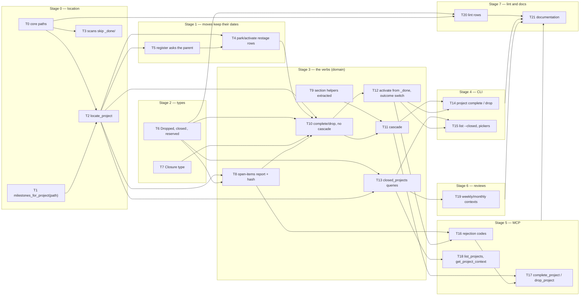

# RFC 0004 — Implementation plan

Companion to [RFC 0004 — Closing a project](0004-closing-projects.md); tracked by #669, with
T0–T21 filed as #670–#691 in order. Each task below is meant
to be one issue and one pull request: small enough to review in one sitting, independent where
the dependency graph allows, and **done only when its probe passes**. Two rules carried over from
#597 and the RFC 0002 plan: a green suite is not a probe (a probe asserts the specific new
behaviour, and where it guards a regression the breaking mutation is shown to fail), and
no-regression probes are differential against artefacts captured from `main`, never against a
hand-written expectation.

Conventions used here: `cdno` means the CLI built from the branch; `just ci` is the local gate
(fmt + clippy + test); every new Rust test is registered in its crate's `tests/unit.rs` or it
never runs. The RFC's section numbers (§5.3, §6.2, …) refer to the amended RFC.

## Complexity tiers

Every task carries a tier so that the work can be matched to a model of the right capability
without spending high-reasoning effort on mechanical edits. The tier is assessed from what the
task requires, not from how many lines it touches.

| Tier | Meaning | Match to |
|---|---|---|
| **M — mechanical** | The pattern exists next door and is copied; the probe is a compile plus an existing test shape; no new invariant, no ordering or concurrency question. | A small, fast model. |
| **S — standard** | Several files or one judgement call; an existing invariant must be kept; the design is fully specified in the RFC and the task follows it. | A mid-tier model. |
| **R — reasoning** | A new invariant, a transaction with ordering or rollback hazards, error-path design, or a cascade whose correctness is not obvious from any one file. | A frontier reasoning model, with a second-model review of the diff. |

A task tiered M or S that turns out to need a decision the RFC does not make is stopped and the
decision raised on its issue, not improvised.

## Dependency graph

T0, T1, T6, T7 and T9 have no prerequisites and can start in parallel. Stage 0 and stage 1 are
safe to merge before the RFC is accepted: they change no user-visible behaviour except fixing
#611 and the lost-rows bug (RFC §3.3 G4). T5 lands before T4 on purpose: the status filter alone
changes nothing today (a parked project's rows are already gone), and restaging alone would make
a parked project's dates nag reliably.

---

## Stage 0 — location

### T0 — Core paths for `projects/_done/`

**What.** In `crates/cdno-core/src/paths.rs`: `pub const PROJECTS_DONE: &str = "projects/_done"`,
`pub fn projects_done_dir(year: i32) -> String` (`projects/_done/<year>`), and the current year's
folder appended to `init_dirs`. The doc comment on `PROJECTS` names the third location.

**Deliverable.** The three additions and their tests in `crates/cdno-core/tests/unit/paths_tests.rs`.

**Depends on.** Nothing.

**Complexity.** M. `commitments_done_dir` and `actions_done_dir` are the template, line for line.

**Probes.**
- `cargo test -p cdno-core --test unit -- unit::paths_tests` passes with two new tests:
  `projects_done_dir_is_year_partitioned` (`projects_done_dir(2026) == "projects/_done/2026"`)
  and `init_dirs_includes_projects_done_for_the_current_year` (the vector contains
  `projects_done_dir(today.year())`, once).
- `cdno init` in an empty temp dir creates `projects/_done/<this year>/`.

**Correct means.** The new folder is spelled in exactly one place, no other file names the
string `projects/_done`, and a fresh vault has the folder from day one.

### T1 — `milestones_for_project` takes the resolved path

**What.** Change the `VaultIndex` trait method `milestones_for_project(&self, slug: &str)` in
`crates/cdno-core/src/index.rs` to `milestones_for_project(&self, path: &VaultPath)`; delete
`project_path_candidates`; update the SQLite and memory implementations to a single
`note_path = ?1` lookup; update the test wrappers in `crates/cdno-core/tests/unit/transaction_tests.rs`
and `reconcile_tests.rs`; in `crates/cdno-domain/src/vault/projects/milestones.rs`,
`open_milestones` resolves the project path first (through `resolve_any_project` until T2
replaces it) and passes it.

**Deliverable.** The signature change end to end, green.

**Depends on.** Nothing (T2 later swaps the resolver it calls).

**Complexity.** M. A signature change with the compiler as the checklist.

**Probes.**
- `cargo test -p cdno-core --test unit -- unit::vault_index_tests unit::memory_index_tests`
  passes with `milestones_for_project_reads_the_given_path` on both implementations: rows for
  `projects/_parked/x.md` are returned when that path is passed and not when `projects/x.md` is.
- `cargo test -p cdno-domain --test unit -- unit::projects_tests` still passes (the
  `open_milestones` callers).
- `grep -rn project_path_candidates crates/` returns nothing.

**Correct means.** The index no longer guesses where a project lives; the caller tells it.

### T2 — `locate_project`, from the disk, with `AmbiguousProject`

**What.** New `Vault::locate_project(&self, slug) -> Result<ProjectLocation, DomainError>` in
`crates/cdno-domain/src/vault/projects/mod.rs`, with `ProjectLocation { path: VaultPath,
frontmatter: ProjectFrontmatter }`. It probes `projects/<slug>.md`, `projects/_parked/<slug>.md`,
then each year directory under `projects/_done/` (via `store.list_dir`), and parses the
frontmatter from the file it finds. Two or more hits: `DomainError::AmbiguousProject { slug,
candidates: Vec<VaultPath> }`, a new variant with its own message. Zero hits: `Store(NotFound)`
with `available_projects_hint`. Then rewrite every two-path probe onto it: `resolve_active_project`,
`resolve_any_project` (`projects/mod.rs`), `update_project_state` (`projects/state.rs`),
`get_project_full` (`context.rs`), `resolve_project_path` (`commitments.rs`), `available_projects_hint`
(labels `(parked)`, `(completed)`, `(dropped)`), `activate_project` (`projects/lifecycle.rs`),
`project_summary`, and the project-only branch of `note_ref::narrow` (reads keep the documented
active-beats-parked rule; writes refuse). `commitments()` builds its stem-to-path map once per
call instead of probing per action note.

**Why.** RFC §5.5, D9: where a verb writes must never depend on the index, which can be stale
for up to 300 s on the HTTP server and until restart on stdio.

**Deliverable.** The resolver, the error variant, the nine call sites, and no remaining literal
`PROJECTS_PARKED` path probe outside `locate_project`, `park_project` and `create_project`.

**Depends on.** T0, T1.

**Complexity.** S. The design is fixed; the work is a careful, wide refactor where each call
site keeps its existing error (`ProjectNotActive`, `ProjectNotParked`, `NotFound`) and its
existing tests.

**Probes.**
- `cargo test -p cdno-domain --test unit -- unit::projects_tests` passes with:
  `locate_project_finds_active_parked_and_closed` (a map seeded at each of the three locations
  is found with the right frontmatter); `locate_project_resolves_by_disk_when_index_is_stale`
  (move a map on disk through the store without touching the index; the locator finds the new
  path); `locate_project_refuses_a_stem_at_two_locations_as_ambiguous_project` (seed the same
  slug active and parked; the error is `AmbiguousProject` naming both paths, not
  `AlreadyExists`).
- The whole domain suite passes unchanged: `cargo test -p cdno-domain`.
- Mutation: make `locate_project` read the index instead of the disk; the stale-index test fails.
- `grep -n "PROJECTS_PARKED" crates/cdno-domain/src/vault/**/*.rs` lists only `locate_project`,
  `park_project`, `create_project` and `note_ref.rs`.

**Correct means.** One function answers "where is project X and what state is it in", from the
files, and every reader and writer goes through it.

### T3 — Active-only scans skip `projects/_done/` by path

**What.** `active_projects`, `parked_projects` (`projects/lifecycle.rs`), `stuck_projects` and
`stuck_project_days` (`context.rs`) skip any indexed project whose path starts with
`PROJECTS_DONE` before reading or parsing the file.

**Why.** RFC §5.5, D5: those scans fail on one malformed map; `_done/` grows for ever and
invites hand edits; a broken retrospective must not block `create`, `activate` or `orient`.

**Deliverable.** Four `starts_with` guards and one test.

**Depends on.** T0.

**Complexity.** M.

**Probes.**
- `cargo test -p cdno-domain --test unit -- unit::projects_tests::active_projects_ignores_malformed_done_map`
  passes: seed `projects/_done/2025/old.md` with unparseable frontmatter and one active project;
  `active_projects()` returns the one project and no error; `stuck_projects` likewise.
- Mutation: remove the guard in `active_projects`; the test fails with a parse error.

**Correct means.** Nothing under `_done/` can make a live-vault query fail.

---

## Stage 1 — moves keep their dates, and the register asks the parent

### T5 — The register asks the parent's status

**What.** In `Vault::commitments` (`commitments.rs`): source 1 skips a milestone whose owning
project's `status` is not `Active`; source 4 skips an action note whose project's `status` is not
`Active`; source 3 is untouched. `cached_project_context` widens to cache
`Option<(Context, ProjectStatus)>`.

**Why.** RFC §5.5, the second half of G4 and of #611.

**Deliverable.** The two filters, the widened cache, three tests.

**Depends on.** T2.

**Complexity.** S. Small change, but the reasoning about which sources filter and which must
not is the point, and the tests for it must be written from the RFC, not from the code.

**Probes.**
- `cargo test -p cdno-domain --test unit -- unit::commitments_tests` passes with:
  `commitments_skips_milestones_of_parked_projects` (seed a parked map with a hard milestone in
  the window **and its index rows present**, since T4 has not landed; the register omits it);
  `commitments_skips_action_dues_of_non_active_projects` (an active action note with `due:` whose
  `project:` is parked; omitted); `commitments_keeps_standalone_commitment_of_closed_project`
  (a `status: active` commitment whose `project:` names a map with `status: completed`; kept).
- Mutation: remove the source-1 filter; the first test fails.

**Correct means.** A date surfaces only when the container that owns it is active; a promise to
someone else surfaces regardless.

### T4 — `park` and `activate` restage milestone and deadline rows

**What.** `park_project` and `activate_project` stage `replace_milestones` and
`replace_deadlines` for the destination path from the map's `## Milestones` section, after
`upsert_note(dest)` and before commit, reusing `stage_milestone_index_rows` from
`projects/milestones.rs` (make it `pub(in crate::vault)`).

**Why.** RFC §3.3 G4, reproduced: `remove_note(old)` cascades the rows through the FK
(`migrations/001_initial.sql`) and nothing restages them; reconciliation's fast path never heals
the moved file. Today a hard deadline vanishes from `cdno commitments` on `park` and stays gone
after `activate` until `cdno reindex`.

**Deliverable.** Two calls, one visibility change, one end-to-end test.

**Depends on.** T2, T5 (see the stage note).

**Complexity.** S. The fix is two lines; the proof that it is the right fix (the FK cascade, the
fast path) is what the test must pin.

**Probes.**
- `cargo test -p cdno-domain --test unit -- unit::projects_tests::park_then_activate_keeps_milestones_in_register`
  passes: add a hard milestone, `park`, `activate`, then `commitments()` lists it **without** a
  reconcile in between. Before this task the same test fails (write it first, watch it fail).
- With the binary: `cdno project milestone add … --hard`, `cdno project park`, `cdno project
  activate`, `cdno commitments` shows the milestone. This is the reproduction in RFC §3.3 G4,
  now passing.
- Mutation: remove the restaging from `activate_project`; the test fails.

**Correct means.** A project's dates survive every move of its map.

---

## Stage 2 — types

### T6 — `ProjectStatus::Dropped`, `closed:`, the template, the reservation

**What.** In `crates/cdno-domain/src/frontmatter/project.rs`: `ProjectStatus::Dropped` (kebab
`dropped`), `ProjectFrontmatter.closed: Option<NaiveDate>` via `optional_field`, and the doc
comment "completion is terminal" replaced by RFC §5.7's rule. In
`crates/cdno-domain/templates/project.md`: `closed: null` as the **last** frontmatter line; the
`frontmatter_order` entry for `project` in `note_type.rs` ends with `closed`. In
`set_frontmatter.rs`, `is_reserved_key` returns true for `("project", "closed")`. The exhaustive
matches gain a `Dropped` arm: `render_show` in `crates/cdno-cli/src/commands/project.rs` and the
DTO mapping in `crates/cdno-mcp/src/dto.rs`; `ProjectFrontmatterDto` gains `closed`.

**Deliverable.** The type, template and pin changes, compiling across the workspace.

**Depends on.** Nothing.

**Complexity.** M. Every change mirrors an existing field or arm.

**Probes.**
- `cargo test -p cdno-domain --test unit -- unit::frontmatter_tests` passes: `status: dropped`
  parses; `closed:` absent reads as `None`; `closed: 2026-09-29` reads as a date.
- The existing "fresh scaffold matches frontmatter_order" test for `project` passes with
  `closed` last.
- `cargo test -p cdno-domain --test unit -- unit::set_frontmatter_tests::set_frontmatter_refuses_closed_on_project`
  passes (refused as engine-owned; `closed` on a custom type with a declared `closed` field is
  still settable).
- `cargo build --workspace --all-targets` is green (the two arms).

**Correct means.** Every existing project map still parses, the new field is last so a
pre-RFC map gains it without tripping the order lint, and no settable schema can forge it.

### T7 — `Closure` promoted to `vault/closure.rs`

**What.** New `crates/cdno-domain/src/vault/closure.rs` with `pub(in crate::vault) enum Closure {
Completed, Dropped }` and `fn action_status(self) -> ActionStatus`; `ActionClosure` in
`vault/actions.rs` becomes `pub(in crate::vault) type ActionClosure = Closure;` (or is replaced
outright); `stage_action_archival` and its callers compile unchanged.

**Deliverable.** The module, registered in `vault/mod.rs`, with no behaviour change.

**Depends on.** Nothing.

**Complexity.** M.

**Probes.**
- `cargo test -p cdno-domain` passes unchanged (`actions_tests`, `projects_tests` cover both
  archival outcomes).
- `grep -rn "enum ActionClosure" crates/` returns nothing.

**Correct means.** One type names the two outcomes for every closable thing.

---

## Stage 3 — the verbs (domain)

### T8 — The open-items report and its hash

**What.** In a new `crates/cdno-domain/src/vault/projects/open_items.rs`: `pub struct
OpenItemsReport { actions: Vec<OpenAction { text, note: Option<String>, note_status:
Option<ActionStatus> }>, milestones: Vec<OpenMilestone { title, date: Option<NaiveDate>, hard:
bool }>, untouched_commitments: Vec<LinkedCommitment { slug, due: NaiveDate }> }`, `impl
OpenItemsReport { fn is_empty(&self) -> bool; fn hash(&self) -> OpenItemsHash }` (content hash of
the report serialised in source order), and `Vault::open_items_report(&self, doc:
&MarkdownDocument, slug) -> Result<OpenItemsReport, DomainError>`. Open bullets come from
`## Next Actions` through `parse_open_action_text` / `parse_attached_action_slug`; an attached
note's existence and status are read from `actions/<slug>.md` on disk; open milestones come from
`cdno_core::markdown::extract_milestones_from_body` on `## Milestones`; linked commitments from
`commitments_for_project` filtered to `status == Active`. Also `DomainError::ProjectHasOpenItems
{ slug, report: OpenItemsReport }` and `OpenItems { Refuse, Drop { expected: Option<OpenItemsHash> } }`.

**Why.** RFC §5.3: the report must parse the map, never `list_actions` (active-only) or
`open_milestones` (index rows a parked map no longer has).

**Deliverable.** The module, the two types, the error variant, and tests. Nothing calls it yet.

**Depends on.** T2, T6.

**Complexity.** S. Pure functions over a document; the one subtlety is that the hash must be
stable across identical reports and change on any change of content or order.

**Probes.**
- `cargo test -p cdno-domain --test unit -- unit::open_items_tests` (new file, registered)
  passes: a map with two bullets (one attached to an existing note, one plain), one open hard
  milestone with a date, one `- [x]` milestone, and one linked active commitment yields exactly
  two actions (the attached one carrying slug and status), one milestone with `hard: true`, and
  one commitment; a parked map yields the same as an active one; a `- [x]` milestone and a
  dropped commitment are excluded; an attached note missing on disk yields `note: Some(slug),
  note_status: None`; the hash is equal for two identical reports and differs when a bullet is
  added, removed or reordered.
- Mutation: read milestones from the index instead of the body; the parked-map test fails once
  its fixture omits index rows.

**Correct means.** The report is exactly what the user will be shown and exactly what the
cascade will act on, computed from the file, and the hash identifies that list and no other.

### T9 — Section helpers extracted from `drop_action` and `drop_milestone`

**What.** Behaviour-preserving refactor: the bullet-removal logic in `drop_action` (and
`complete_action`) and the bullet-with-continuation-lines removal in `drop_milestone` become
free functions in `projects/actions.rs` and `projects/milestones.rs` that take the section text
and the resolved line index and return the new section text; the public verbs call them. The
log-line formatters (`format_action_dropped_log_entry`, `format_milestone_dropped_log_entry`)
are already free functions and stay.

**Why.** RFC §6.2 step 3: the cascade edits the same sections inside one transaction, and the
public verbs each open their own transaction under a non-re-entrant lock.

**Deliverable.** The helpers, no change to any existing test's expectation.

**Depends on.** Nothing.

**Complexity.** S. Refactoring under test; the risk is a whitespace change in the rendered
section, which the existing tests pin.

**Probes.**
- `cargo test -p cdno-domain --test unit -- unit::projects_tests unit::actions_tests` passes
  with no test edited.
- The daily-log lines written by `drop_action` and `drop_milestone` are byte-identical before
  and after (an existing assertion; if none pins the exact line, add one).

**Correct means.** Nothing observable changes; the section edits are callable without a
transaction.

### T10 — `complete_project` and `drop_project`, refusing on open items

**What.** In `projects/lifecycle.rs`: `Vault::complete_project(at, slug, open_items:
OpenItems) -> Result<ProjectClosureOutcome, DomainError>` and `Vault::drop_project(at, slug,
reason: Option<&str>, open_items)`. This task implements everything except the cascade: with
`OpenItems::Drop` and a non-empty report it still returns `ProjectHasOpenItems` (T11 lifts
that). One transaction, lock taken first. Steps: a new `resolve_closable_project` (status
`Active` or `Parked`, else `ProjectNotActive`, which gains the actual `status`); the T8 report,
refused if non-empty; stamp `status` and `closed: <today>` **on the rendered document** through
`merge_fields_into_frontmatter` (`frontmatter_edit.rs`); destination
`projects/_done/<year>/<slug>.md`, `AlreadyExists` if occupied; `write_file`, `delete_file`,
`upsert_note`, `remove_note`, then `stage_milestone_index_rows` for the destination; one
`stage_daily_logs` call with the line `project completed [[<slug>]] — <title>` or `project
dropped on [[<slug>]] — <title>` plus the `reason:` continuation when given (`<title>` via
`body_title_or_slug`). No cap check. `ProjectClosureOutcome { outcome: WriteOutcome,
dropped_actions: Vec<String>, dropped_milestones: Vec<String>, untouched_commitments:
Vec<LinkedCommitment> }`, the two `dropped_*` vectors empty until T11.

**Why.** RFC §5.1, §5.4, §6.2, D6, D8.

**Deliverable.** The two verbs, the outcome type, the widened error, and tests.

**Depends on.** T2, T4, T6, T7, T8.

**Complexity.** R. It composes six invariants (lock before read, frontmatter over folder, stamp
on the rendered document, destination check before staging, index swap then restage, log last)
and the RFC's reviewers found two ways to get it subtly wrong by copying `park_project`.

**Probes.**
- `cargo test -p cdno-domain --test unit -- unit::projects_tests` passes with:
  `complete_project_moves_stamps_and_logs` (destination path, `status: completed`, `closed:` =
  today, old path gone, index has the new path only, daily log has exactly one new line with the
  bare slug and the H1 title); `drop_project_stamps_dropped_and_logs_reason` (`status: dropped`,
  `closed:` = today, log line with the `reason:` continuation, no `completed:` key anywhere);
  `complete_project_restages_milestone_rows_at_destination` (a `- [x]` milestone's row exists at
  the new path after the call); `complete_project_refuses_with_open_items_listed` (an open bullet
  present; error is `ProjectHasOpenItems` whose report matches T8's; **no file and no index row
  changed**); `drop_project_closes_a_parked_project_at_cap` (five active, one parked with no open
  items; `drop_project` on the parked one succeeds and no `activated` line is written);
  `drop_project_at_cap_lists_open_milestone_of_parked_project` (same, with an open milestone and
  no index rows for it; refused, milestone listed); `complete_project_refuses_an_occupied_destination`;
  `complete_project_refuses_a_closed_project` (a map at `_done/` — `ProjectNotActive` carrying
  its status; T12 relaxes this for the other outcome); `closing_pre_rfc_map_leaves_frontmatter_in_canonical_order`
  (a map without `closed:` gains it as the last key and `cdno lint` reports no order warning);
  `project_closure_lines_not_parsed_as_state_or_focus` (`project_state_changes_between` and
  `current_focus` ignore the new lines).
- Mutation: stamp on a fresh `store.read_file` instead of the rendered document; after T11 the
  cascade test fails. Mutation now: move the destination check after `write_file`; the occupied
  destination test fails with a partial write.

**Correct means.** A project ends in one committed transaction that leaves the files, the index
and the log telling the same story, from active or parked, without a slot.

### T11 — The cascade

**What.** In `complete_project` / `drop_project`, `OpenItems::Drop { expected }` with a non-empty
report: refuse with `ProjectHasOpenItems` if `expected` is `None` **when the caller declares it
must be present** (a `bool` on the domain call, true for MCP, false for the CLI's scripted
`--drop-open`) or differs from the fresh report's hash; else, in the same transaction: check every
`_done` destination first (each attached note's, then the project's) and refuse on any
collision before staging anything; dedupe attached slugs; skip an attached note whose status is
not `Active`; remove each open bullet and each open milestone (with continuation lines) through
the T9 helpers on the one document; `stage_action_archival(…, Closure::Dropped, …)` for each
distinct active attached note; then the T10 steps. The single `stage_daily_logs` call carries
one line per dropped child, children first — `format_action_dropped_log_entry(slug, text,
Some(reason))` and `format_milestone_dropped_log_entry(slug, title, Some(reason))` with reason
`project completed` or `project dropped (<user reason>)` — then the project line. The outcome's
`dropped_*` vectors are filled.

**Why.** RFC §5.3, §6.2 step 3, D2, D3, D10.

**Deliverable.** The cascade and its tests.

**Depends on.** T9, T10.

**Complexity.** R. Ordering, deduplication, partial-failure and hash-check semantics all live in
one transaction; each has a test that must be reasoned out from the RFC rather than copied.

**Probes.**
- `cargo test -p cdno-domain --test unit -- unit::projects_tests` passes with:
  `complete_project_drop_open_cascades_as_drops_with_reason` (two bullets, one milestone: map
  sections emptied of them, three child lines with `reason: project completed` **before** the
  project line, all in one daily note write); `drop_project_carries_reason_to_children`
  (`reason: project dropped (superseded)`); `complete_project_cascade_archives_attached_notes_as_dropped_and_frozen`
  (note at `actions/_done/<year>/`, `status: dropped`, `completed: null`, an archival snapshot
  recorded); `complete_project_cascade_dedupes_attached_note` (two bullets linking one note;
  one archive, commit succeeds); `complete_project_cascade_skips_non_active_attached_note` (an
  attached note hand-edited to `status: completed` is left where it is, its bullet still removed);
  `complete_project_cascade_collision_writes_nothing` (an occupied `_done` path for one attached
  note; error, and every file and index row is as before); `complete_project_refuses_stale_open_items_hash`
  (hash from a report, then add a bullet, then `Drop { expected: Some(old) }`; refused with the
  fresh report); `complete_project_drop_without_hash_is_refused_when_required` and
  `…_is_accepted_when_not_required`.
- Mutation: remove the dedupe; the dedupe test fails at commit. Mutation: check the hash before
  taking the lock; no test can catch it, so the review of this PR must confirm by reading that
  the comparison sits after `self.transaction()`.

**Correct means.** Every open item the user was shown, and nothing else, is dropped, each with
its own honest log line, or nothing at all changes.

### T12 — `activate` from `_done/`, the outcome switch, and `ProjectNotActive` with status

**What.** `activate_project` locates through T2 and accepts `Parked`, `Completed` or `Dropped`;
it clears `closed:` (writes `closed: null`) and restages rows (T4). `complete_project` /
`drop_project` on a map whose status is the *other* closed outcome restamp `status` and
`closed:`, move it to `_done/<current year>/`, restage, and log a new line; on the *same*
outcome they return `ProjectNotActive { slug, status, closed }` so a surface can say "already
completed on <date>". `ProjectNotParked`'s message widens to "not parked or closed".

**Why.** RFC §5.7, Q4.

**Deliverable.** The widened `activate`, the switch, the error fields, tests.

**Depends on.** T10.

**Complexity.** S. Each branch is a variant of T10's path with the destinations changed; the
RFC fixes every rule.

**Probes.**
- `cargo test -p cdno-domain --test unit -- unit::projects_tests` passes with:
  `activate_project_from_done_clears_closed_and_cap_checks` (from `_done/2026/`, back at
  `projects/`, `closed: null`, log line `project [[s]] activated`; at cap, `ProjectCapReached`);
  `complete_project_on_dropped_project_switches_outcome` (folder year is the current year,
  `closed:` is today, a second closure line in the log); `complete_project_on_completed_project_is_refused`
  (error carries `status: Completed` and the `closed` date).

**Correct means.** A closed project can come back or change its verdict, each as a logged
decision, and a repeat of the same verdict is refused with the date it already has.

### T13 — `closed_projects` and `closed_projects_between`

**What.** `Vault::closed_projects() -> Vec<(VaultPath, ProjectFrontmatter)>` (status `Completed`
or `Dropped`, from the index by type, path under `_done/`, parse errors skipped with the T3
rationale), and `Vault::closed_projects_between(from, to) -> Vec<ClosedProjectEntry { slug,
title, context, outcome: ProjectStatus, closed_on: NaiveDate }>` filtered on `closed:`, sorted
by `closed_on` then slug. New file `vault/projects/closed.rs`.

**Deliverable.** The two queries and tests.

**Depends on.** T2, T6.

**Complexity.** M. `completed_actions_between` (`context.rs`) is the template.

**Probes.**
- `cargo test -p cdno-domain --test unit -- unit::projects_tests::closed_projects_between_returns_both_outcomes`
  passes: one completed and one dropped map inside the window and one completed outside it;
  two entries, correct outcomes and dates, in date order.
- `active_projects_excludes_closed` (an active scan never returns a `_done/` map).

**Correct means.** The reviews can ask "what ended this week" and get typed rows.

---

## Stage 4 — CLI

### T14 — `cdno project complete` and `cdno project drop`

**What.** Two subcommands in `crates/cdno-cli/src/commands/project.rs`: `complete [--slug S]
[--drop-open]`, `drop [--slug S] [--reason R] [--drop-open]`. `--slug` through `gather_or_error`
with a picker over active and parked projects (labelled); `--reason` never prompted. On
`ProjectHasOpenItems` without `--drop-open`: print the report in RFC §1.1's wording (hard
milestones with their date, "Still open, not touched:" for linked commitments, the two
sentences of advice); interactive — `prompt_confirm("Let these N go and complete <slug>?",
false)`, on yes retry with `Drop { expected: Some(hash) }`; non-interactive — exit 1, and under
`--json` print the same object the MCP rejection carries (T16's shape) on stdout. Success:
"Completed <slug>. N of M slots in use." (+ " Let go: 2 actions, 1 milestone." when the cascade
ran); "Dropped <slug>. …" for a drop. `--drop-open` calls with `expected: None` and the
"required" flag false. The word "abandoned" appears nowhere.

**Deliverable.** The subcommands, wired; `assert_cmd` tests only.

**Depends on.** T11, T12.

**Complexity.** S. The convention is fixed (`docs/cli-ergonomics.md`) and `park` is the
template; the refusal rendering and the retry-with-hash are the only new shapes.

**Probes.**
- `cargo test -p cdno-cli --test project` passes with:
  `complete_non_interactive_lists_open_items_and_fails` (exit 1, stdout lists the bullet text
  and the milestone with "hard"); `complete_json_refusal_matches_mcp_shape` (stdout parses as
  JSON with `code == "project_has_open_items"` and `details.open_items_hash` present);
  `complete_drop_open_succeeds_and_prints_destination`; `drop_with_reason_writes_reason_line`
  (the daily note contains `  reason: `); `drop_parked_project_needs_no_slot` (five active, drop
  the parked one, exit 0); `complete_missing_slug_non_interactive_errors_with_missing_flag`.
- Manual: with a TTY, the refusal is followed by `[y/N]` and a bare Enter aborts.

**Correct means.** The refusal reads as a list of things, the confirm cannot drop work by
accident, and a script gets the same object an agent does.

### T15 — `list --closed`, wider pickers, the `Dropped` badge

**What.** `cdno project list --closed` renders `closed_projects_between(MIN, today)` newest
first with outcome and date; under `--json` it emits `ClosedProjectEntry` rows. The `activate`
picker (`prompt.rs`) and a new `complete_reactivatable_project` completion (`completions.rs`)
offer parked and closed projects, labelled `(parked)` / `(completed)` / `(dropped)`; `park`,
`complete` and `drop` use `complete_active_project` or a new active-or-parked completion as
appropriate. `render_show` already has its `Dropped` arm from T6.

**Deliverable.** The flag, the pickers, the completion, tests.

**Depends on.** T12, T13.

**Complexity.** M.

**Probes.**
- `cargo test -p cdno-cli --test project` passes with `list_closed_shows_outcome_and_date` and
  `activate_from_done_works`.
- `cargo test -p cdno-cli --test completions` covers the new completion listing a closed slug.

**Correct means.** Every closed project is reachable from the terminal by slug and by list.

---

## Stage 5 — MCP

### T16 — Rejection codes: `project_has_open_items`, `ambiguous_project`, status on `project_not_active`

**What.** In `crates/cdno-mcp/src/rejection.rs`: `RejectionCode::ProjectHasOpenItems` classified
from `DomainError::ProjectHasOpenItems` with `details: { slug, open_items_hash, actions: [{text,
note, note_status}], milestones: [{title, date, hard}], untouched_commitments: [{slug, due}] }`;
`RejectionCode::AmbiguousProject` with `details: { slug, candidates }`; `ProjectNotActive` now
serialises `details: { slug, status, closed }`. The `rename_all` derive gives the wire codes; the
`classify` match gains its arms.

**Deliverable.** The three classifications and their tests; no tool changes yet.

**Depends on.** T8, T12.

**Complexity.** S. The envelope is fixed; the work is the DTO of the report and keeping the
existing code names stable.

**Probes.**
- `cargo test -p cdno-mcp --test handlers_operations` (or the rejection test module) passes
  with `complete_project_rejection_carries_open_items_and_hash` (exercised through a direct
  `classify` call until T17 adds the tool), `ambiguous_project_rejection_carries_candidates`,
  `project_not_active_details_carry_status`.
- The existing rejection-code snapshot test (the one guarding `rename_all`) passes with the
  two new codes added to its expected list.

**Correct means.** An agent can branch on the code and act on the details without parsing a
message.

### T17 — `complete_project` and `drop_project` tools

**What.** In `crates/cdno-mcp/src/lifecycle.rs`: `complete_project { project, open_items?:
"refuse" | "drop", expected_open_items?: string }` and `drop_project { project, reason?,
open_items?, expected_open_items? }`, both through `with_vault` and `verified_write(…,
WriteShape::Rewritten)` on the destination path, the result naming what the cascade dropped
(`dropped_actions`, `dropped_milestones`, `untouched_commitments`). `"drop"` calls the domain
with "hash required" true. Descriptions state: closing is refused while items are open and the
rejection lists them; `"drop"` cascades them as drops with a recorded reason and must echo
`open_items_hash` as `expected_open_items`; a completion is a claim about work and a drop is
not; closing accepts a parked project and never needs a slot. The catalogue pins in
`tests/server.rs` and `tests/e2e_stdio.rs` move 58 → 60.

**Deliverable.** Two tools, descriptions, tests, pins.

**Depends on.** T11, T16.

**Complexity.** S. `park_project` is the template; the descriptions are the part that needs
care, since they are the only instruction surface an agent sees.

**Probes.**
- `cargo test -p cdno-mcp --test handlers_operations` passes with
  `complete_project_tool_refuses_with_open_items` (an `isError` result whose `code` is
  `project_has_open_items`), `drop_project_with_stale_hash_is_re_refused`,
  `drop_project_with_open_items_drop_cascades` (result lists the dropped items; the map is at
  `_done/`).
- Differential: `tools/list` on the branch minus `main` is exactly `{complete_project,
  drop_project}`; the reverse difference is empty. `cargo test -p cdno-mcp --test server` and
  `--test e2e_stdio` pass at 60.

**Correct means.** An agent can end a project honestly, is stopped from dropping anything it
was not shown, and learns the rules from the description alone.

### T18 — `list_projects.include_closed`, `get_project_context` on a closed map, stale descriptions

**What.** `list_projects { include_closed?: bool }` (default false) adds `closed:
[ProjectListEntryDto]` to `ProjectListDto` when true. `get_project_context` resolves through
`locate_project`, so a closed project is readable. Descriptions updated: `activate_project`
("a parked or closed project"), `list_projects` ("active and parked, closed on request"),
`get_project_context` (three locations), `get_weekly_context` and `get_monthly_context` (their
new slices, once T19 lands; this task leaves a TODO-free wording that T19 completes).

**Deliverable.** The input, the DTO field, the resolver swap, the descriptions.

**Depends on.** T13 (and T2 for the resolver).

**Complexity.** M.

**Probes.**
- `cargo test -p cdno-mcp --test handlers_context` passes with
  `list_projects_includes_closed_only_when_asked` and `get_project_context_reads_a_closed_project`.
- Differential: `tools/list` on the branch minus `main` is empty in tool names; the
  description diff touches exactly the tools named above.

**Correct means.** Closed projects are discoverable on request and never inflate the light
enumeration by default.

---

## Stage 6 — reviews

### T19 — `closed_projects` in both contexts, `parked_projects` in the monthly one

**What.** `get_weekly_context` gains `closed_projects: Vec<ClosedProjectDto>` for the ISO week;
`get_monthly_context` gains `closed_projects` for its 30-day window and `parked_projects:
Vec<ProjectListEntryDto>` from `parked_projects()`. Descriptions enumerate the new slices and
note that `parked_projects` fails on one malformed parked map, as `list_projects` does.

**Deliverable.** Two DTO fields, one new DTO, descriptions, tests.

**Depends on.** T13.

**Complexity.** M. Each field mirrors `completed_actions` next to it.

**Probes.**
- `cargo test -p cdno-mcp --test handlers_context` passes with
  `get_weekly_context_includes_closed_projects` and
  `get_monthly_context_includes_parked_and_closed_projects`.
- Differential: no tool-name change; description diff touches exactly the two context tools.

**Correct means.** A review sees every project that ended in its window and every project on the
shelf, without reading the log.

---

## Stage 7 — lint and docs

### T20 — Lint rows for status against folder and `closed:`

**What.** In `crates/cdno-domain/src/vault/lint.rs`, for every `project` note: `Error` when
`status` disagrees with the folder (`active` outside `projects/`, `parked` outside
`projects/_parked/`, `completed` or `dropped` outside `projects/_done/<year>/`), with the message
"move the map to `projects/_done/<year>/` and set `closed: <date>`, or set `status: active` and
close it with `cdno project complete`"; `Warning` when a closed status has no `closed:` and when
`active` or `parked` carries one.

**Deliverable.** The rows and their tests.

**Depends on.** T0, T6.

**Complexity.** S. Small, but the error/warning split must follow the rule in CLAUDE.md
("Error = downstream code can trip over it") and the message wording is part of the contract.

**Probes.**
- `cargo test -p cdno-domain --test unit -- unit::lint_tests` passes with
  `lint_errors_on_project_status_folder_mismatch` (three fixtures, three errors),
  `lint_names_fix_for_closed_map_outside_done` (message contains both steps verbatim),
  `lint_warns_on_closed_status_without_closed_date`, `lint_warns_on_active_project_with_closed_date`.
- The repository's own dev vault lints clean: `cdno lint` from the repo root reports no new row.
- `cargo test -p cdno-cli --test lint` still passes.

**Correct means.** The one state the verbs cannot reach or repair is named by lint with the
exact steps out of it.

### T21 — Documentation

**What.** `docs/design.md`: §5.3 (status values incl. `dropped`, `closed:`, the `_done/`
folder, the lifecycle paragraph and the log-line shapes), the structural-conventions list, the
note-type table's `project` row, the CLI and MCP surface tables. `docs-site/src`:
`reference/cli/project.md` (two subcommands, `list --closed`, `activate` from `_done/`),
`reference/mcp/creation-and-lifecycle.md` and `reference/mcp/overview.md` (60 tools),
`concepts/business-rules.md`, `concepts/vault-structure.md`, `concepts/rlm.md` (line 85, and the
named exception to "no un-drop" for projects), `tutorials/projects.md`. `CLAUDE.md`: the two new
prefixes in the history-preservation paragraph. `CHANGELOG.md` `[Unreleased]` and `STATUS.md`
(command list, tool count, the #611 fix). The RFC's status line moves to "Accepted — shipped"
once the maintainer confirms D7.

**Deliverable.** The edits; `mdbook build docs-site` clean.

**Depends on.** T14, T15, T17, T18, T19, T20.

**Complexity.** M. Everything to say is in the RFC; the work is placing it.

**Probes.**
- `mdbook build docs-site` reports no broken intra-book link.
- `grep -n "58 tools" docs-site/src STATUS.md` returns nothing; `grep -n "60 tools"` finds the
  overview and STATUS.
- `grep -n "projects park" docs-site/src/concepts/rlm.md` shows the amended sentence.
- A reader of `reference/cli/project.md` can run the §1.1 walkthrough of the RFC verbatim.

**Correct means.** Every surface the RFC changed is documented where its neighbours are, and no
page still describes `park` as the only exit.

---

## Done when

T0 to T21 are merged, `cdno commitments` keeps a parked project's hard milestone across `park`
and `activate` without a reindex, `cdno project complete` and `drop` exist on both surfaces with
the refuse-or-cascade policy, the weekly and monthly contexts carry `closed_projects`, lint names
the repair for a misfiled map, and #667 and #611 are closed by the PRs that implement T10 and T4.
