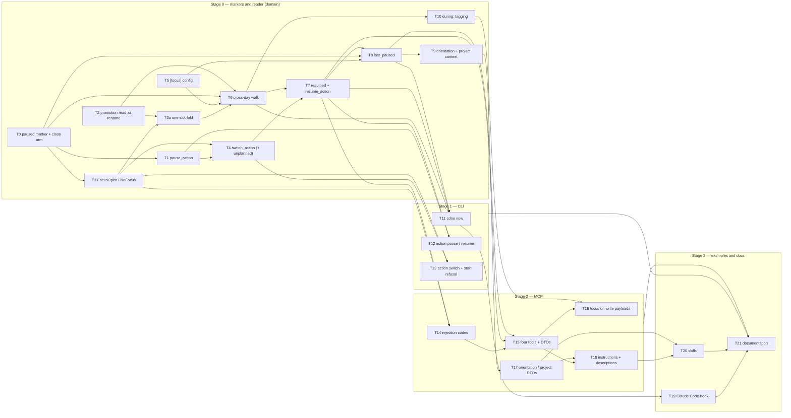

# RFC 0005 — Implementation plan

Companion to [RFC 0005 — Focus](0005-focus.md) (merged as #718); tracked by #719, with T0–T21
filed as #720–#741 in order and T3a (added by D11) as #746. Each task below is meant to be one issue and one pull request: small enough to review in one sitting, independent where the
dependency graph allows, and **done only when its probe passes**. Two rules carried over from the
RFC 0002 and 0004 plans: a green suite is not a probe (a probe asserts the specific new behaviour,
and where it guards a regression the breaking mutation is shown to fail), and no-regression probes
are differential against artefacts captured from `main`, never against a hand-written expectation.

Conventions used here: `cdno` means the CLI built from the branch; `just ci` is the local gate
(fmt + clippy + test); every new Rust test is registered in its crate's `tests/unit.rs` or it
never runs; **every task adds its line to `CHANGELOG.md` under `[Unreleased]`** (RFC §6.5 — a
new refusal, a new verb and a new marker are all behavioural). The RFC's section numbers (§5.1,
§6.2, …) refer to the amended RFC. Marker lines are quoted with the em dash spelled `\u{2014}` in
Rust and `—` in markdown; the two are the same codepoint and the parsers accept nothing else.

## Complexity tiers

Every task carries a tier so that the work can be matched to a model of the right capability
without spending high-reasoning effort on mechanical edits. The tier is assessed from what the
task requires, not from how many lines it touches.

| Tier | Meaning | Match to |
|---|---|---|
| **M — mechanical** | The pattern exists next door and is copied; the probe is a compile plus an existing test shape; no new invariant, no ordering or concurrency question. | A small, fast model. |
| **S — standard** | Several files or one judgement call; an existing invariant must be kept; the design is fully specified in the RFC and the task follows it. | A mid-tier model. |
| **R — reasoning** | A new invariant, a fold or transaction with ordering hazards, error-path design, or a correctness argument that spans files (the cross-day walk, the resume re-stamp). | A frontier reasoning model, with a second-model review of the diff. |

A task tiered M or S that turns out to need a decision the RFC does not make is stopped and the
decision raised on its issue, not improvised.

Tally: 6 M, 14 S, 3 R (T6, T7, T16). The three R tasks are the ones where a wrong answer is
silent — a focus that quietly expires, quietly persists, or quietly lies after a write — and
each has a mutation probe for exactly that.

## Dependency graph

T0, T2 and T5 have no prerequisites and can start in parallel. T2 is safe to merge before
anything else: it fixes a documented limitation (RFC §3.2 H3) and changes no other behaviour.
T11 may land before T12/T13 because `cdno now` reads only.

---

## Stage 0 — markers and reader (domain)

### T0 — The `paused` marker and its close arm

**What.** In `crates/cdno-domain/src/vault/projects/actions.rs`:
`pub(in crate::vault) const LOG_ACTION_PAUSED_PREFIX: &str = "action paused on "`,
`pub(in crate::vault) const LOG_NEXT_KEY: &str = "next: "`, and
`format_action_paused_log_entry(slug, action_text, next: Option<&str>, reason: Option<&str>)`
producing `action paused on [[slug]] — text` followed by an indented (two spaces, like
`format_action_dropped_log_entry`) `next:` line then `reason:` line, each only when given and
non-empty after `flatten_reason`. In `crates/cdno-domain/src/vault/context.rs`, the fold in
`current_focus` clears an open start on a `paused` head exactly as it does on done and dropped
(a third `.or_else`). In `crates/cdno-domain/src/vault/lint.rs`, `FOCUS_MARKER_PREFIXES` becomes
`[&str; 4]` with the new prefix.

**Deliverable.** The constants, the formatter, the fold arm, the lint prefix, and tests. No verb
yet.

**Depends on.** Nothing.

**Complexity.** M. `format_action_dropped_log_entry` and the dropped arm are the template.

**Probes.**
- `cargo test -p cdno-domain --test unit -- unit::actions_tests` passes with
  `paused_entry_carries_next_then_reason_as_continuations` (both given: three lines in that
  order, two-space indent; neither: one line; `next` with an interior newline is flattened).
- `cargo test -p cdno-domain --test unit -- unit::context_tests` passes with
  `current_focus_is_cleared_by_a_paused_action` built on the existing `focus_vault` helper: a
  start then a paused head of the same text yields `None`; a paused head of *different* text
  leaves the start standing.
- `cargo test -p cdno-domain --test unit -- unit::lint_tests` passes with
  `a_paused_line_with_an_ascii_hyphen_is_reported` using the existing `focus_warnings` helper,
  and the message names `action paused on`.
- Mutation: remove the `.or_else` for paused; the context test fails.

**Correct means.** A paused line is a close to the reader and a marker to lint, and the
continuation keys are spelled in exactly one place each.

### T1 — `pause_action`

**What.** `Vault::pause_action(&self, at: NaiveDateTime, next: Option<&str>, reason: Option<&str>)
-> Result<PauseOutcome, DomainError>` in `actions.rs`, where
`PauseOutcome { paused: CurrentFocus, path: VaultPath }`. It opens a transaction, reads
`current_focus(at.date())` (today only until T6 widens it; the call site does not change), fails
with the new `DomainError::NoFocus` when none, and stages one `format_action_paused_log_entry`
for the focus's own `(project, action)` text. **It does not resolve the project or the bullet
against the map** (RFC §5.1: a focus on a parked project can be paused), so it never returns
`ProjectNotActive` or `ActionNotFound`.

**Deliverable.** The verb, the error variant with its `thiserror` message
(`nothing is started — nothing to pause`), and tests.

**Depends on.** T0.

**Complexity.** S. One verb, one judgement already made for it (no map lookup), and the
`transaction → stage → commit` shape from `log_to_daily_note`.

**Probes.**
- `cargo test -p cdno-domain --test unit -- unit::actions_tests` passes with:
  `pause_logs_the_focus_text_verbatim` (start a bullet, pause with next and reason, the daily
  note's last three lines are the paused head and two continuations, and `current_focus` is
  `None`); `pause_with_nothing_started_is_no_focus`;
  `pause_does_not_touch_the_map_or_require_an_active_project` (start, park the project through
  the store without a log line, pause succeeds; the map is byte-identical before and after).
- Mutation: resolve the project through `resolve_active_project` inside `pause_action`; the
  parked test fails with `ProjectNotActive`.

**Correct means.** Pausing is a log line about the focus and nothing else.

### T2 — Promotion is read as a rename

**What.** In `context.rs`, `parse_promotion_marker(text) -> Option<(project, title, new_slug)>`
that accepts exactly the head `promote_action_with_vars` writes:
`action promoted on [[p]] — "title" -> [[actions/x]]` — strip the prefix and `[[`, split on
`]]`, require the em dash, strip the leading `"`, split on the **last** `" -> [[`, require the
closing `]]`; `None` otherwise. A fourth arm in the fold: on a promotion head, find the open
start `(p, a)` with `strip_energy_suffix(a).trim() == title`; replace `a` with
`[[actions/x]] (energy)` where `energy` is `parse_bullet_energy(a)` (if the open start has no
suffix it cannot be the subject, because promotion refuses `BulletMissingEnergy`; skip);
**keep its `started`**. `LOG_ACTION_PROMOTED_PREFIX` becomes a shared constant used by the writer
and the parser, and joins `FOCUS_MARKER_PREFIXES` (`[&str; 5]`) so lint reports a near-miss.
Rename `a_promotion_between_start_and_close_strands_the_focus` in `actions_tests.rs` to
`a_promotion_between_start_and_close_moves_the_focus_to_the_note` and invert it. Delete every
"promotion strands the focus" paragraph: `now.rs` module doc, the `Start` doc comment in
`cli/commands/action.rs`, the `start_action`, `start_unplanned_action`, `current_focus` and
`lint` descriptions in `cdno-mcp`, `docs-site/src/reference/cli/action.md`, `now.md`,
`troubleshooting.md`, `tutorials/actions.md`.

**Deliverable.** The parser, the fold arm, the shared constant, the lint prefix, the inverted
test, the deletions.

**Depends on.** Nothing.

**Complexity.** S. The rule is fully specified in RFC §5.4; the care is in the title parse and in
taking the energy from the start, not the map.

**Probes.**
- `cargo test -p cdno-domain --test unit -- unit::actions_tests` passes with the inverted test:
  start a bullet, promote it, complete the attached note; `current_focus` is `None`, and
  between promote and complete it reports `[[actions/<slug>]] (deep)` with the **original**
  start time.
- `cargo test -p cdno-domain --test unit -- unit::context_tests` passes with
  `a_hand_written_promotion_line_renames_the_open_start` (via `focus_vault`, no verb involved)
  and `a_promotion_title_containing_an_arrow_still_parses` (title `fix a -> b`).
- `cargo test -p cdno-domain --test unit -- unit::lint_tests` passes with
  `a_promotion_line_with_a_missing_stamp_is_reported`.
- Mutation: take the energy from the map's rewritten bullet instead of the start; the
  hand-written test (which has no map) fails.
- `grep -rn "strands the focus" crates docs-site` returns nothing.

**Correct means.** The line promotion already writes is enough for the reader to follow the
focus, and nothing else is logged.

### T3 — `FocusOpen` and `NoFocus` in the start verbs

**What.** `DomainError::FocusOpen { focus: CurrentFocus, same_action: bool, carried: bool }`
(message names the open focus and the remedy; with `same_action` it gives no switch advice).
The variant carries the whole `CurrentFocus`, so T6's `date` and T7's `origin` reach T14's
`details.focus` without changing the error (amended in review of #748). In `start_action` and `start_unplanned_action`, after the
transaction is open and **after** project and bullet resolution (so `ActionNotFound`,
`AmbiguousAction`, `ProjectNotActive` keep winning), and in `start_unplanned_action` **before**
the bullet is appended: read `current_focus(at.date())`; if `Some`, fail with `FocusOpen`,
`same_action` true when `(project, action)` equals the resolved target, `carried` false for now
(T6 sets it from `date`). `NoFocus` already exists from T1.

**Deliverable.** The variant, the two checks, tests.

**Depends on.** T0 (the fold must see `paused` so a paused focus does not block a start).

**Complexity.** S. Placement is the whole task and the RFC fixes it.

**Probes.**
- `cargo test -p cdno-domain --test unit -- unit::actions_tests` passes with:
  `a_second_start_is_refused_naming_the_open_focus`;
  `a_typo_is_reported_as_not_found_even_with_a_focus_open` (precedence);
  `an_unplanned_start_refused_by_focus_open_adds_no_bullet` (map byte-identical, no log line);
  `starting_the_focused_bullet_sets_same_action`;
  `a_paused_focus_does_not_block_a_start`.
- Mutation: move the check before resolution; the precedence test fails.
- Differential: every existing `actions_tests` test that starts twice in one day must now
  pause or complete between — list those edits in the PR; there are no silent stacks left.

**Correct means.** Starting is refused only when something is genuinely open, after the request
has been understood, and the refusal creates nothing.

### T3a — The one-slot fold

**What.** RFC §5.2 and D11 (maintainer's decision, 2026-10-02): focus is a one-spot buffer. In
`current_focus` (`vault/context.rs`), replace the stack (`open.push` / `open.retain` /
`open.pop`) with a single `Option<CurrentFocus>` slot: an open marker (`started`; `resumed` when
T7 adds it) replaces the slot; a close (`done`, `dropped`, `paused`) empties it only when its
`(project, action)` is the slot's; a promotion head (T2's arm) renames the slot only when its
title is the slot's text; anything else leaves the slot alone. Invert
`completing_one_action_leaves_an_earlier_start_standing` in `context_tests.rs` to
`completing_the_newer_start_leaves_nothing_open`, reword the stack phrasing in the comment of
`the_most_recent_open_start_wins` (it passes unchanged), and rewrite the `current_focus` doc
comment's "several starts in a day … the last one standing" paragraph to say a newer start
displaces an older one. A trial slot fold run against the whole workspace on `main` broke only
the inverted test.

**Deliverable.** The slot fold, the inverted test, the new tests, the doc comment, and a
`CHANGELOG.md` line naming the visible change: a log with *start X, start Y, done Y* now reports
no focus where it reported X.

**Depends on.** T2 (its rename arm is converted here), T3 (the refusal that stops new stacks
being written).

**Complexity.** S. One data-structure change in one function; the rule is stated.

**Probes.**
- `cargo test -p cdno-domain --test unit -- unit::context_tests` passes with:
  `a_newer_start_displaces_the_older` (start X, start Y → Y);
  `pausing_the_newer_start_does_not_bring_back_the_older` (start X, start Y, paused Y → `None`);
  `a_close_of_a_displaced_start_does_nothing` (start X, start Y, done X → Y);
  `completing_the_newer_start_leaves_nothing_open` (the inverted test);
  `a_promotion_of_a_displaced_start_does_not_rename_the_slot` (start X, start Y, promoted X →
  Y unchanged).
- Mutation: restore the stack (`retain` + `pop`); `pausing_the_newer_start_does_not_bring_back_the_older`
  fails.
- `cargo test -p cdno-cli --test now` unchanged.

**Correct means.** Whatever was written, the reader never returns a focus that something newer
displaced.

### T4 — `switch_action` and `switch_unplanned_action`

**What.** `Vault::switch_action(at, slug, query, next, reason) -> Result<SwitchOutcome, DomainError>`
and `Vault::switch_unplanned_action(at, slug, title, energy, next, reason)`, in `actions.rs`,
`SwitchOutcome { paused: Option<CurrentFocus>, started: CurrentFocus, primary: VaultPath, paths }`.
One transaction: resolve the target (or build the bullet) exactly as the start verbs do; read the
focus; if open, build its paused entry; stage every log line in **one** `stage_daily_logs` call
(`paused` [, `action added to`], `started`), in that order. With no focus open it is a plain
start and `next` is ignored with `paused: None` so the CLI can say so. **Composed from the
`stage_*` helpers**, never by calling `pause_action` then `start_action` (the write lock is not
re-entrant). The `FocusOpen` check from T3 does not apply here by construction.

**Deliverable.** The two verbs and tests.

**Depends on.** T1, T3.

**Complexity.** S. `start_unplanned_action` already stages two lines in one call; this stages
three. Atomicity falls out of staging.

**Probes.**
- `cargo test -p cdno-domain --test unit -- unit::actions_tests` passes with:
  `switch_writes_pause_then_start_in_one_entry_set` (lines in order, `current_focus` is the new
  one); `switch_with_nothing_open_is_a_plain_start_and_reports_no_pause`;
  `switch_to_a_missing_bullet_leaves_no_pause_line` (the daily note is unchanged after
  `ActionNotFound`); `switch_unplanned_adds_the_bullet_and_three_lines`;
  `switch_to_the_focused_bullet_is_focus_open_same_action`.
- Mutation: stage the paused line in its own `stage_daily_logs` call before resolution; the
  missing-bullet test fails (a stray pause line remains).

**Correct means.** A switch is one commit, and a failed switch is no commit.

### T5 — `[focus]` config

**What.** In `crates/cdno-core/src/config.rs`, `pub focus: FocusConfig` on `VaultConfig` with
`#[serde(default)]`, where
`#[derive(Deserialize, Default)] #[serde(deny_unknown_fields)] struct FocusConfig { carry_over_days: u32 (default 1), paused_lookback_days: u32 (default 14) }`,
using the same `default = "…"` function pattern `TrackingSpec` uses. Document both keys in the
commented template `cdno init` writes (the block in `.cuaderno/config.toml` is the model).

**Deliverable.** The struct, the defaults, the template comment, tests.

**Depends on.** Nothing.

**Complexity.** M.

**Probes.**
- `cargo test -p cdno-core --test unit -- unit::config_tests` passes with
  `focus_section_defaults_to_one_and_fourteen` (absent section), `focus_section_parses` and
  `focus_section_rejects_an_unknown_key` (`carry_over_day = 1` is a hard error naming the key).
- `cdno init` in a temp dir writes a config whose `[focus]` comment block names both keys.

**Correct means.** The two windows exist, default as the RFC says, and a typo cannot silently
disable either.

### T6 — The cross-day walk

**What.** In `context.rs`, `current_focus(date)` becomes: read the daily notes for
`date - carry_over_days ..= date` (skipping missing ones) and run T3a's one-slot fold over all of
their heads, oldest to newest; **no early stop** (RFC §5.2 — a stop is unsound for `resumed`'s
inherited origin, and the window is at most `carry_over_days + 1` notes). Factor the per-note head
extraction into `focus_heads(date) -> Vec<(NaiveDateTime, String)>` so each open marker carries
its date. The fold's order is note order, then line order within a note — **never a sort by
stamp**, which would reorder a hand-edited line and break the `carry_over_days = 0` differential. `CurrentFocus` gains `date: NaiveDate`; `FocusOpen.carried` (T3) is set
from `date != at.date()`. `carry_over_days = 0` must reproduce the pre-T6 behaviour exactly.

**Why.** RFC §5.2 and D11: closes pair across days, a note holding only an unrelated close must
not hide an older start, and T7's `resumed` inherits its origin from a marker that may sit in an
older note — the whole-window fold gets all three right by construction.

**Deliverable.** The walk, the field, tests.

**Depends on.** T0, T2, T3a, T5.

**Complexity.** R. This is the one place where the slot meets "closes can pair with earlier
days": the fold must run in note-then-line order, every arm (including T2's rename and T7's reopen that
lands next) must see the older notes, and `carry_over_days = 0` must reproduce today-only
reading exactly.

**Probes.**
- `cargo test -p cdno-domain --test unit -- unit::context_tests` passes with a new
  `focus_days(&[(date, &[lines])])` helper and:
  `a_start_yesterday_closed_today_is_not_a_focus`;
  `a_start_yesterday_left_open_is_the_focus_with_yesterdays_date`;
  `a_start_two_days_ago_is_outside_the_default_window`;
  `window_two_d2_start_d1_start_d0_close_is_no_focus` (the review's case, under D11);
  `two_starts_yesterday_closing_the_later_today_leaves_nothing`;
  `an_unrelated_close_today_does_not_hide_yesterdays_start`;
  `window_zero_reads_today_only` (yesterday's open start is ignored).
- Mutation: fold only today's note; `a_start_yesterday_left_open_is_the_focus_with_yesterdays_date`
  fails. Mutation: stop at the newest note holding any focus line; the unrelated-close test
  fails.
- Differential: capture `cdno now --json` on `main` against a fixture vault with ten days of
  logs and `carry_over_days = 0`; identical on the branch.

**Correct means.** The focus is the newest open marker inside the window unless a later close
names it, and no close or origin is ever lost by reading too little of the window.

### T7 — The `resumed` marker and `resume_action`

**What.** `LOG_RESUMED_PREFIX = "resumed "` in `actions.rs`, `format_resumed_log_entry`, and the
fold arm in `context.rs`: on a `resumed` head, the slot (T3a) takes a new `CurrentFocus` at
this head's time and date, carrying `origin: Option<NaiveDateTime>` = the displaced marker's
original stamp when the slot held the same `(project, action)` (or that marker's own origin, so
a chain keeps the earliest start the window still shows). Otherwise — an empty slot, or a different action in it — it is
a plain start (`origin: None`). A resume after a pause therefore has `origin: None` (the pause
emptied the slot); `ResumedFrom.date` carries the pause's date. `CurrentFocus` gains `origin`. Lint's `FOCUS_MARKER_PREFIXES` becomes
`[&str; 6]`. `Vault::resume_action(at, project: Option<&str>) -> Result<ResumeOutcome, DomainError>`:
with no `project`, resume the carried focus (`current_focus` with `date != today`) if any, else
the most recent pause (a minimal `last_paused` is written here as a private helper and
generalised in T8); with `project`, that project's most recent pause. `NoFocus` when nothing
qualifies; `FocusOpen` when a different focus is in the slot — open today **or carried** (D11:
resuming over a carried X would displace it with no pause line, and `last_paused` would never
offer it again) — or `same_action` when it is already today's. `ResumeOutcome { resumed: CurrentFocus, from: ResumedFrom { kind: Carried | Paused, date, next, reason }, path }`.

**Deliverable.** The marker, the fold arm, the verb, the outcome type, tests.

**Depends on.** T4, T6.

**Complexity.** R. The reopen must re-stamp (so the window counts from the resume) while keeping
the origin (so `cdno now` can say "started Tuesday 14:05"), and it must interact correctly with
every other arm: a `resumed` after a `paused` of the same text is a reopen, a `done` after a
`resumed` closes it, and a promotion after a resume renames it.

**Probes.**
- `cargo test -p cdno-domain --test unit -- unit::context_tests` passes with:
  `a_resume_today_of_yesterdays_start_is_dated_today_with_yesterdays_origin`;
  `a_resumed_focus_is_inside_the_window_the_day_after` (Tuesday start, Wednesday resume,
  Thursday read with window 1 → the Wednesday-dated focus);
  `a_resume_with_no_open_marker_is_a_plain_start`;
  `pause_then_resume_round_trips_without_a_second_verb` (and its focus has `origin: None`);
  `a_promotion_after_a_resume_renames_and_keeps_the_resume_stamp`.
- `cargo test -p cdno-domain --test unit -- unit::actions_tests` passes with:
  `resume_with_nothing_resumable_is_no_focus`;
  `resume_prefers_the_carried_focus_over_an_older_pause`;
  `resume_with_project_picks_that_projects_last_pause_and_returns_its_next`;
  `resume_while_a_different_focus_is_open_today_is_focus_open`;
  `resume_of_a_pause_while_a_different_focus_is_carried_is_focus_open`;
  `resume_of_todays_focus_is_focus_open_same_action`.
- Mutation: keep the original stamp instead of re-stamping; the Thursday test fails.
- Mutation: drop `origin`; the first test fails.
- Mutation: check `FocusOpen` against today's open markers only; the carried test fails.

**Correct means.** Work that continues keeps its focus from day to day by one explicit line, and
the origin is kept for as long as the window can see it.

### T8 — `last_paused`, one pass

**What.** `Vault::last_paused(today) -> Result<BTreeMap<String, LastPause>, DomainError>` in
`context.rs`, `LastPause { project, action, at: NaiveDateTime, next: Option<String>, reason: Option<String> }`.
One pass over the daily notes for `today - paused_lookback_days ..= today` (skip missing
notes), reading **folded** entries this time (`parse_log_lines`, since the continuations are
wanted) and keeping, per project, the most recent `paused` head that is not followed — in the
same pass, any day — by a `started` or `resumed` of the same `(project, action)`. The T7 private
helper is replaced by this.

**Deliverable.** The function, the type, tests.

**Depends on.** T0, T5, T7.

**Complexity.** S. The scan shape is `weekly_logs` / `daily_log_mentions`; the one rule
("not followed by a start or resume of the same text") is stated.

**Probes.**
- `cargo test -p cdno-domain --test unit -- unit::context_tests` passes with:
  `last_paused_returns_the_continuations` (`next` and `reason` read back, whitespace as
  written); `a_pause_followed_by_a_resume_is_not_offered`;
  `a_pause_followed_by_a_start_of_the_same_text_is_not_offered`;
  `a_friday_pause_is_offered_on_monday` (three-day gap, default look-back);
  `a_pause_outside_the_lookback_is_not_offered` (15 days, default);
  `one_pass_yields_every_project` (two projects paused on different days, both present).
- Mutation: read heads instead of folded lines; the continuations test fails.

**Correct means.** The re-entry hint survives a weekend and is found in one scan.

### T9 — Orientation and project context carry the focus

**What.** In `crates/cdno-domain/src/vault/orient.rs`, `OrientationContext` gains
`focus: Option<CurrentFocus>` and each `ProjectSummary` (the type `project_summary` returns)
gains `last_paused: Option<LastPause>`, filled from one `last_paused(today)` call in
`orientation_context`. In `context.rs`, `get_project_full` gains the same `last_paused` for its
project.

**Deliverable.** The fields and tests.

**Depends on.** T8.

**Complexity.** M. Field plumbing; the computation exists.

**Probes.**
- `cargo test -p cdno-domain --test unit -- unit::orient_tests` passes with
  `orientation_carries_the_focus_and_each_projects_last_pause` (one project focused, another
  paused with a `next`, a third neither).
- `cargo test -p cdno-domain --test unit -- unit::context_tests` passes with
  `project_context_carries_its_last_pause`.
- `cargo test -p cdno-cli --test orient` is unchanged (the CLI renderer ignores the new fields
  until T21 decides whether to show them).

**Correct means.** The morning read and the project read answer "where did I leave this" without
a second call.

### T10 — `during:` and `captured_during`

**What.** When `current_focus(at.date())` is `Some` at write time: `capture_to_inbox`
(`vault/capture.rs`) writes `captured_during: <project-slug>` into the new item's frontmatter;
`note_to_daily` (`vault/notes_section.rs`) and `log_to_daily_note` (`vault/log.rs`, behind
`cdno log` and `append_to_log`) append an indented `during: [[<slug>]]` continuation to the line
they write; `discard_inbox_item` and the inbox routing verbs (`triage_inbox` in `cdno-mcp`
routes through them) carry `during: [[<slug>]]` on their own log line **copied from the item's
frontmatter**, so the tag outlives the file. `LOG_DURING_KEY = "during: "` beside `LOG_REASON_KEY`.
The focus reader is unaffected (it reads heads).

**Deliverable.** The four writers, the key, the `captured_during` frontmatter field accepted by
the inbox schema, tests.

**Depends on.** T6 (the focus read must already be window-aware so a carried focus tags).

**Complexity.** S. Four small edits with one invariant: the tag must not perturb any existing
reader (`current_focus` reads heads; `parse_log_lines` folds the continuation, so readers that
fold see `; during: [[x]]` appended — list every such reader in the PR and show each ignores
it).

**Probes.**
- `cargo test -p cdno-domain --test unit -- unit::capture_tests` passes with
  `a_capture_during_a_focus_is_tagged_and_the_discard_line_carries_it` and
  `a_capture_with_no_focus_has_no_tag`.
- `cargo test -p cdno-domain --test unit -- unit::notes_section_tests` and `unit::daily_tests`
  pass with `note_to_daily_and_log_carry_during_when_focused`.
- `cargo test -p cdno-domain --test unit -- unit::context_tests`:
  `a_during_continuation_does_not_perturb_the_focus` (an `append_to_log` line during a focus
  of matching prose does not close it).
- Differential: `get_weekly_context` output on a fixture vault with and without a focus open
  differs only in the daily note's bytes, not in any aggregated field.

**Correct means.** Where attention went during a focus is recorded once, survives triage, and
changes nothing else.

---

## Stage 1 — CLI

### T11 — `cdno now`: date-aware, enriched, `--line`

**What.** In `crates/cdno-cli/src/commands/now.rs`: `elapsed_since(started: NaiveDateTime, now: NaiveDateTime)`
(the two `NaiveTime`s become datetimes built from `CurrentFocus.date` + `started`, and
`main.rs` passes `Local::now().naive_local()`); the three renderings of RFC §5.7 (`since`,
`picked up … (started <weekday> HH:MM)` when `origin` is set, `Nothing started.` plus the
`Last paused:` line from `last_paused` for the most recent pause across projects);
`now_json` gains `title` (`bullet_display_title(strip_energy_suffix(action))`), `note`
(`parse_attached_action_slug`), `energy`, `started_at`, `date`, `carried`, `origin`,
`elapsed_minutes`, `last_paused`, nulls-not-missing; `--line` prints one line through
`sanitise`, truncated to 160 characters with `…`, and exits 0 printing nothing on any error
including no vault found. The module doc's "not a midnight crossing" paragraph is rewritten.

**Deliverable.** The verb's three flags, the JSON shape, the `--line` contract, tests.

**Depends on.** T6, T7, T8.

**Complexity.** S. Rendering and arithmetic; the only trap is the elapsed computation, which the
RFC spells out with two examples.

**Probes.**
- `cargo test -p cdno-cli --test now` passes with:
  `elapsed_spans_midnight` (08:00 yesterday to 10:00 today → `26h`; 14:05 yesterday to 09:00
  today → `18h 55m`); `json_carries_date_carried_and_origin`;
  `line_is_sanitised_and_capped` (a bullet with `\x1b[31m` and a 300-character `next:`);
  `line_prints_nothing_and_exits_zero_outside_a_vault`;
  `nothing_started_shows_the_last_pause_with_its_next`.
- Differential: `cdno now --json` on `main` versus the branch with `carry_over_days = 0` on
  the T6 fixture: every `main` field present with the same value.

**Correct means.** The hook and the person get the same truth, and a carried focus never reads as
"2h".

### T12 — `cdno action pause` and `cdno action resume`

**What.** Two subcommands in `crates/cdno-cli/src/commands/action.rs`:
`Pause { next: Option<String>, reason: Option<String> }` and
`Resume { project: Option<String> }`. Neither takes `--project`/`--query` for the paused thing;
help text opens "Pauses the current focus; takes no project or query." `--reason` is silent
(never prompted, as `drop --reason`). `--next`, when absent and `reports_interactively`, is
**one prompt** (`prompt_text("Where to pick up (Enter to skip)")`), empty → `None`, and it
**does not set `prompted` and triggers no confirm**. `resume` prints the `next:` from
`ResumeOutcome.from` after the standard confirmation line. `NoFocus` renders gently with the
exit code the other refusals use. Amend `docs/cli-ergonomics.md` "What is not part of the
convention" with a named entry: *a skippable hint prompt on a single-log-line verb*, `action
pause` as the example, with the reason (the written line is one cheap log entry; a confirm on
top is the friction).

**Deliverable.** Two verbs, the doc amendment, tests.

**Depends on.** T1, T7.

**Complexity.** S. The subcommand shape is next door; the judgement (no confirm) is made by the
RFC and must be documented, not argued in code comments.

**Probes.**
- `cargo test -p cdno-cli --test action` passes with:
  `pause_prompts_once_for_next_and_never_confirms` (pty-driven: one prompt, Enter, the line
  lands without `next:`, no confirm text); `pause_with_no_interactive_never_prompts`
  (`< /dev/null`, `--no-interactive`: the line lands, exit 0);
  `pause_with_nothing_started_says_so_gently`; `resume_prints_the_next_hint`;
  `resume_with_project_resumes_that_pause`.
- `grep -n "skippable" docs/cli-ergonomics.md` finds the new entry.

**Correct means.** The hint is asked for at the moment of stopping and costs one keypress to
decline.

### T13 — `cdno action switch` and the `start` refusal

**What.** `Switch { project, query, unplanned, title, energy, next, reason }` with the same
`conflicts_with_all` / `requires = "unplanned"` wiring `Start` has; `--project` and `--query`
gathered through `gather_or_error` as `start` does (so a prompted switch confirms, and the
preview reads "pause <X>, start <Y>", showing a typed `--next`); the bullet picker excludes the
bullet that is the focus; `--next` absent + interactive → the T12 skippable prompt, which does
not add to the confirm. With nothing open, print `Nothing was open — started <Y>.` and, if
`--next` was given, `(--next ignored: nothing to attach it to)`. `start` on `FocusOpen`: print
the refusal naming the open focus and the exact `cdno action switch …` (or `resume`) command;
under `--json` emit the §5.1 object (`code`, `message`, `details`); in a terminal
(`reports_interactively`), `prompt_confirm("Switch to it instead?", false)` and on yes run the
switch with the already-resolved arguments, without asking for `--next` or `--reason`.

**Deliverable.** The verb, the refusal UX, tests.

**Depends on.** T3, T4.

**Complexity.** S.

**Probes.**
- `cargo test -p cdno-cli --test action` passes with:
  `switch_requires_the_unplanned_flag_for_title` (parse error names `--unplanned`);
  `switch_preview_names_both_sides`; `switch_with_nothing_open_reports_the_ignored_next`;
  `start_refusal_names_the_switch_command`; `start_refusal_json_matches_the_rejection_shape`
  (compare against the T14 fixture); `start_refusal_offers_the_switch_and_defaults_to_no`
  (pty: Enter leaves the log unchanged).
- Differential: `cdno action start` on a vault with nothing open is byte-identical to `main`.

**Correct means.** The refusal is a speed bump with the remedy in hand, never a dead end.

---

## Stage 2 — MCP

### T14 — Rejection codes

**What.** In `crates/cdno-mcp/src/rejection.rs`, `RejectionCode::{FocusOpen, NoFocus}` and the
`classify` arms: `focus_open` with
`details: { focus: {project, action, started, date, carried}, same_action, remedy }` where
`remedy` is `"already_focused"` (same action, not carried), `"resume_action"` (same action,
carried) or `"switch_action"`; message `An action is already in focus. Ask the person before
switching; do not retry.` `no_focus` with `details: {}` and message `Nothing is started.`
The `attempted` block is filled by the handler (T15), since the domain error does not carry it.

**Deliverable.** Two codes, two arms, tests.

**Depends on.** T3, T7.

**Complexity.** M. `classify` is exhaustive, so the compiler lists the work; the shape is in RFC
§5.1.

**Probes.**
- `cargo test -p cdno-mcp --test handlers_operations` (or the existing rejection test target)
  passes with `focus_open_classifies_with_the_three_remedies` and `no_focus_classifies`.
- The JSON of the `focus_open` fixture is checked into `crates/cdno-mcp/tests/fixtures/` and
  T13's CLI probe compares against the same file.

**Correct means.** An agent can read the remedy without parsing prose.

### T15 — Four tools and the DTOs

**What.** In `crates/cdno-mcp/src/operations.rs`: `pause_action {next?, reason?}`,
`switch_action {project, query, next?, reason?}`,
`switch_unplanned_action {project, title, energy, next?, reason?}`,
`resume_action {project?}`, each through `with_vault` and `verified_write_with`, each
description opening with the "acts on the CURRENT focus; takes no project or query" sentence
where that applies. `CurrentFocusDto` gains `date`, `carried`, `origin`; new `LastPauseDto`,
`ResumedFromDto`; `resume_action`'s payload carries `resumed_from`. The `start_action` handler
fills `attempted` into a `focus_open` rejection. The catalogue pins in `tests/server.rs:141`
and `tests/e2e_stdio.rs:226` move 60 → 64.

**Deliverable.** Four tools, three DTOs, the pins, tests.

**Depends on.** T7, T8, T14.

**Complexity.** S. Each handler is `start_action`'s shape; the only new mechanic is threading
`attempted` into the rejection.

**Probes.**
- `cargo test -p cdno-mcp --test handlers_operations` passes with one round-trip test per tool
  and `start_action_rejection_carries_attempted`.
- `cargo test -p cdno-mcp --test e2e_stdio` passes with the new pin and
  `pause_switch_resume_over_stdio` (three calls, the daily note's lines in order).
- `cargo test -p cdno-mcp --test server` passes with the new pin.

**Correct means.** Every focus verb an agent needs exists, with the same split `start` has.

### T16 — `focus` on every write payload

**What.** Every tool that writes a daily-log line or changes a project map carries
`focus: Option<CurrentFocusDto>` in its success payload, read **inside the same `with_vault`
closure** that runs `verify()` (extend `verified_write_with`'s closure to return
`(verification, focus)`, or add a sibling `verified_write_with_focus` used by the listed tools),
after the commit, with `Err` from the focus read mapped to `None` and logged at `debug` — never a
tool error. `focus: null` is documented on the DTO as "nothing open, the same as
`current_focus` returning null". Tools: `start_action`, `start_unplanned_action`,
`switch_action`, `switch_unplanned_action`, `pause_action`, `resume_action`, `complete_action`,
`drop_action`, `promote_action`, `add_action`, `append_to_log`, `capture`, `note_to_daily`,
`park_project`, `activate_project`, `complete_project`, `drop_project` (the last two through
`ProjectClosureDto`'s own builder; `note_to_daily` through `NoteToDailyResponse`).

**Deliverable.** The helper, seventeen payloads, the schema doc, tests.

**Depends on.** T10, T15.

**Complexity.** R. Not for the volume but for the two rules: one closure (a second
`spawn_blocking` would read a focus another process may have changed, and would double the lock
traffic), and a failing read must not fail the write. Both are easy to get subtly wrong across
three payload builders.

**Probes.**
- `cargo test -p cdno-mcp --test handlers_operations` passes with
  `every_listed_write_carries_focus` (a table-driven test over the seventeen tools: after
  `start_action`, each returns the same `focus`; after `complete_action`, each returns null)
  and `a_failing_focus_read_yields_null_not_an_error` (inject a daily note the markdown
  parser rejects after the write, through the store).
- `cargo test -p cdno-mcp --test e2e_stdio`: `focus_is_on_the_write_result_over_stdio`.
- Mutation: read the focus in a second `with_vault`; the failing-read test still passes but a
  new `focus_is_read_in_the_same_closure` test, which counts `spawn_blocking` calls through the
  existing test hook (add one if none), fails.

**Correct means.** An agent that never calls `current_focus` cannot miss the focus, and a
successful write never reports as failed.

### T17 — Orientation and project context DTOs

**What.** `OrientationDto` gains `focus`; its per-project entries gain `last_paused`;
`ProjectContextDto` gains `last_paused`. `From` impls over T9's types.

**Deliverable.** Fields and tests.

**Depends on.** T9.

**Complexity.** M.

**Probes.**
- `cargo test -p cdno-mcp --test handlers_context` passes with
  `orientation_carries_focus_and_last_paused` and `project_context_carries_last_paused`.

**Correct means.** The skill's first call has everything §5.6 needs.

### T18 — Server instructions and tool descriptions

**What.** Append the eight-point detour protocol of RFC §5.6 to the `with_instructions` text in
`crates/cdno-mcp/src/server.rs`, verbatim in substance, under a heading `FOCUS`; one-line
pointers in the `current_focus`, `start_action` and `switch_action` descriptions ("read the
FOCUS section of the server instructions before acting on a request outside the focus");
`lint`'s description lists `paused`, `resumed` and `promoted`; the `focus_open` message text
agrees with the instructions ("ask the person"). Apply the wording rule: no "drift",
"distraction", "off-task", "leaked", "enforce" anywhere in `crates/cdno-mcp/src/`.

**Deliverable.** The text, a test.

**Depends on.** T15, T17.

**Complexity.** S. Prose, but prose an agent executes; the RFC fixes the content, the task
fixes the placement and the words.

**Probes.**
- `cargo test -p cdno-mcp --test server` passes with
  `instructions_carry_the_focus_protocol` (the string contains the eight numbered points'
  key phrases: "project level", "once per topic", "never ask why", "return cue", "ask the
  person").
- `grep -rniE "drift|distraction|off-task|leak|enforc" crates/cdno-mcp/src/` returns nothing.

**Correct means.** An agent with no skill loaded behaves per §5.6 from the instructions alone.

---

## Stage 3 — examples and docs

### T19 — The Claude Code hook example

**What.** `examples/hooks/claude-code/README.md`, `focus.sh` and `settings.snippet.json`: a
`UserPromptSubmit` hook running `cdno now --line --vault "${CUADERNO_VAULT_PATH:?}"`, `set -u`,
exit 0 always, output only when `cdno` succeeded. README: what it does, that it is what makes
§5.6 behaviour rather than advice, the measured cost (one warm `cdno` run per turn, §3.3), that
`--vault` or the env var is required because CLI discovery is upward from the session's cwd, and
how to merge the snippet into `settings.json`. Add the folder to `examples/README.md` if one
indexes the examples.

**Deliverable.** Three files.

**Depends on.** T11.

**Complexity.** M.

**Probes.**
- `bash -n examples/hooks/claude-code/focus.sh`; `shellcheck` clean if available.
- Running the script with `CUADERNO_VAULT_PATH` pointing at the repo's dev vault prints one
  line; with it unset prints nothing and exits 0; with it pointing at an empty dir prints
  nothing and exits 0.

**Correct means.** The hook can never break a turn.

### T20 — Skills

**What.** `examples/skills/daily-orientation/SKILL.md`: delete the "No stored focus" surface note
and the "Don't reference a stored focus" line; add `current_focus` semantics via
`get_orientation.focus`; keep steps 2–4 (greeting, wins, due-soon) and make the carried focus
the step-6 recommended pick with the §1.1 wording, `last_paused.next` quoted when present, the
deep-focus-on-a-light-day pause suggestion; step 9 calls `resume_action` on "yes" or
`start_action` on an explicit pick, never a prose `append_to_log` line containing "focus".
`examples/skills/quick-capture/SKILL.md`: correct the inbox claim (`capture` exists), keep
`append_to_log` as the default, add the return cue when a focus is open.
`examples/skills/references/ADHD-PRINCIPLES.md`: a "Focus and moving over" section with the
eight points and the wording rule.

**Deliverable.** Three edited files.

**Depends on.** T17, T18.

**Complexity.** S. Skill text is what the agent does; it must match the tool contracts exactly.

**Probes.**
- Every tool named in the three files exists in the catalogue (a script in the PR greps
  `` `[a-z_]+` `` tokens against `tools/list` output).
- `grep -niE "drift|distraction|off-task|leak|enforc" examples/skills/` returns nothing.
- A dry run of the orientation skill against the dev vault with a carried focus (seed
  yesterday's note) produces the resume-or-pause offer *after* the greeting and wins, not before.

**Correct means.** The shipped skills do what the RFC says an agent should do.

### T21 — Documentation

**What.** `docs-site/src/reference/cli/action.md` (pause, switch, resume, the start refusal),
`now.md` (three shapes, `--json` fields, `--line`), `configuration.md` (`[focus]`),
`troubleshooting.md` (delete "names the wrong action"; add "says I'm still on yesterday's thing"
and "`action start` refuses with `focus_open`"), `reference/mcp/reads.md` and `writes.md` (four
tools, `focus` on writes, `last_paused`), `concepts/contexts-and-energy.md` (a "Focus" section),
`tutorials/daily-loop.md` and `actions.md`; `SUMMARY.md` if a page is added. `docs/design.md`:
the marker family gains `paused` and `resumed`, and names `promoted` as read back. `CLAUDE.md`:
the history-preservation paragraph lists the three. `STATUS.md`: the RFC 0005 row. Whether
`cdno orient` renders the focus and `last_paused` (T9 left it unrendered) is decided here and
done in the same PR if yes.

**Deliverable.** The pages, the three repo docs.

**Depends on.** Everything above.

**Complexity.** S.

**Probes.**
- `mdbook build docs-site` with no warnings.
- `grep -rn "strands\|promotion between" docs-site/src docs/design.md CLAUDE.md` returns nothing.
- Every CLI flag and MCP field named in the pages exists (`cdno action pause --help` etc. and
  the DTO schemas), checked by hand in the PR description.

**Correct means.** A reader of the user guide can use every verb the RFC added, and the
contributor docs no longer describe the stranding.

---

## Out of scope, by the RFC

- **Weekly-review metrics** (RFC T8): focus time per project against `This Week's Goal`,
  pauses and resumes, top `during:` sources — a separate RFC once a few weeks of log exist, bound
  to a wins-first framing.
- **`detour_budget`** (D10) and any elapsed-time nudge (§5.6 point 8) — the same RFC.
- **`Vault::open_unreconciled`** for a faster hook — only if a hook measures lag (§3.3).
- **Project-level focus without a bullet** (D6).

## Suggested order of work

Three tracks can run in parallel from day one: **A** T0 → T1 → T3 → T4; **B** T2; **C** T5. A and
B meet at T3a (the one-slot fold, after T2 and T3); all three join at T6 (R), which gates T7 (R), then T8 → T9 → T10. The CLI and MCP stages are independent of
each other once T7 and T8 are in; T16 (R) is the last piece of real risk. T19–T21 are the tail.
